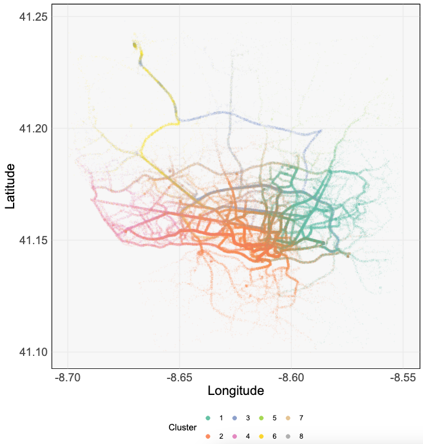

# Data Visualization Exercises

These are the problems that we use for homework/in-class practice in STAT
436/479 at the University of Wisconsin - Madison. They are designed to give some
experience in applying visualization tools (ggplot2, shiny, d3) to problems
common in data science (e.g., visualizing temporal or high-dimensional data --
see the table of contents in the PDF). The inspiration for compiling this came
from exercise books on analysis and probability that are common in math
coursework. Even with data visualization, the best way to learn is through
practice.

  |
|:--:| 
| *An example solution to the [Taxi Trips] exercise.* |

I'll keep this repository updated as I write new problems in new semesters.
You're also welcome to suggest or contribute new problems through email (see
below) or a [repository
issue](https://github.com/krisrs1128/data_visualization_exercises/issues). If
you are an instructor, feel free to re-use any of the exercises here -- the
underlying `.Rmd` source code is in the `source/` subfolder. I can also share my
solutions (though, be forewarned that these are quite scattered).

If you're curious about our other learning materials, you can check out:

* [Course Notes I](https://krisrs1128.github.io/stat479/)
* [Course Notes II](https://krisrs1128.github.io/stat992_f23/website/docs/)
* [Recordings I](https://mediaspace.wisc.edu/channel/STAT+479%3A+Statistical+Data+Visualization/197911113)
* [Recordings II](https://www.youtube.com/playlist?list=PLhax_7Mawcfk1GEl_vOg7cE_vtRTsqMWw)

And to any former students reading this -- thank you for all your effort! Your
motivation made writing all this worthwhile.

### Contact

These exercises were written on and off over several years, and I hadn't
originally planned to share them beyond my classes. If you notice that I haven't
properly attributed a dataset that you gathered or otherwise find any issues,
don't hesitate to [reach
out](https://measurement-and-microbes.org/_includes/contact).