<!-- 30 + 63 + 22 + 38 + 14 + 24 + 10 + 3 problems -->

```{r, echo = FALSE, message = FALSE, warning = FALSE}
library(knitr)
library(tidyverse)
theme_set(theme_classic())
opts_chunk$set(cache = TRUE, message = FALSE, warning = FALSE, echo = TRUE, include = TRUE)
```

# Design Principles

1. [Formulating Questions] Pick a dataset from
[TidyTuesday](https://github.com/rfordatascience/tidytuesday#datasets), [Data Is Plural](https://docs.google.com/spreadsheets/d/1wZhPLMCHKJvwOkP4juclhjFgqIY8fQFMemwKL2c64vk/edit#gid=0),
[Kaggle Datasets](https://www.kaggle.com/datasets), [Google Dataset Search](https://datasetsearch.research.google.com/), [AWS Data Registry](https://registry.opendata.aws/), [Wisconsin DNR](https://data-wi-dnr.opendata.arcgis.com/), [IPUMS](https://www.ipums.org/), [538](https://github.com/fivethirtyeight/data/), [Buzzfeed](https://github.com/BuzzFeedNews), [Propublica](https://www.propublica.org/datastore), [LILA BC](https://lila.science/datasets/), ..., or your own personal
studies that you would like to visualize this semester. 
    a. What makes you interested in this dataset? What questions does it help to answer?
    b. Using any tools of your choice, make one example visualization from your
    dataset. What was your thought process behind the design of this
    visualization? This will not be evaluated except for effort -- the purpose
    of the problem is to create a record your data visualization skills at the
    start of the course. Submit both your visualization and code used to create
    it.

1. [Data Types] For the following parts, specify whether the data field is
Nominal, Ordinal, or Quantitative.
    a. `BuildingArea` in the Melbourne Homes [dataset](https://uwmadison.box.com/shared/static/h5u176syp4xkret4w89n70efsp1tubex.csv)
    b. `Sport` in the 2012 Olympics [dataset](https://uwmadison.box.com/shared/static/rzw8h2x6dp5693gdbpgxaf2koqijo12l.csv)
    c. `age_group` in the Language Learning [dataset](https://uwmadison.box.com/shared/static/m53dea9w5ipczs3d7nqdnxqxx5ao501b.csv)

1. [Critique - Infographic] Figure 1 below is from the Information is Beautiful Infographic "Food Waste
is a Big Climate Problem We Can Actually Solve." It shows the breakdown of
sources of food waste in the UK. Give an example of a question that this
visualization helps answer. How easy / difficult is it to answer based on the
current design? What is one design choice that you like? What is one thing you
would do differently if you were redesigning it?
    
    ```{r fig.cap = "Sources of food waste, from Information is Beautiful infographic.", out.width = 250, fig.align = "center", echo = FALSE}
    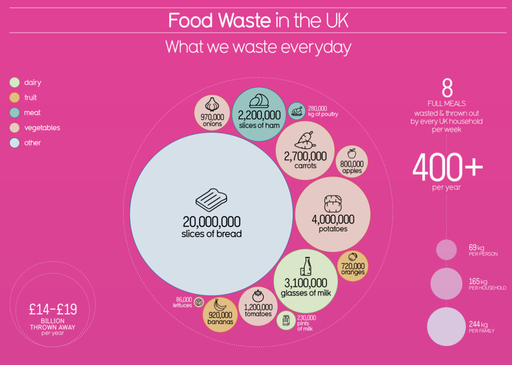
    ```
  
1. [Critique - Science Paper] Figure 2 below is from the scientific article *Both consumptive and non-consumptive effects of predators impact mosquito populations and have implications for disease transmission* by Russell et al. (2022). It describes the predators of mosquitos at different points in their life cycles. Give an example of a question that this visualization helps answer. How
easy / difficult is it to answer based on the current design? What is one design
choice that you like? What is one thing you would do differently if you were
redesigning it?
    
    ```{r, fig.cap = "Animals that eat mosquitos, depending on the age of the mosquito, from Russell et al. (2022).", out.width = 250, fig.align = "center", echo = FALSE}
    include_graphics("figure/mosquito-predators.jpeg")
    ```
  
1. [Critique - Science Paper] Figure 3 below is from the scientific article *Genetic basis and dual adaptive role of floral pigmentation in sunflowers* by Todesco et al. (2022).
While all sunflower petals look the same to us (they look yellow), they actually
vary quite a bit in how they reflect ultraviolet light, which is visible to
pollinators. The figure studies the variation in this ultraviolet proportion
(LUVp) across populations of sunflowers. Give an example of a question that this visualization helps answer. How
easy / difficult is it to answer based on the current design? What is one design
choice that you like? What is one thing you would do differently if you were
redesigning it?
    
    ```{r fig.cap = "Variation in amount of ultraviolet proportion of sunflower petals, from Todesco et al. (2022).", out.width = 250, fig.align = "center", echo = FALSE}
    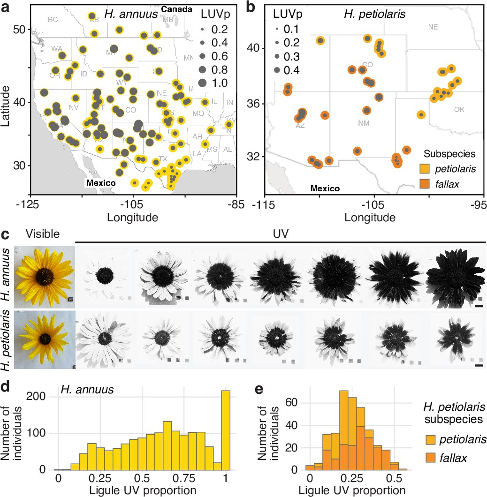
    ```
    
1. [Critique - Personal Visualization] In this exercise, we will critically
review the design for one of our own past visualizations. First, go through each
part verbally with your partner, then summarize your discussion for each part in
a short paragraph. Be respectful and make sure that all your comments are
constructive.

    a. Find a partner for this exercise. Share an example of one visualization
    you have made before, either from a previous course or from an earlier
    lecture. Summarize the purpose of your visualizations.
    
    b. Critique one another's attention-to-detail. Is the plot legible -- are
    all the graphical marks and text annotation easy to read? Are the colors
    easy to compare? Are there superfluous marks that could be removed to
    concentrate more of the reader's attention on the data?
    
    c. Critique's one another's designs. How does the choice of visual encodings
    prioritize some comparisons over others? How well does that prioritization
    match the goals of the visualization?
    
1. [`ggplot2` reflection] Compare and contrast the `ggplot2` package with an
alternative interface for constructing visualizations with which you have past
experience (e.g., base R’s `plot`, the `lattice` package, `matplotlib` in
python, Tableau, or Excel). What characteristics are common between the two
interfaces, and what is unique to each? In which situations does it make more
sense to use one approach vs. the other?

1. [Beauty and functionality] There are a surprising number of controversies in
data visualization, but few can get as heated as the beautify vs. functionality
debate. In each pair of articles below, we have one representative from each
school of thinking.
    
  	- [The Creative Pace of the 20th Century’s Greatest Authors, Visualized](https://www.themarginalian.org/2013/11/29/accurat-modern-library/) vs. [Redesigning Visualizations](https://medium.com/@hint_fm/design-and-redesign-4ab77206cf9)
  	- [Poor op/ed data graphic in New York Times](https://www.edwardtufte.com/notebook/poor-op-ed-data-graphic-in-new-york-times/) vs. [The Power of Visualization’s “Aha!” Moments](https://hbr.org/2013/03/power-of-visualizations-aha-moment)
  
    Respond to the positions taken by one of these pairs of articles (you are free
    to choose). Which of the arguments did you find most / least convincing? How
    might you evaluate the beauty or functionality of your own visualizations?

1. [Reading Response] This problem asks you to reflect on one of the 
readings from this week. Prepare a brief (1 paragraph)
response. For example, you may discuss any of the following points,
    
    a. Are there points from the reading that you strongly agree or disagree with?
    b. Are there lessons from the reading that you think you might incorporate into
    your future projects or plans?
    c. How would you explain the main ideas of the reading to a friend who is not
    technically trained in visualization?
    
1. [Skimming a Paper] This problem asks you to analyze a paper (specified in
lecture) from an area of active research in the visualization literature.

    a. Skim the abstract of the paper. What is the critical need that the paper
    seeks to address? What do they do to help address it (gather new data,
    propose new methods, etc.)?
    b. Review the figures from the paper. Pick two that you think are especially
    important, and summarize their takeaways.
    c. What is one way in which either the message or techniques of the paper
    might be releavnt to your own intellectual interests?
  
1. [Visual Redesign] In this exercise, you will find a visualization you have
made in the past and redesign it using the skills you have learned in this
course.

  	a. Identify one of your past visualizations for which you still have data.
  	Include a screenshot of this past visualization.
	  b. Comment on the main takeaways from the visualization and the graphical
	  relationships that lead to that conclusion. Is this takeaway consistent with
	  the intended message? Are there important comparisons that you would like to
	  highlight, but which are harder to make in the current design?
  	c. Comment on the legibility of the original visualization. Are there aspects
  	of the visualization that are cluttered or difficult to read?
  	d. Propose and implement an alternative design. What visual tasks do you
  	prioritize in the new design? Did you have to make any trade-offs? Did you
  	make any changes specifically to improve legibility.

1. [Concept Map] Prepare a concept map to summarize the last week of reading
material. An effective submission will include a thorough coverage of both
abstract concepts and practical examples, summarized concisely into short
phrases. It will also include well-justified links between nodes, with text
explanations for edges whose interpretation might not be obvious at first.

1. [ggplot2 Extensions] One of the amazing things about ggplot2's design is that
it makes it easy to create new packages that build on top of it. We have already
seen a few of these in class, e.g., ggridges, patchwork, and ggraph. Since the
extensions share fundamental concepts with ggplot2, they are often easy for new
users to pick up.  Nonetheless, these extensions cover a very wide range of use
cases, ranging from visual encodings adapted to specific application domains to
new collections of custom themes.

    In this exercise, you will study, reflect upon, and prepare an example using a
    ggplot2 extension package. You may pick any extension discussed in these
    sources:
    * https://exts.ggplot2.tidyverse.org/gallery/
    * https://z3tt.github.io/exciting-extensions/slides.html
    * https://github.com/erikgahner/awesome-ggplot2 (only packages)

    The only exceptions are packages that have already been discussed in class. Your
    write-up should have two main parts. The first part should summarize the
    extension package. You should describe the package's motivation and core
    functionality. In the second part, you should provide an illustrative example of
    how the package can be used. You can model this part off the problems in the
    exercise sheet/the in-class demos. You may use any dataset, including those from
    previous homework submissions or which appear in our notes/exercises. However,
    you may not copy an example from the package documentation or an existing online
    example.

    Aside: I'm not familiar with most of these packages. Find something that you
    think is cool and teach me something!

1. [Mini-presentation] Prepare a short presentation to summarize the last week
of reading material. Make sure to include coverage of both important concepts
and practical implementation details. Prepare either a short set of slides or an
original code notebook. When you present your material, make sure that all team
members have an opportunity to speak.

1. [ggplot2 commands] Circle whether the following statements about ggplot2 are TRUE or FALSE.

    a. TRUE FALSE To use a custom color palette in a ggplot2 scatterplot, we
    can add a `scale_color_manual` layer.

    b. TRUE FALSE A `geom_boxplot()` layer can be used to simultaneously
    visualize a continuous variable against many levels of a categorical variable.

    c. TRUE FALSE A plot like the one shown in Figure 1 can be made using a
    `geom_area` layer.

    d. TRUE FALSE The `aes()` function maps values stored in the columns of a
    dataset into properties of graphical marks.

    ```{r echo = FALSE, fig.cap = "Plot for Q2c.", out.width="0.45\\textwidth", fig.align="center"}
    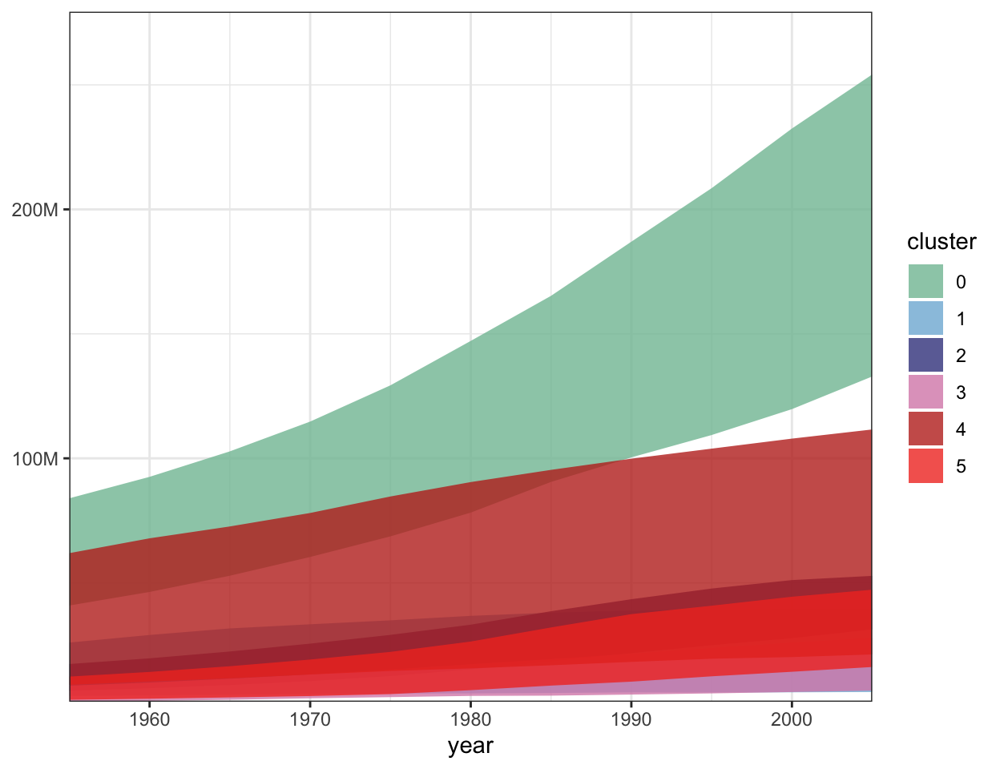
    ```
  
1. [Diamonds True/False] Circle whether the following statements about
visualizing the diamonds dataset below are TRUE or FALSE. [0.75 points each]
  
    ```{r}
    diamonds
    ```
    
    a. TRUE FALSE To visualize the relationship between the price and depth
    variables, you can use:\newline $~$ \hspace{10mm} `ggplot(diamonds) +
    geom_point(aes(price, depth))`
    
    b. TRUE FALSE To visualize the relationship between x and caret variables with
    cut encoded by color, you can use:\newline $~$ \hspace{10mm} `ggplot(diamonds)
    + geom_point(aes(price, depth)) + scale_color_manual(cut)`.

    c. TRUE FALSE A scatterplot of `x` vs. `caret` faceted by `color` will have
    53,940 points in each facet.
    
    d. TRUE FALSE You built a plot of price against caret faceted by
    clarity:\newline $~$ \hspace{10mm} `ggplot(diamonds) + geom_point(aes(caret,
    price)) + facet_wrap(~ clarity)`.\newline To sort facets by price, you could
    modify the `geom_point` layer to `geom_point(aes(carat, reorder(price)))`.
  
1. [Multipanel True/False] Circle all the statements below that are true about
small-multiple and compound figures. Assume that the `ggplot2`, `ggridges`, and
`patchwork` packages have been loaded.

    a. Each panel in a plot using `+ facet_grid(x ~ y)` will show a
    different subset of the data.
    
    b. The number of vertical panels in a plot using `facet_wrap(~ x)` depends
    on the number of levels of `x`.
    
    c. If `p1`, `p2`, and `p3` are each `ggplot2` objects, then using `p1 + p2 + p3` 
    will combine those plots horizontally.
    
    d. The ridge heights across `x` in a plot using `+ geom_ridge_density(aes(x, y))` encodes the variable `y`.
  
1. [Interactivity Discussion] This problem asks you to comment on variations of
the Names App that we used to introduce Shiny.

    a. What is a reactive graph? What types of nodes can it contain and why is
    it relevant to interactive visualization?

    b. The code below is supposed to print "Hello {name}!" when the user
    enters their name into a textbox. It may or may not have a bug. If it has a bug,
    circle the line(s) and explain the issue. Otherwise, write "No Bug."
    ```{r, eval = FALSE}
    ui <- fluidPage(
      textInput("name", "Enter your name"),
      textOutput("printed_name")
      )
      server <- function(input, output) {
      input$name <- paste0("Hello ", input$name, "!")
      output$printed_name <- renderText({
            input$name
      })
    }
    ```
  
    c. The code below is supposed to update a counter each time the user clicks on a
    button. It may or may not have a bug. If it has a bug, explain the issue.
    Otherwise write, "No Bug."
    ```{r, eval = FALSE}
ui <- fluidPage(
  actionButton("increment", "Increment Counter"),
  verbatimTextOutput("counter_text")
)

server <- function(input, output) {
  counter <- reactiveVal(0)
  observe({
        counter <- counter + 1
  })
  output$counter_text <- renderPrint(counter)
}
    ```

1. [New Data Application] Create a version of a visualization included in this
week’s readings, lecture notes, or in-class exercises, but applied to new
dataset of your choice.
	
  	a. Provide a reference to the visualization that you will be adapting for your application.
  	b. Identify a dataset that you will use. What makes this dataset interesting,
  	and how was it gathered / generated?
  	c. Generate a version of the visualization from (a) to the dataset from (b).
  	Interpret the result in context.
  	
1. [Transition Taxonomy] In "Animated Transitions in Statistical Graphics," Heer
and Robertson introduce a taxonomy of visualizations transitions. These include,
    * View Transformation: We can move the "camera view" associated with a fixed
    visualization. This includes panning and zooming, for example.
    * Filtering: These transitions remove elements based on a user selection.
    For example, we may smoothly remove points in a scatterplot based on a
    dropdown menu selection.
    * Substrate Transformation: This changes the background context on which
    points lie. For example, we may choose to rescale the axis in a scatterplot
    to show a larger range.
    * Ordering: These transitions change the ordering of an ordinal variable.
    For example, we may transition between sorting rows of a heatmap
    alphabetically vs. by their row average.
    * Timestep: These transitions smoothly vary one plot to the corresponding
    plot at a different timestep. For example, we might show "slide" a time
    series to the left to introduce data for the most recent year.
    * Visualization Change: We may change the visual encoding used for a fixed
    dataset. For example, we may smoothly transition from a bar chart to a pie
    chart.
    * Data Scheme Change: This changes the features that are displayed. For
    example, we may smoothly turn a 1D point plot into a 2D scatterplot by
    introducing a new variable.

1. [Real-world Transition Examples] In this problem, we will explore how these
transitions arise in practice and explore how they may be implemented.
    a. Pick any visualization from the New York Times Upshot, Washington Post
    Visual Stories, the BBC Interactives and Graphics, or the Guardian
    Interactives pages. Describe two transitions that it implements. Of the 7
    transition types given above, which is each one most similar to? Explain
    your choice.
    
    b. For any transition (which may or may not be one of those you chose in
    (a)), identify the types of graphical marks used to represent the data. How
    would you create this type of mark in SVG?

    c. To achieve the transition effect, how do you expect that the SVG elements
    would be modified / added / removed? Specifically, if elements are modified,
    what SVG `attrs` would be changed, and if elements are added or removed, how
    would the enter-exit-update pattern apply? You do not need to look at the
    code implementing the actual visualization, but you should give a plausible
    description of how the transition could be implemented in D3.

1. [Network Visualization Breakdown] In this problem, we will analyze a
visualization hosted on either
[visualcomplexity](http://www.visualcomplexity.com/vc/) or
[FlowingData](https://flowingdata.com/category/visualization/network-visualization/)
using the language we’ve developed in class. Briefly respond to each of the
queries below.
    
    a. What visual encodings does your selected example use (e.g., node-link vs.
    adjacency)? In its layout, does it use any additional structure (e.g., are
    any constraints present)?
    b. What types of queries does this visualization seemed designed to support?
    If the design includes any interactive elements, classify it into either
    view, encoding, or data interactivity.
    c. Propose one alternative layout or form of interactivity that could be
    used for this dataset. What are some of the trade-offs involved with using
    the original vs. your proposed layout?

1. [Dissecting a visualization] Pick two static views of visualizations from any
of the following sites: 1, 2, 3. For each view, answer the questions below,

    a. What graphical marks are used in the display? What data attribute does
    each mark encode?
    b. Are there visual queries that their design makes especially
    straightforward to answer? Are there queries that are more difficult
    relative to a simpler alternative? 
    c. Why do you think the authors chose the visual encodings that they did?
  
  
1. [Analyzing a Demo] Watch one of the following interactive demos, or choose a
comparable one from your own visualization interests.

	a. Analyze the transitions or interactivity are shared in the demo.
	Specifically, list all transition or interactive elements of the visualization
	and summarize the designer’s motivation for including them.
	b. For one of the transition or interactivity elements, imagine an alternative
	design that accomplishes a similar purpose. Compare and contrast your proposed
	implementation with that in the original display.

1. [Guided literature search] This exercise will help you search for references
to support the literature review for your course project.

	a. Reflect on the problem your project is trying to solve. List 6 - 10 data
	visualization related keywords that should bring up literature relevant to that
	problem. These keywords can be related to the type of data you have or the
	visual tasks your work is supposed to support.

	b. Use these keywords to search for 10 - 15 papers relevant papers. You may
	find it useful to (i) search using [Google Scholar](https://scholar.google.com), (ii) skim the bibliographies
	of the first few papers you find that seem relevant (especially if they are
	review papers), (iii) browse abstracts in major journals / conferences (like
	[TVCG](https://ieeexplore.ieee.org/xpl/RecentIssue.jsp?punumber=2945),
	[PacificVis](https://pvis2022.github.io/pvis2022/program/sessions/),
	[IEEEVis](http://ieeevis.org/year/2022/info/papers-sessions),
	[EuroVis](https://conferences.eg.org/eurovis2022/program/) or
	[VAST](https://ieeexplore.ieee.org/xpl/conhome/1001630/all-proceedings), or (iv) go to the home pages of researchers chairing conference sessions related
	to your keywords.

	c. Skim the abstracts from the papers on your list. Based on your quick
	reading, group your identified papers into overall themes. Prepare a short
	description of each theme. How are the groups of papers similar / different
	from one another?

1. [The top ten worst graphs]. Prof. Broman has a delightful list of rogue data
Visualizations: [https://www.biostat.wisc.edu/~kbroman/topten_worstgraphs/](https://www.biostat.wisc.edu/~kbroman/topten_worstgraphs/)

    a. Review 3 figures from the list *without* reading Prof. Broman's discussion
    of them. Summarize the essential issues with the underlying visualization.

    b. Again, without reading the discussion, propose an alternative way to
    communicate the main message of the graphic.

    c. Read the discussion. How does it complement your analysis? What shared data
    visualization principles are you drawing from?

    d. Bonus: Create your own list of top X worst data visualizations.

1. [Shniederman's Golden Rules] In this exercise, you will analyze your course project's interaction
design according to Rules 1 - 3 from Shneiderman's Golden Rules of Interface Design
([https://www.cs.umd.edu/users/ben/goldenrules.html](https://www.cs.umd.edu/users/ben/goldenrules.html)).

    a. Give an example of a specific question that readers should be able to
    answer using your interface.  For example, this might be a question based on
    the reader's personal background or a thought that is prompted from the
    initial static overview.
    
    b. Summarize Rules 1 - 2 in your own words. Evaluate your interface
    according to both rules. What does your interface already do well and what
    could be improved?

    c. What are potential sequences of actions the user could take in order to
    answer this question? Draw the sequence as a directed graph where each node
    is a user input (in HCI, this is called a user flow). For example, you might
    write "Drag slider A to value B" -> "Type C into the multiselect menu D" ->
    "Brush the scatterplot within the region E" -> ...
    
    d. Summarize Rule 3 in your own words. Evaluate the action sequence from the
    previous part according to this rule. Which interactions are associated with
    the most and least informative feedback?


1. [Milestone Reflection] In this exercise, you will have a chance to reflect on
your team's workflow for the upcoming project milestone. Please respond to the
following prompts,

    a. How do you plan on organizing your team’s writing and coding efforts? How
  can you ensure that relevant resources and preliminary progress can be easily
  reviewed?
  
    b. What do you anticipate will be the most significant challenge your team
  faces in preparing the project milestone? Which aspects of this challenge are
  within your team’s control? How do you plan on overcoming (or sidestepping)
  this challenge?
  
    c. Do you have any questions for the teaching staff related to the upcoming
  project milestone?

1. [Brainstorming Exchange] This discussion shares an opportunity to describe
technical challenges your team has encountered as well as brainstorm potential
solutions.

    a. Describe the 1 - 2 most pressing technical challenges you encountered during your project’s implementation (e.g., “Too many overlapping lines in a time series” or “Slow interactivity in Shiny”). What is your ideal outcome and what is the gap with your current implementation? Provide concrete details.
    b. Pair with another team and brainstorm solutions. Questions to consider are, Where might you find references from people who have encountered similar problems? Are there example visualizations from the course that might be a useful starting point? Are there ways to simplify the problem? Consider George Polya’s advice: “If you cannot solve the proposed problem do not let this failure afflict you too much but try to find consolation with some easier success, try to solve first some related problem; then you may find courage to attack your original problem again.”
    c. Return to your original team and distill the most important takeaways. For a proposed approach, what would be the immediate next step? If you had 30 free minutes to work on it, how would you begin?

1. [Code Analysis] Pick one code example from this week's lecture notes. Provide
a 3 - 4 sentence summary of the overall implementation strategy. Then, add
comments every 10 - 15 lines describing what each section of code is doing. If
there are parts that you do not understand, add a ??? next to it (we will review
these in the next lecture).

# Visualization with R

1. [Ikea Furniture] The dataset below shows prices of pieces of Ikea furniture.
We will compare prices of different furniture categories and label the
(relatively few) articles which cannot be bought online.

    ```{r}
    ikea <- read_csv("https://uwmadison.box.com/shared/static/iat31h1wjg7abhd2889cput7k264bdzd.csv")
    ```
    a. Make a plot that shows the relationship between the `category` of furniture
and `price` (on a log-scale). Show each `item_id` as a point -- do not aggregate
to boxplots or ridgelines -- but make sure to jitter and adjust the size the
points to reduce the amount of overlap. _Hint: use the `geom_jitter` layer._
    b. Modify the plot in (a) so that categories are sorted from those with highest
to lowest average prices.
    c. Color points according to whether they can be purchased online. If they
cannot be purchased online, add a text label giving the name of that item of
furniture.

1. [City Temperatures] Let's create versions of Figure 2.3 and 2.4 from the
[reading](https://clauswilke.com/dataviz/aesthetic-mapping.html) this week. The
command below reads in the data. We've filtered to a slightly different set of
cities (Barrow is in Alaska, Honolulu is in Hawaii), but we should still be able
to study changes in temperature over time.

    ```{r}
    temperature <- read_csv("https://go.wisc.edu/bo9m94")
    ```
    a. Make a version of Figure 2.3 using a line mark (`geom_line`). Make at
    least one customization of the theme to make the plot more similar to the
    version in Figure 2.3. _Hint: To group the lines by city, use the `group = ` aesthetic mapping._
    b. Using the `group_by` + `summarise` pattern, compute the mean temperature
    for each month in each city.
    c. Using the data generated in (b), Make a version of Figure 2.4 using a
    tile mark (`geom_tile`). Try either (i) adding the `scale_fill_viridis_c(option =
    "magma")` scale to match the color scheme from the reading or (ii) adding
    `coord_fixed()` to make sure the marks are squares, not rectangles.
    d. Compare and contrast the two displays. What types of comparisons are
    easier to make / what patterns are most readily visible using Figure 2.3 vs.
    Figure 2.4, and vice versa?
  
1. [Penguins] The data below measures properties of various Antarctic penguins.
    ```{r, echo = TRUE}
    penguins <- read_csv("https://uwmadison.box.com/shared/static/ijh7iipc9ect1jf0z8qa2n3j7dgem1gh.csv")
    ```
    Create a single plot that makes it easy to answer both of these questions, (i) How is bill length related to bill depth within and across species? (ii) On which islands are which species found?
    
    Read about [Simpson's paradox](https://en.wikipedia.org/wiki/Simpson%27s_paradox) and summarize it in your own words. Then, explain how part (i) provides a real-world example of this paradox.
    
1. [Aiddata Tidying] The dataset below from `aiddata.org` gives the total
goverment aid of donor to recipient countries (as reported by the donor country)
over time and across sectors.
    ```{r}
    aid_data <- read_csv("https://github.com/krisrs1128/stat436_s25/raw/refs/heads/main/data/aid_data.csv")
    head(aid_data, 4)
    ```
    a. What does it mean for a dataset to be "tidy"? Briefly discuss
    whether the data above are tidy.
    
    b. Provide code to calculate the total aid given by each `donor` country to each `purpose` across all `years` and all `recipients`.
    
    c. Provide code that returns only the rows where the `donor` country is either "United States" or "Canada" and which log-transforms the `dollars` column.

1. [Student Exercise Responses] The data
[here](https://raw.githubusercontent.com/krisrs1128/stat679_code/main/examples/week1/formulating_questions.csv)
give an (anonymized) summary of responses to the [Formulating Questions]
exercise, given by students in Stat 679 / 992 in Fall 2022. It describes the
dataset topic, its source, the submitted visualization type, and the software
used to create it.
    a. What types of topics seem to interest students in this class?
    b. What types of visualization techniques and software to students seem most
    familiar with? How should teaching be adapted to reflect this?
    c. When were submissions being made? Are the in-class exercises actually being
    solved in class?

1. [ggplot2 Flipbook] Gina Reynolds has prepared a [ggplot2 flipbook](https://evamaerey.github.io/ggplot_flipbook/ggplot_flipbook_xaringan.html)
that illustrates how ggplot2 figures are built up layer-by-layer, using the
concept of "slow ggplotting." This helps to clarify what each step of a long
ggplot2 command actually does, and it also lets you see how rough, initial plots
can be gradually improved into refined, final versions.

    a. Pick one of the flipbook visualizations to study. Compare and contrast
    the initial vs. final versions of the plot. What do you think motivated
    these design choices?

    b. Did you learn any new ggplot2 tricks from reading the example? Explain.

    c. Create your own ggplot2 flipbook example. You may use a visualization of
    your own or any from the prior class notes.

1. [Simple Theming] The questions below refer to the two figures below.

    ```{r, out.width = "50%", fig.show = "hold", echo = FALSE}
    library(EBImage)
    display(readImage("https://krisrs1128.github.io/stat479/posts/2021-01-12-week1-2/week1-2_files/figure-html5/unnamed-chunk-8-1.png"))
    display(readImage("https://krisrs1128.github.io/stat479/posts/2021-01-12-week1-2/week1-2_files/figure-html5/unnamed-chunk-16-1.png"))
    ```

    a. Describe three distinct customizations used to transform the plot
    on the left into the plot on the right.

    b. Provide the `ggplot2` commands that were used for each transformation. Be
    as specific as possible.
      

1. [When2Meet Queries] In addition to being a scheduling tool, When2Meet polls
provide a heatmap visualization of respondent availability. In this exercise,
use the results from our [office hour poll](https://www.when2meet.com/?16334941-sIMyb) to evaluate the properties
of this visualization.
    a. What are two concrete questions that the heatmap visualization is
    effective at answering? Why do you think this?
    b. What are two concrete questions that the heatmap visualization is *not* 
    effective at answering? Why do you think this?
    c. Describe an alternative static or interactive visual design that is
    better suited to one of the questions you identified in (b).
    d. The dataset at [this link](https://raw.githubusercontent.com/krisrs1128/stat679_code/main/examples/week1/when2meet_679f22.csv) include responses from our poll. Columns 1 - 35 represent students, and 1/0
    denotes whether the student is or is not available. Implement a version of
    your proposed visual design from (c).

1. [London Olympics] The data at this
[link](https://uwmadison.box.com/s/rzw8h2x6dp5693gdbpgxaf2koqijo12l) describes
all participants in the London 2012 Olympics.
    a. Create a layered display that shows (i) the ages of athletes across sports
    and (ii) the average age within each sport.
    b. Sort the sports from lowest to highest average age.
    c. Develop one new question based on these data. What makes you interested
    in it? Provide a visualization that supports the comparisons needed to
    arrive at an answer.
    
    ```{r}
    olympics <- read_csv("https://uwmadison.box.com/shared/static/rzw8h2x6dp5693gdbpgxaf2koqijo12l.csv")
    ```
    
1. [Coffee Ratings] The data at this
[link](https://github.com/rfordatascience/tidytuesday/blob/master/data/2020/2020-07-07/readme.md)
comes from a 2018 report by the Coffee Quality Institute^[Yes, it's a real
thing.]. We'll be working with this [lightly processed version of the data]( https://raw.githubusercontent.com/rfordatascience/tidytuesday/master/data/2020/2020-07-07/coffee_ratings.csv).
    a. Clean the `harvest_year` column. Specifically, if a year of the form 20XX
    appears in the name, keep it in a new column. For example, `23 July 2010`
    and `Abril - Julio /2011` should be converted into 2010 and 2011,
    respectively. Remove years that appear less than 10 times.
    b. Create a layered visualization of `aroma` against the year variable
    defined in (a).
    c. Develop a new question related to these data. Make sure that it refers to
    3 or more variables. Provide a visualization that answers your question.
    d. Study a public analysis of any public dataset. For example, you can skim David Robinson's [screencast](https://www.youtube.com/watch?v=-1x8Kpyndss) or Benjamin Smith's [blog](https://bensstats.wordpress.com/2021/01/08/robservations-7-tidytuesday-analysing-coffee-ratings-data/) about the coffee data discussed in this problem, or you could watch one of Julia Silge's [screencast](https://www.youtube.com/juliasilge) or read one of Danielle Navarro's [blog](https://blog.djnavarro.net/) posts on any data analysis. You can also choose your own public data analysis. Comment on either (i) one code technique you learned from the example or (ii) the visual design of one figures.

    ```{r}
    coffee_ratings <- read_csv("https://raw.githubusercontent.com/rfordatascience/tidytuesday/master/data/2020/2020-07-07/coffee_ratings.csv")
    ```
    
1. [Language Learning] This problem will look at a simplified version of the 
data from the study _A critical period for second language acquisition: Evidence from 2/3 million English speakers_, 
which measured the effect of the the age of initial language learning on
performance in grammar quizzes. We have downloaded the data from the
supplementary material and reduced it down to the average and standard
deviations of test scores within (initial learning age, the `Eng_start`
variable) $\times$ (current age-group, the `age_group` variable) combinations.
We have kept a column `n` showing how many participants were used to compute the
associated statistics. The resulting data are available
[here](https://uwmadison.box.com/shared/static/m53dea9w5ipczs3d7nqdnxqxx5ao501b.csv).

    a. Define two new fields, `low` and `high`, giving confidence intervals for
    the means in each row. That is, derive new variables according to $\hat{x} \pm 2 * \frac{1}{\sqrt{n}}\hat{\sigma}$.
    
    b. Design and implement a visualization that helps answer the following
    questions,
    
      - How does test score vary as a function of current age group?
      
      - How does test score vary as a function of initial learning age? Is this
      relationship the same across all age groups?
  
      - For which populations are we least certain about true language learning
      ability?
    
    c. Provide answers for each question from (b) within context.
   
1. [Homelessness] Take a static screenshot from any of the visualizations in
this
[article](https://www.theguardian.com/us-news/ng-interactive/2017/dec/20/bussed-out-america-moves-homeless-people-country-study),
and deconstruct its associated visual encodings. 

    a. What do you think was the underlying data behind the current view? What where
    the rows, and what were the columns?
    b. What were the data types of each of the columns?
    c. What encodings were used? How are properties of marks on the page derived
    from the underlying abstract data?
    d. Is multi-view composition being used? If so, how?
  
1. [Plant Growth Experiment] This problem will give you practice with tidying a
dataset so that it can be easily visualized. The data describe the height of
several plants measured every 7 days. The plants have been treated with
different amounts of a growth stimulant. The first few rows are printed below --
`height.x` denotes the height of the plant on day `x`.
    
    ```{r}
    plants <- read_csv("https://uwmadison.box.com/shared/static/qg9gwk2ldjdtcmmmiropcunf34ddonya.csv")
    ```
    
    a. Propose an alternative arrangement of rows and columns that conforms to the
    tidy data principle.
    
    b. Implement your proposed arrangement from part (a).
    
    c. Using the dataset from (b), design and implement a visualization showing the
    growth of the plants over time according to different treatments.
    
1. [California Wildfires] In this problem, we will interactively visualize a
[dataset](https://uwmadison.box.com/shared/static/k5vvekf1bhh9e16qb9s66owygc70t7dm.csv)
giving statistics of recent California wildfires. The steps below guide you
through the process of building this visualization.
    
    a. (Static) Plot the day of the year that each fire started against the
    county within which it was located. Use the size of the mark to encode the
    number of acres burned in each fire.
    
    b. (Interactive) Provide a way for the viewer to interactively highlight or
    reveal details about subsets of fires. For example, introduce a slider to
    interactively highlight selected years, a tooltip to highlight the name of a
    fire, or a select to search for counties, or a slider to filter by fire
    size.
    
    c. Introduce at least one other UI output. For example, print a table of the
    selected fires, interactively print summary statistics, or show a histogram
    of fire sizes. Sketch the reactivity graph associated with your application.
    
1. [California Wildfire Alternatives] Below, we provide three approaches to
visualizing wildfire severity in the California fires dataset.
    ```{r fires-alternative}
    fires <- read_csv("https://uwmadison.box.com/shared/static/k5vvekf1bhh9e16qb9s66owygc70t7dm.csv") |>
      select(Name, Counties, year, day_of_year, AcresBurned, MajorIncident)
    head(fires, 3)
    ```
  For each approach, describe,
    * One type of visual comparison for which the visualization is well-suited.
    * One type of visual comparison for which the visualization is poorly-suited.
  Make sure to explain your reasoning.

    a. Approach 1
    ```{r fires-approach-1, echo = FALSE, fig.width = 12, fig.height = 6, out.width = "0.65\\textwidth"}
    ggplot(fires) +
      geom_point(aes(day_of_year, reorder(Counties, AcresBurned), size = log(AcresBurned)), alpha = 0.8) +
      facet_grid(. ~ year) +
      theme(
        axis.text.y = element_text(size = 8),
        strip.text = element_text(size = 14),
        legend.title = element_text(size = 22),
        strip.text.x = element_text(size = 22),
        legend.text = element_text(size = 12),
        axis.text.x = element_text(size = 12),
        axis.title = element_text(size = 22)
      ) +
      labs(
        x = "Day of Year", 
        y = "County (Sorted by Acres Burned)",
        fill = "log(AcresBurned)"
      )
    ```

    b. Approach 2
    ```{r fires-approach-2, echo = FALSE, fig.width = 6, fig.height = 3, out.width = "0.65\\textwidth"}
    ggplot(fires) +
      geom_boxplot(aes(factor(year), log(AcresBurned), fill = MajorIncident)) +
      scale_fill_brewer(palette = "Set2") +
      labs(fill = "Major Incident?", x = "Year") +
      theme(
        axis.text = element_text(size = 12),
        axis.title = element_text(size = 14)
      )
    ```
    c. Approach 3
    ```{r fires-approach-3, echo = FALSE, fig.width = 6.5, fig.height = 3.4, out.width = "0.7\\textwidth"}
    fires |>
      slice_max(AcresBurned, n = 18) |>
      ggplot() +
        geom_col(aes(AcresBurned, reorder(Name, AcresBurned), fill = factor(year))) +
        scale_x_continuous(expand = c(0, 0, 0.1, 0)) +
        scale_fill_brewer(palette = "Set3") +
        labs(y = "Fire", x = "Acres Burned", title = "Fires with the Most Acres Burned", fill = "Year") +
      theme(
        axis.text = element_text(size = 10),
        axis.title = element_text(size = 14)
      )
    ```
    d. Provide the code that could be used to create one of the figures above. If
  the original data need to be transformed/reshaped, include code for this as
  well.
    
1. [NCAA Trends] This [538 article](https://fivethirtyeight.com/features/louisiana-tech-was-the-uconn-of-the-80s/)
describes NCAA women's college basketball team performance over time. Each team
was assigned a score representing how successfully it played during each year
from 1982 to the present. This overall score is contained in the "points" column
below.

    ```{r ncaa-data}
    ncaa <- read_csv("https://github.com/krisrs1128/stat992_f23/raw/main/exercises/ps1/ncaa_filtered.csv") 
    ```

    a. Derive new columns representing (i) the cumulative total number of points
    over time for each school (ii) the cumulative total number of points over
    time for a hypothetical team that earns 35 points a year.
    
    b. Create a visualization that shows the running total number of points for
    each school over time. If you use faceting, ensure that facets are sorted in
    an informative way.

    c. Design a visualization that that compares each school's performance with
    that of the hypothetical team that averages 35 points per year. See the
    figure below for an example approach. Explain the strengths and weaknesses
    of your design and comment on a finding from your visualization.

    d. Note that the original data includes 250+ schools. Propose, but do not
    implement, a visualization of the full dataset that makes use of dynamic
    queries. What questions would the visualization answer? What would be the
    structure of interaction, and how would the display update when the user
    provides a cue?
        
    ```{r ncaa-figure, out.width = 400, fig.cap="An example figure for [NCAA Trends] part (c).", echo = FALSE, fig.align = "center"}
    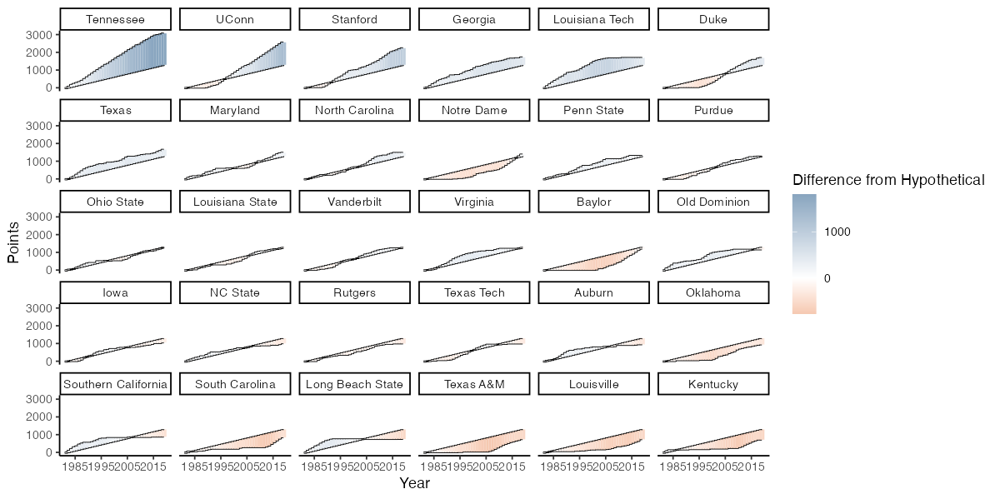
    ```


1. [Pokemon]  This problem gives practice in deriving new variables to improve a
faceted plot. The data below give attack and defense statistics for Pokemon,
along with their types. We will build a visualization to answer the question --
how do the different types of Pokemon vary in their attack and defense
potential?

    ```{r pokemon-read}
    pokemon <- read_csv("https://uwmadison.box.com/shared/static/hf5cmx3ew3ch0v6t0c2x56838er1lt2c.csv")
    ```
        
    a. Derive a new column containing the attack-to-defense ratio, defined as
    $\frac{\text{Attack}}{\text{Defense}}$.
    
    b. For each `type_1` group of Pokemon, compute the median attack-to-defense
    ratio.
    
    c. Plot the attack vs. defense scores for each Pokemon, faceted by `type_1`. Use
    the result of (b) to ensure that the panels are sorted from types with highest
    to lowest attack-to-defense ratio.
    
    d. Propose, but do not implement, a visualization of this dataset that makes use
    of dynamic queries. What questions would the visualization answer? What would be
    the structure of interaction, and how would the display update when the user
    provides a cue?

1. [Kia Thefts] A complex visualization can easily overwhelm an unprepared
audience. If there is no way to simplify the visualization, then one useful
technique is to orient readers with a related but simpler visualization. We will
illustrate this technique by visualizing trends in car thefts, emphasizing the
recent rise in Kia/Hyundai thefts. We will work with the dataset below, which
shows monthly totals for car thefts broken down by whether or not the stolen
cars were Kias/Hyundais (`kia_hyundai`) or not (`others`)

      ```{r kia_read, echo = TRUE}
      kia <- read_csv("https://go.wisc.edu/a0y51y")
      head(kia, 4)
      ```

      a. Before plotting all cities, we will orient the reader using a plot
      focused on Chicago. Describe how you would create an area plot like the
      one below. You **do not need to write R code** but should explain the data
      transformation steps, final format of the transformed data, and aesthetic
      encodings used in the visualization.
      
      ```{r kia_a, echo = FALSE, fig.width = 5, fig.height = 3.5, fig.caption = "An example visualization of car thefts in Chicago.", out.width = "0.45\\textwidth"}
      kia <- kia |>
          pivot_longer(kia_hyundai:others, names_to = "type")

      kia |>
          filter(City == "Chicago") |>
          ggplot() +
          geom_area(aes(Date, value, fill = type)) +
          scale_fill_manual(values = c("#e17878", "#c0c0c0")) +
          scale_x_date(expand = c(0, 0)) +
          scale_y_continuous(expand = c(0, 0)) +
          labs(fill = "Theft Type", y = "Number of Thefts", title = "The Rise in Kia/Hyundai Thefts in Chicago")
      ```

      b. **Write R code** to create a faceted version of the plot that
      shows data for every city. Make sure to sort the cities so that they are not
      simply listed alphabetically. You may assume data formatted according to any
      step from part (a).

      ```{r kia_b, echo = FALSE, fig.width = 7, fig.height = 3.5, fig.caption = "An example visualization of car thefts in 12 cities across the US.", out.width = "0.7\\textwidth"}
      ggplot(kia) +
          geom_area(aes(Date, value, fill = type)) +
          facet_wrap(~ reorder(City, -total)) +
          scale_fill_manual(values = c("#e17878", "#c0c0c0")) +
          scale_x_date(expand = c(0, 0)) +
          scale_y_continuous(expand = c(0, 0)) +
          labs(fill = "Theft Type", y = "Number of Thefts")
      ```

      c. This example shows how the ``simple to complex'' visualization
      technique can help readers understand a faceted plot. Briefly describe how it
      could help with one of the following types of visualizations: ridgelines,
      compound plot, shiny plot with a dropdown selection.

1. [Plot Annotation] This StorytellingWithData
[post](https://www.storytellingwithdata.com/blog/2018/1/22/88-annotated-line-graphs)
highlights 88 community examples of plots that use annotation to call attention
to specific aspects of the data. In this problem, we will discuss a few
examples.

    a. Pick one of the examples and discuss its use of annotation. How does it
    change the way that you read the visualization, compared to if it had no
    annotation at all?

    b. Are there other stylistic decisions the author made that stood out to
    you? What do you think was the intent of that decision? Do you think it was
    effective? Explain your reasoning.
    
    c. Briefly review the [ggtext package](https://wilkelab.org/ggtext/). Could
    it be used to recreate the annotation in your example? Why or why not?

1. [Visualization Narrative] Compare and contrast these two ways of showing
changes in tech company stock prices (Figure \ref{fig:wilkenarrative}), which is taken from Claus Wilke’s data
[visualization book](https://clauswilke.com/dataviz/telling-a-story.html). For
both the left and right hand side approaches, consider: 

    ```{r wilke-narrative, echo = FALSE, out.width = "0.45\\textwidth", echo = FALSE, fig.cap = "\\label{fig:wilkenarrative} Two ways of visualizing the same tech stock trajectories, from Wilke's Fundamentals of Data Visualization book.", fig.show = "hold"}
    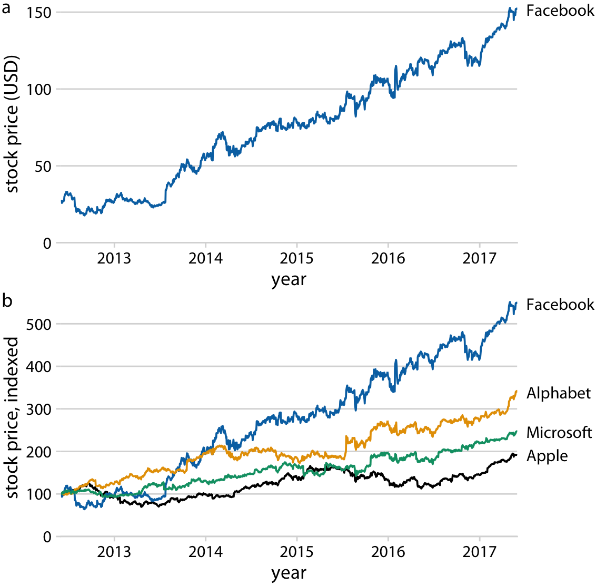
    include_graphics("figure/tech-stocks-diverse-1.png")
    ```

    a. For which audiences is it more vs. less effective?
    b. Which uses more repetitive vs. diverse encodings, and what are the consequences?
    b. Which communicates a clearer story and why?
    c. How do they relate overviews with details?

1. [Melbourne Missingness] Consider the plot of missingness in the Melbourne Homes dataset in Figure 4. Select all the true conclusions.

    * The `Landsize` variable is always missing.
    * The variable with the highest number of missing values is `BuildingArea`. 
    * There are 560 rows where exactly one of `CouncilArea`, `YearBuilt`, or `BuildingArea` are missing.
    * In more than 2/3 of the rows where `BuildingArea` is missing, `YearBuilt` is also missing.
    
    ```{r melbourne-fig, out.width = 400, fig.cap = "Upset plot of missingness in the Melbourne Homes dataset.", echo = FALSE}
    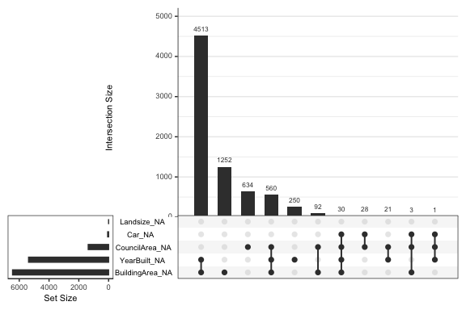
    ```
    
1. Study the visualization at [this link](https://observablehq.com/@d3/collapsible-tree). Its design reflects which of the following visualization techniques? (select all that apply).
    * Faceting
    * Details-on-demand
    * Ridgelines
    * Overview + detail
    * Tidy data
    
1. [Yu-Gi-Oh!] This question asks you to tidy a Yi-Gi-Oh! [dataset](https://uwmadison.box.com/shared/static/asjb29rhu1hrm2zizv0iu7eqqw9mj0ds.csv).
    a. Write code that provides more meaningful attribute and type columns. The result of your transformation should look like [this](https://uwmadison.box.com/shared/static/6akcs5d1khcgxa4blgtcrylq8rl2dx9h.csv).
    b. Count the number of attribute and type combinations. Derive new features that count the fraction of each combination that are on the trading and official card game banlists (Banned trading and official cards have non-NA values in the tcg_ban and ocg_ban columns, respectively). The result of your transformation should look like [this](https://uwmadison.box.com/shared/static/frwm9uhqzx3rnjnh6j6vyt4ypvjwcb89.csv).
    c. Reshape the dataset so that the trading and official card game
    proportions are listed in a single column and the Spell and Trap cards are
    at the top. The result of your transformation should look like [this](https://uwmadison.box.com/shared/static/56mn6kfajqxua6tx4fgpq7r7ixs2zt0o.csv).

1. [Reshaping practice] The following parts ask you to provide R code that
transforms one dataset (I) into another (II).
    a. Regional murder rates: Turn [I](https://uwmadison.box.com/shared/static/h4gau9heqy3uue9rmpq9b55s3kw37zd8.csv) into [II](https://uwmadison.box.com/shared/static/h4gau9heqy3uue9rmpq9b55s3kw37zd8.csv). 
    b. Antiobitics and bacteria. Turn [I](https://uwmadison.box.com/shared/static/bq4afq9kl2zn9qlb89q2rxhrrv73iuil.csv) into [II](https://uwmadison.box.com/shared/static/gmzul7bp78o6kwtutl73hkiyxea4dr21.csv)

1. [Birds Reshaping] Consider the dataset below, which contains the average `Asymmetry` across
several groups of birds. Note that only the first few rows are shown,
    
    ```{r}
      birds <- read_csv("https://raw.githubusercontent.com/krisrs1128/stat479_s22/main/exercises/data/birds.csv") |>
        filter(!is.na(Order))
      
      birds
    ```
        
    a. Provide code to convert the `Order` variable to lower case and
    to compute the mean `Asymmetry` within each `Order`.
        
    ```{r, echo = FALSE}
    birds <- birds |>
      group_by(Order) |>
      summarise(mean_asymmetry = mean(Asymmetry)) |>
      mutate(Order = tolower(Order))
    ```


    b. Provide code needed to generate the plot below. Be as specific as
    possible.
        
    ```{r, echo = FALSE, fig.height = 4, fig.width = 8}
    birds |>
      ggplot() +
      geom_bar(aes(mean_asymmetry, reorder(Order, mean_asymmetry)), width = 1, stat = "identity") +
      labs(x = "Mean Asymmetry", y = "Order") +
      scale_x_continuous(expand = c(0, 0, 0.1, 0)) +
      theme(axis.ticks = element_blank(), panel.grid = element_blank())
    ```

1. [Medals reshaping] Sketch the code needed to transform `medals`,

    ```{r, echo = FALSE}
    medals <- data.frame(
      "country" = c("USA", "Canada"),
      "gold" = c(10, 20),
      "silver" = c(7, 26)
    )
    medals
    ```

    into the form given below,

    ```{r, echo = FALSE}
    medals |>
      pivot_longer(gold:silver, names_to = "medal", values_to = "count")
    ```


1. [Sales summaries] Consider the sales data below.
            
    ```{r sales-data, echo = FALSE}
    sales <- data.frame(
      region =  c('A', 'A', 'A', 'A', 'B', 'B', 'B', 'B'),
      quarter = c('Q1', 'Q2', 'Q3', 'Q4', 'Q1', 'Q2', 'Q3', 'Q4'),
      sales = c(6, 5, 3, 2, 4, 8, 2, 6)
    )
    sales
    ```
    
    a. Provide code to compute the total sales for each quarter, across both regions.
    The result should look like the table below.
      
    ```{r sales-summary, echo = FALSE}
    sales |>
      group_by(quarter) |>
      summarise(total = sum(sales))
    ```
        
    b. Provide code to compute the proportion of each quarter's sales that came
    from each region. The result should look like the table below.
    
    ```{r sales-code, echo = FALSE}
    sales |>
      group_by(quarter) |>
      mutate(total = sum(sales)) |>
      ungroup() |>
      mutate(prop = sales / total) |>
      select(-total)
    ```
    
1. [Bookstore Reshaping] The dataframe called `df` contains the habits of
readers in a hypothetical reading group. The first few rows of `df` are shown
below. The problems below ask you to **write R code** which manipulates `df` to
answer basic questions. For each part, a few example rows of the final output
are given. Each part is independent of the others.

    ```{r, echo = FALSE}
    bookstore_data <- data.frame(
        person_id = rep(501:510, each = 12),
        genre = rep(c("Mystery", "Science Fiction", "History"), times = 40),
        pages_read = sample(100:400, 120, replace = TRUE),
        days_taken = sample(1:14, 120, replace = TRUE),
        rating = sample(1:5, 120, replace = TRUE)
    ) |>
        arrange(person_id, genre) |>
        as_tibble()

    head(bookstore_data, 4)
    ```

    a. How many pages did each person read across all books within each genre?

    ```{r, echo = FALSE}
    bookstore_data |>
        group_by(person_id, genre) |>
        summarise(total_pages = sum(pages_read)) |>
        ungroup() |>
        head(4)
    ```

    b. Create a new column called `pace` that shows how many pages that
    were read per day for that particular reader and book. Sort the rows from
    fastest to slowest pace.

    ```{r, echo = FALSE}
    bookstore_data |>
        group_by(person_id, genre) |>
        mutate(pace = pages_read / days_taken) |>
        arrange(-pace) |>
        ungroup() |>
        head(4)
    ```

    c. What was each reader's average rating for each genre? Each row
    should be a reader and the columns should list the genre names.

    ```{r, echo = FALSE}
    bookstore_data |>
        group_by(person_id, genre) |>
        summarise(rating = mean(rating)) |>
        pivot_wider(names_from = genre, values_from = rating) |>
        ungroup() |>
        head(4)
    ```
    
1. [Interactive Penguins] This problem visualizes the Penguins [dataset](https://uwmadison.box.com/shared/static/ijh7iipc9ect1jf0z8qa2n3j7dgem1gh.csv) interactively.
    a. Create two static scatterplots: one of of bill length vs. depth and
    another of flipper length vs. body mass.
    b. Create selection menus that can be used to highlight the island that the
    penguin came from, along with its gender.
    c. Create selection brushes that can be used to link the two plots together.
    That is, highlighting points in a brush for one view should highlight the
    corresponding penguins in the other.
    d. Provide one takeaway from the interactive visualization that is not
    possible to make using the original static version.
    
1. [Olympics Derivations] This problem gives some practice with deriving and
visualizing new variables.

    a. Create new columns for the city and country of birth for each athlete in the
    London 2012 Olympics
    [dataset](https://uwmadison.box.com/s/rzw8h2x6dp5693gdbpgxaf2koqijo12l).
    b. Compute the standard deviation of athlete age within each sport. Which sport
    has widest SD in age?
    c. Make a visualization of sports against participant age. Sort sports by
    age variance.
    
    ```{r olympics-data}
    olympics <- read_csv("https://uwmadison.box.com/shared/static/rzw8h2x6dp5693gdbpgxaf2koqijo12l.csv")
    ```
    
1. [NYC Flights] The following questions refer to the NYC flights dataset. The
first few lines are printed below.

    ```{r nyc-flights}
    library(nycflights13)
    flights |> select(carrier, air_time, distance)
    ```
    
    a. Provide code to create a new column giving the average speed of
    the flight: $\texttt{speed} := \frac{\texttt{distance}}{\texttt{air\_time}}$.
    
    b. Is there a large variation in flight speed across carriers? Design and a
    visualization to answer this question and comment on your findings.
    
1. [Gapminder Queries] The example visualization below comes from the course
notes. It is supposed to help readers compare country populations.

    ```{r gapminder-query, out.width = 200, fig.align = "center"}
    gapminder <- read_csv("https://uwmadison.box.com/shared/static/dyz0qohqvgake2ghm4ngupbltkzpqb7t.csv", col_types = cols()) |> 
      mutate(cluster = as.factor(cluster))

    print(head(gapminder, 3))
    ggplot(filter(gapminder, year == 2000)) +
     geom_col(aes(country, pop))
    ```
  
    a. Give two distinct examples of specific user queries related to the
    overall `gapminder` dataset printed above that are difficult (or impossible)
    to make with the current display.
      
    b. Implement an alternative visualization that addresses the issues you
    raised in part (a). Why does it help?
    
1. [Code Diary] In this exercise, you will write a reflection on your experience of writing code over the next 48 hours. Prepare brief answers to the following questions:

    a. What was your programming environment/workflow? For example, were you running code in an Rmarkdown notebook with Rstudio, or switching between a terminal and a code editor, …?
    b. What techniques did you use to plan your code? For example, did you write pseudocode, brainstorm ideas with a partner, or draw any guiding diagrams?
    c. What kinds of bugs did you encounter? What steps did you take to resolve them?
    d. If you were starting the programming task again, would you do anything differently?

    We encourage you to share some problem solving techniques with others in the
    class and see whether others have approaches you might be able to borrow.

1. [Birds Code Review] This exercise asks you to conduct an imaginary code
review. These are often used in data science teams to,
    
    * Catch potential bugs
    * Make sure code is transparent to others
    * Create a shared knowledge base
    
    It is important to be perceptive but friendly.
    
    * Can the code be made more compact?
    * Are there visual design choices / encodings that could be refined?
    * If your colleague did something well, say so!

    They can also be a great way to learn new functions and programming patterns.
    Unlike standard code-reviews, I ask you to give an example implementing your
    recommendations.
        
    Specifically, in this review, suppose you are working with a scientific
    colleague on your study of bird egg properties and their evolutionary
    implications. They have written the code below. Provide your code review as a
    set of bullet points, and include code giving an example implementation of your
    ideas. The original data are from [this study](https://www.science.org/doi/10.1126/science.aaj1945).
      
    ```{r birds-ggrepel, fig.cap = "An example figure for code review.", fig.height = 4, fig.width = 8}
    library(ggrepel)
    
    birds <- read_csv("https://raw.githubusercontent.com/krisrs1128/stat479_s22/main/exercises/data/birds.csv") |>
      separate(Species, c("genus", "species2"))
    
    bird_summaries <- birds |>
      group_by(genus) |>
      summarise(
        across(
          c("Asymmetry", "Ellipticity", "AvgLength (cm)", 
            "Number of images", "Number of eggs"), 
          list(MEAN = mean, STANDARD_DEVIATION = sd))) |>
      arrange(-Ellipticity_MEAN)
    
    ggplot(bird_summaries) +
      geom_point(aes(Asymmetry_MEAN, Ellipticity_MEAN)) +
      geom_text_repel(aes(Asymmetry_MEAN, Ellipticity_MEAN, label = genus))
    ```
  
1. [Soccer Code Review] This exercise asks you to conduct an imaginary code
review. These are often used in data science teams to,
    
    * Catch potential bugs
    * Make sure code is transparent to others
    * Create a shared knowledge base
    
    It is important to be perceptive but friendly.
    * Can the code be made more compact?
    * Are there visual design choices / encodings that could be refined?
    * If your colleague did something well, say so!
    
    They can also be a great way to learn new functions and programming patterns.
    Unlike standard code-reviews, I ask you to give an example implementing your
    recommendations.
      
    Specifically, in this review, suppose you are working on a sports blog, and
    your colleague is soccer interested in which teams won the most games in a
    few European leagues over the last few years. They have written the code
    below. Provide your code review as a set of bullet points, and include code
    giving an example implementation of your ideas. The original data are from
    [this
    link](https://www.kaggle.com/slehkyi/extended-football-stats-for-european-leagues-xg).
    
    ```{r win-proportions, fig.cap = "An example figure for code review.", fig.width = 16, fig.height = 4}
    win_props <- read_csv("https://raw.githubusercontent.com/krisrs1128/stat479_s22/main/exercises/data/understat_per_game.csv") |>
      group_by(team, year) |>
      summarise(n_games = n(), wins = sum(wins) / n_games)
    
    best_teams <- win_props |>
      ungroup() |>
      slice_max(wins, prop = 0.2) |>
      pull(team)
    
    win_props |>
      filter(team %in% best_teams) |>
      ggplot() +
      geom_point(aes(year, team, size = n_games, alpha = wins))
    ```
    
1. [Poisson Guidance] This exercises asks you to imagine working with a student
who is just beginning to learn ggplot2 and needs help constructing a plot.
Specifically, the student would like to create a barplot of Poisson distribution
mass functions for a few choices of $\lambda$, like the figure displayed below.
The following code is their initial attempt.

    ```{r poisson, eval = FALSE}
    mylambda1 <- function(x) dpois(x, lambda = 2)
    mylambda2 <- function(x) dpois(x, lambda = 4)
    mylambda3 <- function(x) dpois(x, lambda = 16)
    
    ranges1 <- data.frame(x=c(0,25), PMF = factor(1))
    ranges2 <- data.frame(x=c(0,25), PMF = factor(2))
    range3 <- data.frame(x=c(0,25), PMF = factor(3))
    
    ggplot(NULL, aes(x=x, colour=PMF)) +
       stat_function(data = ranges1, fun = mylambda1, size = 1.5) +
       stat_function(data = ranges2, fun = mylambda2, size = 1.5) +
       stat_function(data = range3, fun = mylambda3, size = 1.5) +
    
      geom_bar()+
    
      theme_bw(base_size = 14) +
       scale_colour_manual("Parameters", guide="legend", 
                      labels = c("2", "4", "16"), 
                      values= c("red", "green"))
      
    ```
    
    a. Provide code implementing the figure that the student is interested in.
    b. From the attempted solution, what conceptual difficulties do you think
    the student encountered?
    c. How might you have helped the student resolve the challenges evident in
    part(b)? Briefly explain at least one concept that would improve their
    knowledge of either ggplot2 or effective code style.
    
    ```{r poisson-vis, echo = FALSE, fig.width = 8, fig.height = 3.5, out.width = 400}
    theme_set(theme_bw())
    poisson_data <- tibble(
      x = rep(seq_len(25), 3),
      lambda = rep(c(2, 4, 16), each = 25)
    )
    
    ggplot(poisson_data) +
      geom_col(aes(x, dpois(x, lambda), fill = factor(lambda)), position = "identity", alpha = 0.8) +
      scale_fill_brewer(palette = "Set2") +
      labs(x = "x", y = "Poisson Density", fill = expression(lambda))
    ```
    
1. [Pair Code Review] In this exercise, we will share a code review with a
partner in the class. Reading others’ code is a great way to learn new
programming or documentation techniques. This exercise also gives practice in
code review, which is ubiquitous in software engineering industry.

    a. Pick a partner who you will work through this exercise with, and find an example of code that you wrote for this course that you would like your partner to review.
    b. Individually, review one another’s code. Are there alternative ways of writing the program and documentation that might make it more efficient or readable? Were there elements of the approach that you thought were especially clear or creative?
    c. If a visualization is generated, critique the figure. How easy is it to make the comparisons of interest? Are there details that could be refined?
    d. Once you are both done, exchange comments and submit a one paragraph summary of your discussion.

1. [Multiple Weather Variables] In this problem, we will construct a compound
figure to simultaneously visualize several weather variables in one display. The
block below reads a dataset that includes temperature, precipitation, and wind
measurements for New York City and Seattle over the course of several years. It
then then averages each variable for each day (1 - 365) in the year.

    ```{r weather-data}
    weather <- read_csv("https://raw.githubusercontent.com/krisrs1128/stat479_s22/main/exercises/data/weather.csv") |>
      mutate(day_in_year = lubridate::yday(date)) |>
      group_by(location, day_in_year) |>
      summarise(across(precipitation:wind, mean))
    ```
  
    a. Construct three base `ggplot2` plots based on the variables that are
    provided. For example, you may construct a line plot (`geom_line`) of
    average precipitation, a histogram (`geom_histogram`) of per-city
    windspeeds, or a ribbon plot (`geom_ribbon`) of temperature ranges over
    time. Make sure to display at least two weather variables from among the
    four that are provided.
    b. Design a compound figure based on the base plots in part (a). Why did you
    lay out the subplots in the locations that you did? Ensure that consistent
    visual encodings are used throughout, that legends are collected, and that
    clear but unobtrusive annotation is provided.
    c. Discuss, but do not implement, an alternative compound figure for the
    same data, with either different base plots or overall layout (or both). For
    which visual comparisons are either designs best suited?

1. [Pokemon View Composition] This problem revisits the pokemon dataset and asks
you to combine complementary visualizations into a single display.

    a. What is the difference between faceting and compound figures?

    b. The figure below shows three views of the pokemon dataset.  Provide code
    to recreate it. You do not need to customize the axis titles or themes but
    should include the panel titles (i), (ii), and (iii).
    ```{r}
pokemon <- read_csv("https://uwmadison.box.com/shared/static/hf5cmx3ew3ch0v6t0c2x56838er1lt2c.csv")
head(pokemon, 3)
    ```

    ```{r pokemon_faceting, echo = FALSE, fig.width = 6.5, fig.height = 4, fig.align="center", out.width = "0.7\\textwidth"}
library(patchwork)
p1 <- count(pokemon, type_1) |>
  ggplot() +
  geom_col(aes(reorder(type_1, -n), n)) +
  scale_y_continuous(expand = c(0, 0, 0.1, 0)) +
  labs(x = "Type 1 Category", y = "Frequency", title = "(i)") +
  theme(
    title = element_text(size = 12),
    axis.text.x = element_text(size = 7)
  )
p2 <- ggplot(pokemon) +
  geom_histogram(aes(HP), bins = 30) +
  scale_y_continuous(expand = c(0, 0, 0.1, 0)) +
  labs(x = "HP", y = "Frequency", title = "(ii)") +
  theme(
    title = element_text(size = 12)
  )
p3 <- ggplot(pokemon) +
  geom_point(aes(Attack, Defense)) +
  labs(title = "(iii)") +
  theme(
    title = element_text(size = 12)
  )

p1 / (p2 + p3)
    ```

    c. List one consideration that can (in general) improve readability
    for either compound or faceted figures.
    
1. [Faceting rules-of-thumb] Circle all the true statements for compound and
faceted figures.

    a. Whenever possible, each panel in a faceted plot should be made to have its
    own $y$-axis scale.
    
    b. When using the `patchwork` package, two plots `p1` and `p2` can be placed
    side-by-side using `p1 / p2`.
    
    c. When using the `patchwork` package, the `plot_layout` function can be used
    to collect legends.
    
    d. Relative to interactively filtered displays, faceted plots are less taxing
    on the reader's memory.
    
1. [Ikea Faceting] The code below generates a histogram of prices for a subset of items sold at
Ikea, a furniture outlet.
    
    ```{r ikea, fig.height = 1.5, fig.width = 6}
    ikea <- read_csv("https://uwmadison.box.com/shared/static/iat31h1wjg7abhd2889cput7k264bdzd.csv") |>
      filter(category %in% c("Tables", "Bookcases", "Beds", "Cabinets", "Sofas", "Wardrobes"))
    ggplot(ikea) +
      geom_histogram(aes(log(price)))
    ```
    
    The four plots (i - iv) are generated by faceting this base plot by furniture
    category (the variable `category`). On the blank lines below, put the number of
    the plot that matches the corresponding faceting command, or leave the line
    empty if the corresponding plot does not appear.
    
    __ a. `facet_grid(category ~ .)`
    
    __ b. `facet_wrap(~ category)`
    
    __ c. `facet_wrap(~ category, scales = "free_y")`
    
    __ d. `facet_wrap(~ category, axes = "separate")`
    
    __ e. `facet_wrap(~ reorder(category, price))`
    
    ```{r ikea-vis, echo = FALSE, fig.height = 9, fig.width = 12}
    p <- ggplot(ikea) +
      geom_histogram(aes(log(price)), bins = 14)
    
    ikea_list <- list()
    ikea_list[[1]] <- p + facet_wrap(~ category, ncol = 4) + ggtitle("(i)")
    ikea_list[[2]] <- p + facet_grid(category ~ .) +
      theme(strip.text.y = element_text(angle = 0)) +
      ggtitle("(ii)")
    ikea_list[[3]] <- p + facet_wrap(~ category, scales = "free_y", ncol = 4) +
      ggtitle("(iii)")
    ikea_list[[4]] <- p + facet_wrap(~ reorder(category, price), ncol = 4) +
      ggtitle("(iv)")
    
    library(patchwork)
    (ikea_list[[1]] + ikea_list[[2]]) /
    (ikea_list[[3]] + ikea_list[[4]])
    ```
    
1. [Gene Expression Faceting ] In this problem, we will experiment with several
approaches to visualizing a dataset of gene expression over time. Each row below
contains the expression level for one gene in one sample at a single timepoint.
    ```{r genes-data}
    genes <- read_csv("https://uwmadison.box.com/shared/static/dwzchdtfca33r0f6i055k2d0939onnlv.csv")
    head(genes, 3)
    ```

    a. Provide code to create the small multiples plot below. Note that the points
have been made semi-transparent and that the $y$-axis is a transformation of the
original `value` column.
    ```{r genes-fig, echo = FALSE, out.width = "0.8\\textwidth", fig.height = 4, fig.width = 9}
    ggplot(genes) +
      geom_point(aes(time, log(1 + value)), alpha = 0.2, size = 0.8) +
      facet_wrap(~ gene, nrow = 2) +
      labs(x = "Time", y = expression(log(1 + value))) +
      theme(
        strip.text = element_text(size = 16),
        axis.text = element_text(size = 12),
        axis.title = element_text(size = 16)
      )
    ```
    b. In your own words, describe one strength and one weakness of using small
    multiples.
    c. Suppose we instead wanted a heatmap of expression values with genes along
    rows and timepoint along columns. Provide code to draw this, starting from
    the `gene_groups` dataset defined below. Ensure that genes are sorted from
    most to least abundant, and also that expression values are shown on a
    $\log\left(1 + x\right)$ scale.
    ```{r genes-groups}
    gene_groups <- genes |>
      group_by(gene, rounded_time = round(time, 2)) |>
      summarise(mean_value = mean(value))
    head(gene_groups, 3)
    ```
    ```{r genes-groups-vis, echo = FALSE, out.width = "0.7\\textwidth", fig.height = 3, fig.width = 8}
    ggplot(gene_groups) +
      geom_tile(aes(rounded_time, reorder(gene, mean_value), col = log(1 + mean_value), fill = log(1 + mean_value))) +
      scale_x_continuous(expand = c(0, 0)) +
      scale_y_discrete(expand = c(0, 0)) +
      scale_fill_distiller(direction = 1) +
      scale_color_distiller(direction = 1) +
      labs(
        x = "Time (Rounded)", 
        y = "Gene (Sorted by Expression)",
        fill = "log(1 + mean_value)"
      ) +
      theme(
        axis.text = element_text(size = 12),
        axis.title = element_text(size = 14)
      )
    ```
    d. Imagine that we trained a model that generates a smooth curve over time
    for each gene. It is stored in the `fitted_values` data below. How can you
    modify your solution to (a) to overlay this? Provide example code and
    discuss how this relates to the concept of a "grammar of graphics."
    ```{r fitted-genes}
    fitted_values <- read_csv("https://go.wisc.edu/x678hu")
    head(fitted_values, 3)
    ```
    ```{r fitted-genes-plot, echo = FALSE, out.width = "0.8\\textwidth", fig.height = 4, fig.width = 9}
    ggplot(genes, aes(time, log(1 + value))) +
      geom_point(alpha = 0.2, size = 0.8) +
      geom_line(data = fitted_values, aes(y = log(1 + mu)), linewidth = 2, col = "darkred") +
      facet_wrap(~ gene, nrow = 2) +
      theme(
        strip.text = element_text(size = 16),
        axis.text = element_text(size = 12),
        axis.title = element_text(size = 16)
      )
    ```

1. [Antibiotics Comparison] Below, we provide three approaches to visualizing
species abundance over time in an antibiotics experiment. The first few rows of
the data, stored in a data frame called `df`, are shown below.

    ```{r antibiotics-data, echo = FALSE}
    antibiotic <- read_csv("https://uwmadison.box.com/shared/static/5jmd9pku62291ek20lioevsw1c588ahx.csv") |>
        rename(person = ind, smooth_value = svalue) |>
        dplyr::select(person, species, sample, antibiotic, time, value, smooth_value)
    head(filter(antibiotic, person == "E"), 4)
    ```

    In this problem, we ask you to describe:

    1. One type of visual comparison for which the visualization is well-suited.
    2. One type of visual comparison for which the visualization is poorly-suited.

    In each part, make sure to explain your reasoning.

    a. Approach 1
    ```{r antibiotics-vis-1, echo = FALSE, out.width = "0.55\\textwidth"}
    ggplot(antibiotic, aes(time)) +
        geom_line(aes(y = smooth_value), size = 1.2) +
        geom_point(aes(y = value, col = antibiotic), size = 0.9) +
        facet_grid(species ~ person, scale = "free_y") +
        scale_color_brewer(palette = "Set2") +
        guides(color = guide_legend(override.aes = list(size = 4))) +
        theme(
            strip.text.y = element_text(angle = 0, size = 12),
            axis.text.y = element_text(size = 8),
            axis.title = element_text(size = 12),
            legend.title = element_text(size = 14),
            legend.text = element_text(size = 12),
        )
    ```

    b. Approach 2
    ```{r antibiotics-vis-2, echo = FALSE, out.width = "0.55\\textwidth"}
    ggplot(antibiotic) +
        geom_tile(aes(time, person, fill = value)) +
        scale_x_continuous(expand = c(0, 0)) +
        scale_fill_distiller(direction = 1) +
        facet_grid(species ~ .) +
        theme(
            strip.text.y = element_text(angle = 0, size = 12),
            axis.text.y = element_text(size = 12),
            axis.title = element_text(size = 14),
            legend.title = element_text(size = 14),
            legend.text = element_text(size = 8),
        )
    ```

    c. Approach 3
    ```{r antibiotics-vis-3, echo = FALSE, out.width = "0.55\\textwidth"}
    ggplot(antibiotic) +
        geom_line(aes(time, smooth_value, col = species, group = interaction(species, person)), linewidth = 2) +
        facet_grid(person ~ .) +
        guides(color = guide_legend(override.aes = list(linewidth = 2))) +
        scale_color_brewer(palette = "Set2")
    ```

    d. **Write R code** that could be used to make one of the three
    visualizations above.

1. [Visualization and LLMs] This course generally avoids using large language
models (LLMs) when teaching new material, because they can sometimes be a
distraction (e.g., hallucinating incorrect answers). In practice, though, these
models can help improve programming efficiency. They have also been the source
of concern for many engineers, who wonder whether the models will replace them.
This exercise asks you to reflect on ways to use LLMs when designing and
implementing visualizations.

    a. Try solving any past course demo using an LLM. Reflect on the experience.
    b. How do you think you might use language models when making visualizations?
    Or, if you already use them, what have you found to be best practices?
    c. If programming is not just about writing code, then what is it about?

1. [Name app bugs] The following versions of the Name app all have errors that
will raise an error if you try running them in R. For each part, isolate the
line(s) that contain the bug. Provide a conceptual explanation for why the error
occurred and how they could be prevented more generally.

    a. Program (a).
        
    ```{r shiny-name-bugs, eval = FALSE}
    library(shiny)
    
    ui <- fluidPage(
      titlePanel("Hello!"),
      textInput("name", "Enter your name"),
      textOutput("printed_name")
    )
    
    server <- function(input, output) {
      input$name <- paste0("Welcome to shiny, ", input$name, "!")
      output$printed_names <- renderText({ input$name })
    }
    
    app <- shinyApp(ui, server)
    ```
    
    b. Program (b).
        
    ```{r, eval = FALSE}
    library(shiny)
    
    ui <- fluidPage(
      titlePanel("Hello!"),
      textInput("name", "Enter your name"),
      textOutput("printed_name")
    )
    
    server <- function(input, output) {
      output$printed_names <- renderText({
        paste0("Welcome to shiny, ", input$name, "!")
      })
    }
    
    app <- shinyApp(ui, server)
    ```
    
    c. Program (c).
        
    ```{r, eval = FALSE}
    library(shiny)
    
    ui <- fluidPage(
      titlePanel("Hello!"),
      textInput("name", "Enter your name"),
      textOutput("printed_name")
    )
    
    server <- function(input, output) {
      output$printed_name <- renderDataTable({
        paste0("Welcome to shiny, ", input$name, "!")
      })
    }
    
    app <- shinyApp(ui, server)
    ```
    
    d. Program (d).
        
    ```{r, eval = FALSE}
    library(shiny)
    
    ui <- fluidPage(
      titlePanel("Hello!")
      textInput("name", "Enter your name")
      textOutput("printed_name")
    )
    
    server <- function(input, output) {
      output$printed_name <- renderText({
        paste0("Welcome to shiny, ", input$name, "!")
      })
    }
    
    app <- shinyApp(ui, server)
    ```
    
    
1. [More Shiny Bugs] None of the Shiny apps below work in the way that their
authors intended. For each part, isolate the line(s) that contain the bug.
Provide an alternative working implementation together with a conceptual
explanation for why the error occurred.

    a. Program (a). Goal: When the user inputs a number, the program reports
    whether or not that number is larger than 10.

    ```{r, eval = FALSE}
    ui <- fluidPage(
      numericInput("input_num", "Enter a number:", value = 5),
      textOutput("output_text")
    )
    
    server <- function(input, output) {
      output$output_text <- renderText({
        ifelse(input_num > 10, "Number is greater than 10", "Number is less than or equal to 10")
      })
    }
    
    shinyApp(ui, server)
    ```
    
    b. Program (b). Goal: When the user clicks a button labeled "Increment
    Counter", then the text next to the button should increase by one.
  
    ```{r, eval = FALSE}
    ui <- fluidPage(
      actionButton("increment", "Increment Counter"),
      verbatimTextOutput("counter_text")
    )
    
    server <- function(input, output) {
      counter <- reactiveVal(0)
      
      observe({
        counter <- counter + 1
      })
      
      output$counter_text <- renderPrint(counter)
    }
    
    shinyApp(ui, server)
    ```
    
    c. Program (c). Goal: When the user selects a variable from the selection
    menu, we will show a scatterplot of `mpg` against the selected variable in
    the `mtcars` dataset.
    
    ```{r, eval = FALSE}
    library(ggplot2)
    
    ui <- fluidPage(
      selectInput("plot_type", "Select plot type:", choices = c("cyl", "disp", "hp", "wt")),
      plotOutput("plot")
    )
    
    server <- function(input, output) {
      cur_data <- mtcars[, c("mpg", input$plot_type)]
      output$plot <- renderPlot({
        ggplot(cur_data, aes(mpg, .data[[y_var]])) +
          geom_point()
      })
    }
    
    shinyApp(ui, server)
    ```
    
    d. Program (d). Goal: When the user enters numbers $x$ and $y$, the program
    will print $f\left(x, y\right) ^ 2$ and $f\left(x, y\right) ^ 3$. We wanted
    to implement this without computing $f\left(x, y\right)$ twice, because this
    operation is time consuming.
      
    ```{r, eval = FALSE}
    ui <- fluidPage(
      numericInput("x", "Enter x", value = 0),
      numericInput("y", "Enter y", value = 0),
      textOutput("output1"),
      textOutput("output2")
    )
    
    f <- function(x, y) {
      Sys.sleep(4)
      sqrt(x ^ 2 + y ^ 2)
    }
    
    server <- function(input, output) {
      f_xy <- f(input$x, input$y)
      
      output$output1 <- renderText({
        paste("f(x, y) ^ 2:", total ^ 2)
      })
      
      output$output2 <- renderText({
        paste("f(x, y) ^ 3:", total ^ 3)
      })
    }
    
    shinyApp(ui, server)
    ```

1. [UI Options] Look into the Shiny and shinyWidgets documentation to determine
which UI functions can be used to generate the types of inputs described below.
Example figures are also shown. Provide a minimal app with similar input
functionality (just leave the server empty).

    a. An input to select a date range.
    
    ```{r, echo = FALSE}
    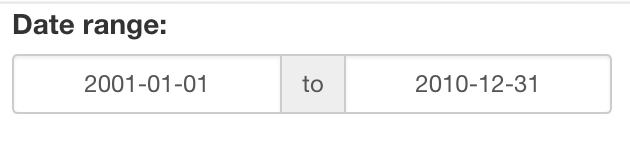
    ```
    
    b. A yes / no toggle that uses an icon for the options.
    
    ```{r, echo = FALSE}
    
    ```
    
    c. A slider that can be used to select a range of values.
    
    ```{r, echo = FALSE}
    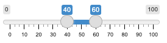
    ```

1. [Improving an app] Make the following apps more concise, modular, and
readable by using reactive expressions to capture duplicated computation and /
or externalizing complex computations into functions which are defined outside
of the server.

    a. Program (a)
    
    ```{r, eval = FALSE}
    library(shiny)
    
    ui <- fluidPage(
      titlePanel("Calculator"),
      numericInput("x", "Enter the value of x", 0),
      textOutput("f1"),
      textOutput("f2"),
      textOutput("f3")
    )
    
    server <- function(input, output) {
      output$f1 <- renderText({ 3 * input$x ^ 2 + 3})
      output$f2 <- renderText({ sqrt(3 * input$x ^ 2 + 3) - 5})
      output$f3 <- renderText({ 30 * input$x ^ 2 + 30})
    }
        
    shinyApp(ui, server)
    ```
    
    b. Program (b)
        
    ```{r, eval = FALSE}
    penguins <- read_csv("https://uwmadison.box.com/shared/static/ijh7iipc9ect1jf0z8qa2n3j7dgem1gh.csv")
    islands <- unique(penguins$island)
    species <- unique(penguins$species)
    
    ui <- fluidPage(
      titlePanel("Penguins Plot"),
      selectInput("species", "Species", species, multiple = TRUE),
      selectInput("island", "Island", islands, multiple = TRUE),
      selectInput("var1", "First Variable", colnames(penguins)[3:6]),
      selectInput("var2", "Second Variable", colnames(penguins)[3:6]),
      plotOutput("scatterplot"),
      plotOutput("histogram1"),
      plotOutput("histogram2"),
    )
    
    server <- function(input, output) {
      output$scatterplot <- renderPlot({
        current_data <- penguins |>
          filter(
            island %in% input$island,
            species %in% input$species
          )
        ggplot(current_data) +
          geom_point(aes(.data[[input$var1]], .data[[input$var2]]))
      })
      
      output$histogram1 <- renderPlot({
        current_data <- penguins |>
          filter(
            island %in% input$island,
            species %in% input$species
          )
        ggplot(current_data) +
          geom_histogram(aes(.data[[input$var1]]))
      })
      
      output$histogram2 <- renderPlot({
        current_data <- penguins |>
          filter(
            island %in% input$island,
            species %in% input$species
          )
        ggplot(current_data) +
          geom_histogram(aes(.data[[input$var2]]))
      })
      
    }
    
    shinyApp(ui, server)
    ```

1. [Switching Datasets] Provide the reactivity graph associated with the shiny
app below, which prints the summary and first few rows of one of three datasets,
depending on the user's selection.
    
    ```{r}
    library(shiny)
    ui <- fluidPage(
        textInput("caption", "Caption:", value = "Data Summary"),
        selectInput("dataset", "Dataset:", choices = c("rock", "pressure", "cars")),
        numericInput("obs", "Number of observations:", value = 10),
        verbatimTextOutput("summary"),
        dataTableOutput("view")
    )

    server <- function(input, output) {
      datasetInput <- reactive({
        if (input$dataset == "rock") {
          return (rock)
        } else if (input$dataset == "pressure") {
          return (pressure)
        }
        cars
      })

      output$caption <- renderText({ input$caption })
      output$summary <- renderPrint({
        dataset <- datasetInput()
        summary(dataset)
      })

      output$view <- renderDataTable({ head(datasetInput(), n = input$obs)})
    }
    ```


1. [Reactivity Graphs] Manually sketch out the reactivity graph associated with
any of the "Shiny Demos" in the official [Shiny
Gallery](https://shiny.rstudio.com/gallery/#demos). Make sure to distinguish
between input, output, observe, and reactive nodes. For a challenge, try the
same exercise for one of the apps in the Shiny User Showcase. _Note: In many cases, the UI and server functions have been split into two files, `ui.R` and `server.R`. The code can nonetheless be read as if the functions were in a single `app.R` file._

1. [Wildfires Interactive II] The following code creates an interactive Shiny app
that provides a histogram that can be brushed to zoom into selected years in the
California fires dataset.  A screenshot of the final visualization is shown
below. Brushing over certain years in the histogram highlights the corresponding
fires in the dotplot. The first few rows of the dataset are also shown.

    a. In your own words, explain the concept of a graphical query.  Give an
    example of when it would be useful.

    ```{r, echo = FALSE, fig.align = "center", out.width = 400}
    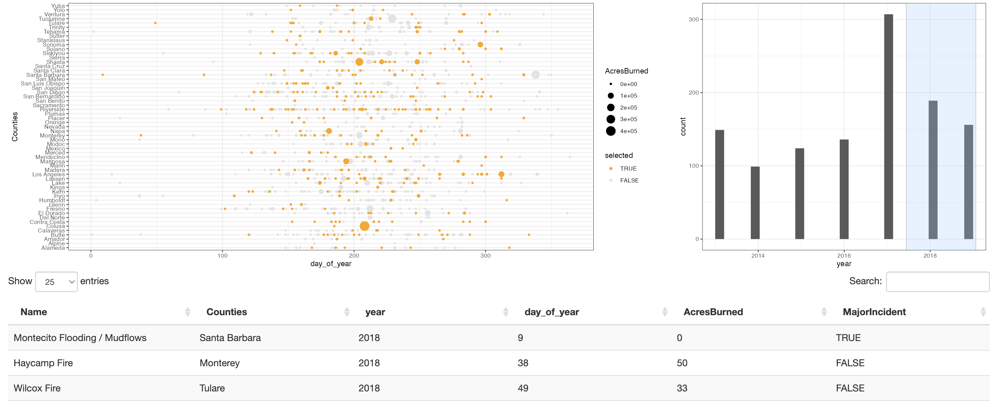
    ```

    ```{r}
    fires <- read_csv("https://uwmadison.box.com/shared/static/k5vvekf1bhh9e16qb9s66owygc70t7dm.csv") |>
      dplyr::select(Name, Counties, year, day_of_year, AcresBurned, MajorIncident)
    head(fires, 3)
    ```


    b. The starter code below sets up the UI, but doesn't support brushing.
    Modify the UI so that years can be brushed as shown in the screenshot.

    ```{r, eval = FALSE}
    ui <- fluidPage(
    fluidRow(
        column(8, plotOutput("dotplot")),
        column(4, plotOutput("histogram"))
    ),
    dataTableOutput("table")
    )
    ```

    c. The starter code below sets up the server. Describe how to modify the code so
    that it updates both the dotplot and the table to reflect the currently brushed
    years. Be as specific as possible. The second argument of `dotplot` is a vector
    of `TRUE` or `FALSE` specifying whether a given row of fires should be
    highlighted. For reference, the function is given at the end of the exam.
    ```{r, eval = FALSE}
    server <- function(input, output) {
    output$dotplot <- renderPlot(dotplot(fires, # ??
    output$histogram <- renderPlot(year_histogram(fires))
    output$table <- renderDataTable( # ??
    }
    ```
    
    d. Sketch the reactivity graph of your final application. Make sure
    to distinguish node types.

1. [Olympics Interactive App] The code below sets up a Shiny app for
interactively visualizing athlete weight and heights in the 2012 London
Olympics. We would like to have an interactive scatterplot of `Weight` vs.
`Height, cm` that updates which points (athletes) are highlighted depending on
which sports have been selected by a dropdown menu. Code for generating the
scatterplot is provided in the function `scatterplot`.
    
    ```{r}
    library(shiny)
    library(tidyverse)
    olympics <- read_csv("https://uwmadison.box.com/shared/static/rzw8h2x6dp5693gdbpgxaf2koqijo12l.csv")
    
    #' Scatterplot with highlighted points
    #' 
    #' Assumes a column in df called "selected" saying whether points should be
    #' larger / darker
    scatterplot <- function(df) {
      ggplot(df) +
        geom_point(
          aes(Weight, `Height, cm`, 
              alpha = as.numeric(selected),
              size = as.numeric(selected))
          ) +
        scale_alpha(range = c(0.05, .8)) +
        scale_size(range = c(0.1, 1))
    }
    
    ui <- fluidPage(
      selectInput("dropdown", "Select a Sport", choices = unique(olympics$Sport), multiple = TRUE),
      plotOutput("scatterplot")
    )
    
    server <- function(input, output) {
      # fill this in...
    }
    ```
    
    a. Provide server code which would allow the scatterplot to update
    the highlighted athletes depending on the currently selected sports.
    
    b. We have been asked to also print a table of the selected athletes.
    Assume the UI has the form,
        
    ```{r}
    ui <- fluidPage(
      selectInput("dropdown", "Select a Sport", choices = unique(olympics$Sport), multiple = TRUE),
      plotOutput("scatterplot"),
      dataTableOutput("table") 
    )
    ```
    
    Describe changes to your solution to (a) to meet the new requirements. How
    would you minimize code duplication? Be as specific as possible.
    
1. [NYC Rentals] In this problem, we'll create a visualization to dynamically query a
[dataset](https://uwmadison.box.com/shared/static/zi72ugnpku714rbqo2og9tv2yib5xped.csv)
of Airbnb rentals in Manhattan in 2019. The steps below guide you through the
process of building this visualization.
    
    a. Make a scatterplot of locations (Longitude vs. Latitude) for all the rentals,
    colored in by `room_type`.
    
    b. Design a plot and a dynamic query so that clicking or brushing on the
    plot updates the points that are highlighted in the scatterplot in (a). For
    example, you may query a histogram of prices to focus on neighborhoods that
    are more or less affordable.
    
    c. Implement the reverse graphical query. That is, allow the user to update
    the plot in (b) by brushing over the scatterplot in (a).
    
    d. Comment on the resulting visualization(s). If you had a friend who was
    interested in renting an Airbnb in NYC, what would you tell them?
    
1. [NYC Rentals Alternative] In this problem, we will use Shiny to visualize the
NYC AirBnB Rental Prices dataset. Each row in this dataset is one rental.

    ```{r}
    rentals <- read_csv("https://uwmadison.box.com/shared/static/zi72ugnpku714rbqo2og9tv2yib5xped.csv") |>
      dplyr::select(id, room_type, price, latitude, longitude) |>
      mutate(log_price = log(price, 10))
    head(rentals, 3)
    ```

    Our Shiny app is defined in the code below. 

    ```{r, eval = FALSE}
    scatterplot <- function(df) {
      ggplot(df) +
        geom_point(aes(longitude, latitude, col = room_type)) +
        scale_color_brewer(palette = "Set2") +
        coord_fixed()
    }

    ui <- fluidPage(
      sliderInput("log_price", "Log(Price)", min = 1, max = 4, value = c(1, 4), step = 0.01),
      selectInput("room_type", "Room Type", choices = unique(rentals$room_type), multiple = TRUE),
      plotOutput("scatterplot"),
      dataTableOutput("table")
    )
    
    server <- function(input, output) {
      current_data <- reactive({
        rentals |>
          filter(
            log_price >= input$log_price[1], 
            log_price <= input$log_price[2],
            room_type %in% input$room_type
          )
      })
      
      output$scatterplot <- renderPlot(scatterplot(current_data()))
      output$table <- renderDataTable(current_data())
    }
    
    shinyApp(ui, server)
    ```
    
    a. What interactions does this app respond to? How does it respond to them?

    b. Sketch this app's reactive graph.

    c. Propose a variation on the interface that uses a graphical query. How would
it respond to user interactions? What is an advantage of this approach?

    d. How would you approach an implementation to (c)? You do not need
to provide all the code, but break your approach into a precise steps.
    
1. [Midwestern Power Plants] Where does our electricity come from? The World
Resources Institute compiles a
[database](https://github.com/wri/global-power-plant-database/blob/master/output_database/global_power_plant_database.csv)
of power plants to help answer this question. We'll read in a [small, preprocessed subset](https://github.com/krisrs1128/stat992_f23/raw/main/exercises/ps2/power_plants.geojson)
focused on the upper midwest. Note that the data can be read in using the following code.

    ```{r}
    library(sf)
    power_plants <- read_sf("https://raw.githubusercontent.com/krisrs1128/stat992_f23/main/exercises/ps2/power_plants.geojson") |>
      mutate(
        coords = st_coordinates(geometry),
        longitude = coords[, 1],
        latitude = coords[, 2]
      )
    ```
    
    a. Create a map of power plants that shows where plants are located, how
    they generate electricy (`primary_fuel`), and how much generation capacity
    they have (`capacity_mw`).
    
    b. Create an interactive version of the map from version (a) that allows
    users to brush a histogram to highlight plants with generation capacity
    within a certain range. One potential solution is shown
    [here](https://github.com/krisrs1128/stat992_f23/blob/main/exercises/ps2/power_plants_v2.mov).
    
    c. Describe one strength and one limitation of the visualization generated
    in part (b). Consider one visual query for which it is poorly suited, and
    discuss (but do not implement) and alternative.
    
1. [Graphical Queries Discussion] This problem asks you to share your
understanding of the concept of graphical queries in data visualization.

    a. Provide a one sentence summary of the concept of graphical
    queries.
    b. Describe an example application that uses a graphical query. Give details
    of the interactivity patterns associated with your example.
    c. Why is a graphical query appropriate in your example from part (b)?
    Contrast the graphical query approach with a non-graphical alternative.

1. [Birds Brushed Scatterplot]. The [`birds`](https://raw.githubusercontent.com/krisrs1128/stat479_s22/main/exercises/data/birds.csv) and `bird_summaries` datasets
defined below give characteristics of the eggs laid by different species of
birds. In this problem, you will build an interactive app to compare egg
`Asymmetry` and `Ellipticity` across species and genera.

    ```{r}
    birds <- read_csv("https://raw.githubusercontent.com/krisrs1128/stat479_s22/main/exercises/data/birds.csv") |>
      separate(Species, c("genus", "species2"))
    
    bird_summaries <- birds |>
      group_by(genus) |>
      summarise(
        across(
          c("Asymmetry", "Ellipticity", 
            "AvgLength (cm)", "Number of images", 
            "Number of eggs"), 
          list(
            MEAN = mean, 
            STANDARD_DEVIATION = sd)
          )
        ) |>
      arrange(-Ellipticity_MEAN)
    ```
  
    a. Create a scatterplot of `Asymmetry` vs. `Ellipticity` which supports
    brushing. Specifically, whenever the user brushes over a set of points in the
    scatterplot, they should be shown a table of the selected species. Also,
    change the color of the currently brushed points, so that they stand out more
    clearly.
    
    b. Design and implement an additional genus-level graphical input using the
    `bird_summaries` data. For example, you could allow the user to highlight
    species belonging to taxa with high average egg asymmetry.
  
1. [Shiny free exploration] Pick one of the following datasets, or propose one of your own interest: [London Olympics](https://uwmadison.box.com/s/rzw8h2x6dp5693gdbpgxaf2koqijo12l), [Pokemon](https://uwmadison.box.com/shared/static/hf5cmx3ew3ch0v6t0c2x56838er1lt2c.csv), [Chicago Traffic Accidents](https://raw.githubusercontent.com/krisrs1128/stat479_s22/main/_slides/week9/exercises/chicago_crashes.csv), [Australian Pharmaceuticals](https://uwmadison.box.com/shared/static/fcy9q1uleqru7gcs287q903y0rcnw2a2.csv).
  
    a. Based on your understanding of how the data were collected and what they
    represent, prepare four questions that you are interested in. Choose questions
    that reflect different aspects of the data and whose answers will require more
    nuanced analysis.
    
    b. Design and implement a Shiny app whose interactivity helps to answer the
    questions you identified in (a).
    
    c. Sketch the reactivity graph of your app’s final implementation.
    
1. [Interactive Visualization True/False] Circle whether the following
statements about interactive visualization are TRUE or FALSE. [0.75 points each]

    a. TRUE FALSE In a visualization built with reactive programming, code is
    executed in response to user interactions rather than from top to bottom.

    b. TRUE FALSE In a Shiny app, `renderPlot` calls must appear in a server
    function.

    c. TRUE FALSE In a Shiny app, click events must be checked using an observer
    within `renderPlot`.

    d. TRUE FALSE In a visualization that uses linked brushing, the number of
    points in one plot may change in response to interactions with a different
    plot.
  
1. [Shiny True/False I] Circle whether the following statements about
interactive visualization with Shiny are TRUE or FALSE.

    a. TRUE FALSE The `bs_theme()` function from the `bslib` library can be used
    to both customize the overall UI theme and modify fonts in a Shiny
    application.
  
    b. TRUE FALSE In order to implement a brush graphical query that only moves
    in the `x` direction, a version of the following code will have to appear at
    some point within the application's server function,
  
        ```{r, eval = FALSE}
        plotOutput("output_id", brush = brushOpts("plot_brush", direction = "x")))
        ```
    
    c. TRUE FALSE By using a `reactive({...})` expression within a server
    function, it is possible to reduce the number of edges appearing in an
    application's reactive graph.
  
    d. TRUE FALSE If the code 
  
        ```{r, eval = FALSE}
        output$scatterplot <- renderPlot({
          ggplot(filter(df, group %in% input$groups)) +
            geom_point(aes(x, y))
        })
        ```
  
       appeared in an application's server, then we would expect to see
       `plotOutput(input$scatterplot)` in the UI.

1. [Shiny True/False II] Circle whether the following statements about interactive
visualization with Shiny are TRUE or FALSE.

    a. TRUE FALSE  The `ui` component of a Shiny app controls the app's appearance.
    b. TRUE FALSE Reactive expressions are used to store intermediate computations that depend on inputs.
    c. TRUE FALSE `selectInput` creates a slider bar that can be used to select a range of values.
    d. TRUE FALSE Conditional encoding changes visual encodings based on user selections.

1. [Reactivity Discussion] Consider the `reactive()` and `observeEvent()`
functions implemented by the `shiny` package. What are common use cases for the
two functions? Be as specific as possible.

1. [Interactive Penguins III] The following problem asks you to reflect on
reactivity structure of an app that studies correlation in the Palmer Penguins
dataset.

    a. Consider the `reactive()` and `observeEvent()` functions provided
    in the `shiny` package. What are common use cases for the two functions? Be as
    specific as possible.

    b. The Shiny app below allows users to compare variables from the
    Palmer penguins dataset. Draw the app's reactivity graph. Make sure to clearly
    indicate each node's type (e.g., input vs. output).

    ```{r palmerinteractive, eval = FALSE}
    library(shiny)
    var_names <- c("bill_length_mm", "bill_depth_mm", "flipper_length_mm", "flipper_depth_mm")

    ui <- fluidPage(
        sidebarLayout(
            sidebarPanel(
                selectInput("species", "Select Species:", choices = unique(penguins$species), multiple = TRUE),
                selectInput("x_var", "Select X-Axis Variable:", choices = var_names),
                selectInput("y_var", "Select Y-Axis Variable:", choices = var_names)
            ),
            mainPanel(
                plotOutput("scatterplot"),
                textOutput("correlation_text")
            )
        )
    )

    server <- function(input, output) {
        filtered <- reactive(filter(penguins, species == input$species))
        correlation <- reactive({
            cur_data <- filtered()
            cor(cur_data[[input$x_var]], cur_data[[input$y_var]])
        })

        output$scatterplot <- renderPlot({
            ggplot(filtered(), aes(.data[[input$x_var]], .data[[input$y_var]])) +
                geom_point()
        })
        output$correlation_text <- renderText({
            paste("Correlation:", round(correlation(), 3))
        })
    }

    shinyApp(ui = ui, server = server)
    ```

    c. Suppose we wanted to extend the app so that, when a user brushed the
    scatterplot, then (i) the selected penguins get highlighted in red and (ii)
    the rows associated with these penguin get printed in a table below the
    correlation. Explain how you would modify the app in part (b) to make this
    possible. It is not necessary to write all the code -- clear pseudocode and
    an explanation of the essential steps is enough.

# Visualization with D3

1. [Javascript Array Manipulation] These are some exercises to prepare you for more complex array and object manipulation that you may need in more advanced D3 visualizations. You will likely find the following resources useful: [[1](https://github.com/d3/d3-array), [2](https://developer.mozilla.org/en-US/docs/Web/JavaScript/Reference/Global\_Objects/Array/slice), [3](https://developer.mozilla.org/en-US/docs/Web/JavaScript/Reference/Global\_Objects/Set), [4](https://developer.mozilla.org/en-US/docs/Web/JavaScript/Reference/Global\_Objects/Object/keys)].
    a. Find the minimum, maximum, and mean of the following array.
    ```{r, eval = FALSE}
    let generator = d3.randomUniform()
    let x = d3.range(100).map(generator)
    ```
    b. Extract the first 5 elements of `x` and then concatenate them to the last
    5 elements of `y`. Your result should look like `[0, 1, 2, 3, 4, 15, 16, 17, 18, 19]`.
    ```{r, eval = FALSE}
    let x = d3.arrange(100),
    	  y = d3.arrange(20);
    ```
    c. Given the object below, how would you create the array `['apple', 'orange', 'banana']` of just the object’s keys?
    ```{r, eval = FALSE}
    let fruits = {apple: 32, orange: 14, banana: 10}
    ```
    d. Repeat (c), but to create the array [32, 14, 10] of just the object’s values.
    e. Given an array, how would you create a new array of just its unique values?
    For example, given an array `[1, 3, 3, 3, 4, 1, 2, 1]`, how would you create
    `[1, 3, 4, 2]`. Your solution doesn’t need to preserve the order of appearance
    in the original array.
    
1. [Penguins Array Manipulation] We will use the `penguins` dataset to practice
common types of javascript array operations. The javascript file
[here](https://github.com/krisrs1128/stat992_f23/blob/main/activities/week4/penguins.js)
defines two objects, `penguins` and `penguins2`, each storing the first 10 rows
of the penguins dataset, but in slightly different formats.
    a. For each of `penguins` and `penguins2`, describe whether the data structure
    is (i) an object of arrays, (ii) an array of objects, or (iii) neither. In
    case (iii), specify the structure.
    b. Using `penguins2`, compute the mean flipper length.
    c. Using `penguins`, define a new array whose elements are `true` or `false`
    depending on whether flipper length is larger than 187.
    d. Create a new array containing all information from just two penguins: The
    ones with the smallest and largest flipper lengths.

1. [Draw a Smiley Face] This exercise gives practice in drawing SVG elements
from scratch and styling them.

    a. Using only SVG elements, draw a black-and-white smiley face.
    b. Associate each of your SVG elements with either a class or an ID. Use these
    newly defined classes / IDs together with a CSS file to style your SVG
    elements.
    c. Using d3's [`clone`
    function](https://github.com/d3/d3-selection#selection_clone), create 50
    copies of your smiley face, located at random locations on the SVG canvas.
  

1. [Modifying Selections] This exercise gives practice making selections on an
HTML page and applying changes using either CSS or D3. We will work with [this HTML page](https://github.com/krisrs1128/stat992_f23/blob/main/activities/week4/demo4-2.html), which contains a variety of SVG elements grouped and labeled
according to different classes and IDs.

    a. Draw the HTML tree structure of the provided page.
    b. Using a CSS rule, change all circles to blue.
    c. Using D3, move the circle with the ID `part_c` to location (100, 100)
    d. Using D3, change all the squares of class `part_d` to red.
    e. Using CSS or D3, change all circles of class `part_e` to red, but only if
    they are contained within the group with label `group_part_e`.
    
1. [Practicing Selections] Circle whether the statements about the D3 selections
below are TRUE or FALSE.

    ```{r, eval = FALSE}
    <svg width="900" height="500">
      <circle id="part_c" r="50" cx="800" cy="100"></circle>
      <g id="group_part_e">
        <circle cx="134.05" cy="219.08" r="10" class="part_e"></circle>
        <circle cx="25.92" cy="150.64" r="10" class="part_e"></circle>
        <circle cx="40.86" cy="186.98" r="10" class="part_e"></circle>
        <circle cx="99.38" cy="217.51" r="10"></circle>
      </g>
      <g id="other_circles">
        <circle cx="132.12" cy="238.44" r="3" class="part_e"></circle>
        <circle cx="14.11" cy="279.48" r="3"></circle>
        <circle cx="109.64" cy="80.25" r="3"></circle>
      </g>
      <h1>Change me!</h1>
      <g id="squares">
        <rect x="496.15" y="283.39" width="3.19" height="10.87" class="part_d"></rect>
        <rect x="527.82" y="302.35" width="4.67" height="22.71" class="other"></rect>
      </g>
    </svg>
    ```
  
    a. TRUE FALSE To change the colors of circles on lines 4 - 6 (and only these
circles) to red, we could use
    ```{r, eval = FALSE}
    d3.select("#group_part_e")
      .selectAll(".part_e")
      .attrs({"fill": "red"})
    ```

    b. TRUE FALSE To change the colors of circles on lines 4 - 6 (and only these
circles) to red, we could use
    ```{r, eval = FALSE}
    d3.selectAll("#group_part_e .part_e")
      .attrs({"fill": "red"})
    ```

    c. TRUE FALSE To change the radius of the circle on line 10 to 20 pixels, we
could use
    ```{r, eval = FALSE}
    d3.select("#other_circles")
      .attrs({"r": 20})
    ```

    d. TRUE FALSE To switch the text `Change me!` to `You are changed!` after a 2
second delay, we could use
    ```{r d3-change, eval = FALSE}
    d3.select("h1")
      .transition()
      .delay(2000)
      .text("you are changed!!")
    ```

1. [Debugging JS Code] Imagine that you are helping your colleagues debug their
javascript programs. They have explained their implementation goals and the
difficulties they have encountered. Your job is to both help them resolve their
specific bug and to briefly explain the concepts that will help them avoid these
issues in the future. Specifically, for each part, explain propose a solution to
your colleague’s problem and briefly explain the concept that will help avoid
similar bugs.

    a. Goal: I want to try to get the average of the “temp_max” array in
    “forecast” below.
    
    Attempt: Here is my [HTML](https://github.com/krisrs1128/stat992_f23/blob/main/activities/week4/in_class4-2a.html) and [JS](https://github.com/krisrs1128/stat992_f23/blob/main/activities/week4/in_class4-2a.js) file. This is the part that I think is
    relevant,
    ```{r d3-forecast, eval = FALSE}
    let forecast = {temp_max: [22, 24, 28, 21], temp_min: [15, 14, 21, 24]}
    d3.mean(forecast[0])
    ```
    Problem: The console prints the error message,
    ```
     Uncaught TypeError: t is not iterable at t.mean (d3-array@3:2:13861) at in_class4-2a.js:3:4 
    ```
    b. Goal: I want to change the color of all the circles on my [HTML page](https://github.com/krisrs1128/stat992_f23/blob/main/activities/week4/in_class4-2b.html) to blue. 
    
    Attempt:
    Here is my [HTML](https://github.com/krisrs1128/stat992_f23/blob/main/activities/week4/in_class4-2b.html) and [JS](https://github.com/krisrs1128/stat992_f23/blob/main/activities/week4/in_class4-2b.js) file. This is the part that I think is relevant,
    ```{r, eval = FALSE}
    d3.select("circle")
      .attr("fill", "blue")
    ```
    Problem: Only the color of the one circle [is changing](https://github.com/krisrs1128/stat992_f23/blob/main/exercises/figure/d3_bugs.png).
    c. Goal: I want to change the color of all the class “highlighted” squares.
    
    Attempt: Here is my [HTML](https://github.com/krisrs1128/stat992_f23/blob/main/activities/week4/in_class4-2c.html) and [JS](https://github.com/krisrs1128/stat992_f23/blob/main/activities/week4/in_class4-2c.js) file. This is the part that I think is relevant,
    ```{r, eval = FALSE}
    d3.selectAll("highlighted")
      .attr("fill", "red")
    ```
    Problem: Nothing is changing.
    d. Goal: I want to move the circle to location 100, 200 on the SVG canvas.
    
    Attempt: Here is my [HTML](https://github.com/krisrs1128/stat992_f23/blob/main/activities/week4/in_class4-2d.html) and [JS](https://github.com/krisrs1128/stat992_f23/blob/main/activities/week4/in_class4-2d.js) file. This is the part that I think is relevant,
    ```{r, eval = FALSE}
    d3.select("#my_circle")
      .attrs({ x: 100, y: 200 })
    ```
    Problem: It is not moving.
  
1. [Random Point Transitions] This exercise will give practice implementing
transitions on simulated data. The code below generates a random set of 10
numbers,
    ```{d3, eval = FALSE}
    let generator = d3.randomUniform();
    let x = d3.range(10).map(generator);
    ```
    a. Encode the data in `x` using the x-coordinate positions of 10 circles.
    b. Animate the circles. Specifically, at fixed time intervals, generate a
    new set of 10 numbers, and smoothly transition the original set of circles
    to locations corresponding to these new numbers.
    c. Extend your animation so that at least one other attribute is changed at
    each time step. For example, you may consider changing the
    color or the size of the circles. Make sure that transitions remain smooth
    (e.g., if transitioning size, gradually increase or decrease the circles'
    radii).
    
1. [Simple Bar Chart] Consider the following list of numbers,
    ```{d3, eval = FALSE}
    let generator = d3.randomUniform();
    let x = d3.range(10).map(generator);
    ```
    
  	a. Create a bar chart that has one bar per number, with the height of that
  	bar determined by the value in the array. There is no need to add labels or
  	axes.
	
  	b. Turn the bar chart from (a) on its side. The horizontal length of each bar
  	should now encode each of the original numbers.

1. [Bar Chart Transitions] This problem continues [Simple Bar Chart] above. We
will create a bar chart that adds and removes one bar each time a button is
clicked. Specifically, the function below takes an initial array `x` and creates
a new array that removes the first element and adds a new one to the end. Using
D3’s generate update pattern, write a function that updates the visualization
from [Simple bar chart] every time that `update_data()` is called. New bars
should be entered from the left, exited from the right, and transitioned after
each click. Your solution should look (roughly) like [this
example](https://github.com/krisrs1128/stat992_f23/raw/main/exercises/ps2/simple_bars_example.mov).

    ```{d3, eval = FALSE}
    let bar_ages = [],
    generator = d3.randomUniform(0, 500),
    id = 0;
  
    function update() {
      bar_ages = bar_ages.map(d => { return {id: d.id, age: d.age + 1, height: d.height }})
      bar_ages.push({age: 0, height: generator(), id: id});
      bar_ages = bar_ages.filter(d => d.age < 5)
      id += 1;
    }
    ```
    
1. [Marching Circles] This problem gives practice using D3's general update
pattern. The code at [this
link](https://github.com/krisrs1128/stat992_f23/blob/main/activities/week5/demo5-1-starter.js)
updates an array of objects each time a button is clicked. You will build a
visualization that draws circles whose positions are updated each time the
underlying data changes.
    a. What does the `update` function do? Give a brief explanation of each line.
    b. Using the general update pattern, create a drawing of circles where the
    x-coordinate position encodes the age (in terms of button clicks) of each
    circle. Older circles should be on the right.
    c. Exit all circles whose age is larger than 5.
    d. Modify your implementation so that circles enter from the top left corner
    and exit to the bottom right.
    e. Modify your implementation so that (i) circles are only exited after
    their age exceeds 10 and (ii) the y-coordinate positions of the circles move
    along a sine curve.

1. [Colorful squares] The code below draws a square on an otherwise blank
canvas.

	a. Modify the code so that, every time the square is clicked, it changes to a
	new, randomly chosen color from the `d3.schemeCategory10` color palette.

	b. Introduce at least one new transition or interactive element. Be creative!
	For example, you can let the user create new squares, have the squares fall off
	of the canvas, change in size, or automatically change color.
	
1. [Scales subtleties] Circle whether the following statements about reshaping
data and scales are TRUE or FALSE.

    a. TRUE FALSE According to the definition below, calling `x_scale(0)` will
return 0.
    ```{r x_scale, eval = FALSE}
    x_scale = d3.scaleLinear()
      .domain([0, 15000])
      .range([0, 700])
    ```
    Then calling `x_scale(0)` will return 0.
    b. TRUE FALSE In the `plants` data below, each row represents the growth of
one plant over 4 consecutive weeks.
    ```{r plants-data, echo = FALSE}
    plants <- read_csv("https://uwmadison.box.com/shared/static/qg9gwk2ldjdtcmmmiropcunf34ddonya.csv")
    head(plants, 3)
    ```
    If we want to reshape the data into the format
    ```{r plants_reshape, echo = FALSE}
    plants |>
      pivot_longer(starts_with("height"), names_to = "day", values_to = "value") |>
      head(3)
    ```
    then it is sufficient to use the following code, 
    ```{r plants_pivot, eval = FALSE}
    plants |>
      pivot_longer(starts_with("height"), names_to = "day", values_to = "value")
    ```
    c. TRUE FALSE Suppose we have a ggplot2 `geom_line` layer that encodes line
color into discrete colors according to a categorical variable. If we want to
customize the line colors, we would have to add the layer
`scale_line_color_discrete(manual = ...)`
    d. TRUE FALSE. Suppose we have data stored in a javascript array `data = [{species: "Adelie", flipper_length: 142}, {species: ...}, ]`. To replace
the flipper lengths with the square root of flipper length, we can use
`data.map(d => Math.sqrt(d))`

1. [General Update Pattern Summary] This problem asks you to share your
understanding of the "General Update" (also called the enter, update, exit)
pattern in D3.

    a. Provide a one sentence summary of the purpose of the General Update
pattern for building interactive visualizations.

    b. Provide a concrete example where the General Update pattern could
be used. What aspects of the example (if any) correspond to the enter, update,
and exit steps?

    c. Describe and annotate pseudocode that could be used to implement
the pattern in the example you proposed for (b). Make sure to include the
relevant D3 selection, `.attr`, `.append`, and `.remove` commands, and summarize
the data structures you use.

1. [A revised "general update pattern"] When D3 was introduced, it recommended
creating, modifying, and deleting elements using a "general update pattern", and
this is still found in most introductions to D3, e.g.,
[1](https://jtr13.github.io/d3book/update-enter-and-exit.html),
[2](https://infx511.github.io/d3.html), or
[3](https://bost.ocks.org/mike/selection). However, recent versions of D3
support a new `selection.join()` pattern to streamline updates. This exercise
provides practice with this new pattern, following the documentation available
[here](https://observablehq.com/@d3/selection-join?collection=@d3/d3-selection).

	a. Consider the join pattern in the second block in the documentation,
		```{d3, eval = FALSE}
		svg.selectAll("text")
		  .data(randomLetters())
		  .join("text")
			.attr("x", (d, i) => i * 16)
			.text(d => d);
	
		yield svg.node();
		await Promises.tick(2500);
		```
		
  	What would happen if instead of `.join("text")`, we had used
  	`.append("text")`? What can you conclude about the behavior of `.join()`?
  
	b. Consider the join pattern in the third block in the documentation,
		
    ```{d3, eval = FALSE}
     svg.selectAll("text")
      .data(randomLetters(), d => d)
      .join(
    	enter => enter.append("text")
        		.attr("fill", "green")
        		.text(d => d),
    	update => update
        		.attr("fill", "gray")
      )
    ```
		
  	Every time new random letters are generated using `randomLetters()`, there is
  	a chance that some letters are removed, others are added, and some overlap
  	between the two calls. In each of the three cases above, how does the letter
  	appear in the visualization after the update? Does it depend on the original
  	location of that letter within the array?

  	c. Rewrite one example either from the D3 for R users
  	[book](https://jtr13.github.io/d3book/update-enter-and-exit.html) or from our
  	own course lecture notes so that, instead of using the earlier general update
  	pattern (based on `.enter()`, `.exit()`, `.merge()`, or `.update()`) it uses
  	only `.join()`.
  
1. [Interactive Penguins II] The code at this
[link](https://observablehq.com/@observablehq/d3-scatterplot) creates a
scatterplot of body mass against flipper length in the penguins dataset. Your
goal in this exercise is to provide a version that responds to user queries.
    a. Skim through `penguins.csv`, which can be downloaded by clicking the
    small paperclip symbol on the right hand side of the interface. Based on the
    data available, discuss a potential user query that might be worth
    supporting. What makes the query interesting?
    b. Describe two types of interactivity available in D3 that could be used to
    support this query. For each, explain (i) the types of input the user
    provides to specify the query and (ii) the changes in the appearance of
    graphical marks that is initiated by the query.
    c. Implement one of the two interactivity possibilities that you described
    in the previous part. You may extend the current online implementation. In
    your submission, include a short video of the interactivity, the code you
    used, and a brief explanation of the logic behind your implementation.
  
1. [General Update Pattern Reflection] The general update pattern is one of the
central, but also most complex, concepts relevant to D3 programming. This
exercise asks you to reflect on your understanding of this concept.
    a. Explain one situation where the general update pattern might be used.
    Your application may be to an animation or interactive visualization, for
    example. Be as specific as possible.
    b. Sketch the pseudocode that implements a version of the general update
    pattern that could potentially be used in the example you outlined in part
    (a). Give an explanation of the main parts of your pseudocode.
    c. What is one aspect of D3's general update pattern that you think might be
    most confusing to your peers?
  
1. [Random Walk with Links] This problem gives practice with the general update
pattern in an animation inspired by [this
example](https://observablehq.com/@mbostock/connected-particles-iii). The code
at [this link](https://github.com/krisrs1128/stat992_f23/blob/main/activities/week5/demo5-2-starter.js) creates a data structure that stores the locations and velocities
of all the circles. You will add SVG circle and line elements that reflect
updates to this data structure.
    a. What does the `update()` function do? Be specific.
    b. Append the circles in their initial state. The result should be a static
    plot of circles at the `x` and `y` coordinate positions specified by
    `circles`.
    c. Animate the circles by calling the `update` function repeatedly. Their
    locations should reflect the changes in the underlying `x` and `y` property
    values.
    d. Create links between pairs of circles that are within a prespecified
    distance of one another. Make sure to enter, exit, and update the paths to
    reflect the motion of the circles. Hint: For paths with only two endpoints, you may use the [`line` SVG element](https://developer.mozilla.org/en-US/docs/Web/SVG/Element/line).
    e. What would happen if you did not exit the lines when the circles drifted
    too far apart? Try this in your visualization and explain what you see.
  
1. [Urbanization Linked Plots I] In this problem, we will create a static
version of the linked bar chart + slope graph visualization from Nadieh Bremer's
Urbanization in East Asia
[visualization](http://nbremer.github.io/urbanization/). Starter HTML, CSS, and
JS code is available at these links [[1](https://github.com/krisrs1128/stat992_f23/blob/main/activities/week6/demo6-1.html), [2](https://github.com/krisrs1128/stat992_f23/blob/main/activities/week6/demo6-1-starter.js), [3](https://github.com/krisrs1128/stat992_f23/blob/main/activities/week6/demo6-1.css)]. Note that the group elements for
the slope graph and barchart have already been translated, so each individual
component can assume that the x-axis starts at pixel 0.

    a. Describe the structure of the data that are available for the
    visualization. How will be able to create a set of bars for both 2000 and
    2010?
    b. What types of scales can be used to create the bar chart? Note that the
    country-level population densities vary from 0 to 10000. Create these
    scales.
    c. Append the rectangles in the bar chart. The colors from the original
    visualization are #858483 and #da6761 for 2000 and 2010, respectively.
    d
    Annotate the bar chart with country names.
    e. What types of scales should be used for the slope graph? Note that the
    city-level population densities vary from 0 to 35000. Create these scales.
    f. Draw the circles and lines needed for the slope graph. Provide labels for
    the cities whose 2010 population density is above 19600.
    
1. [Urbanization Linked Plots II] This problem continues [Urbanization Linked
Plots I], adding interactivity to the scaffolding from the previous version. Starter HTML, CSS, and
JS code is available at these links [[1](https://github.com/krisrs1128/stat992_f23/blob/main/activities/week6/demo6-2.html), [2](https://github.com/krisrs1128/stat992_f23/blob/main/activities/week6/demo6-2-starter.js), [3](https://github.com/krisrs1128/stat992_f23/blob/main/activities/week6/demo6-2.css)]. This provides a static visualization over which we will add our interactivity.

    a. Add an event listener to the rectangles in the bar chart. Print the name
    of the currently hovered country every time a new bar is hovered.
    b. Update the slope graph based on bar chart interaction. Specifically, show
    only cities within the currently hovered country. You do not need to return
    to displaying all cities when the mouse moves off of a country.
    c. Add an event listener to the lines and circles in the slope graph. Print the name of the currently hovered city every time a new slope is hovered.
    d. Update the appearance of the slope graph depending on user interactions.
    Specifically, if the user has hovered over either the line or the circle
    associated with a city, highlight that city and make the rest more
    transparent.

1. [Interactive Census] The code below creates a bar chart of US female
population by age groups from the 1900 census. The x-axis is age group, and the
y-axis is number of people. We will create an interactive version of this
display that allows us to see how the age structure changes over time. [This
exercise is adapted from a visualization by Tongshuang (Sherry) Wu at the
University of Washington.]
	
  	a. Create an interactive version  of the original display that allows you to
  	toggle between age groups in 1900 and 1910. New bars should be introduced for
  	people born between 1900 and 1910. The remaining bars should be shifted to
  	the right by 10 years, and their heights should be adjusted to reflect the
  	new size of that age group.
  
  	b. Generalize your solution in (a) to allow the user to click forward or
  	backward across all the decades in the original dataset.
  
  	c. Allow the user to switch between the genders available in the dataset.
  	When a selection is made, apply a smooth transition to the heights of the
  	bars.
  	
1. [Icelandic Population Analysis] In this problem, we will analyze the design
and implementation of this [interactive
visualization](https://observablehq.com/@mbostock/icelandic-population-by-age-1841-2019)
of Iceland's population.
    a. Explain how to read this visualization. What are two potential insights a
    reader could takeaway from this visualization?
    b. The implementation uses the following data join,
    ```{r iceland-rectangles, eval = FALSE}
    rect = rect
      .data(data.filter(d => d.year === year), d => `${d.sex}:${d.year - d.age}`)
    ```
      What does this code do? What purpose does it serve within the larger
      visualization?
    c. When the bars are entered at `Age = 0`, they seem to "pop up," rather
    than simply being appended to the end of the bar chart. How is this effect
    implemented?
    d. Suppose that you had comparable population-by-age data for two countries.
    What queries would be interesting to support? How would you generalize the
    current visualization's design to support those queries?
  
1. [D3 free exploration] Pick one of the following datasets, or propose one of your own interest: [London Olympics](https://uwmadison.box.com/s/rzw8h2x6dp5693gdbpgxaf2koqijo12l), [Pokemon](https://uwmadison.box.com/shared/static/hf5cmx3ew3ch0v6t0c2x56838er1lt2c.csv), [Chicago Traffic Accidents](https://raw.githubusercontent.com/krisrs1128/stat479_s22/main/_slides/week9/exercises/chicago_crashes.csv), [Australian Pharmaceuticals](https://uwmadison.box.com/shared/static/fcy9q1uleqru7gcs287q903y0rcnw2a2.csv).
  
	a. Based on your understanding of how the data were collected and what they
	represent, prepare four questions that you are interested in. Choose
	questions that reflect different aspects of the data and whose answers will
	require more nuanced analysis.
	
	b. Design and implement a D3 visualization whose interactivity helps to answer
	the questions you identified in (a). Make sure to include the general update
	pattern in some part of your implementation.
	
	c. Explain the way the general update pattern is used in your visualization.
	Describe why you do or do not use transitions within your implementation.

# Spatial and Temporal Data

1. [Matching Autocorrelation Functions] The purpose of this problem is to build
further intuition about auto-correlation. We'll simulate data with known
structure and then see what happens to the associated autocorrelation functions.
    
    a. The code below simulates a sinusoidal pattern over the course of 2020. Extend
    the code so that `date` and `y` are contained in a tsibble object.
    
    ```{r lubridate-sine}
    library(lubridate)
    date <- seq(from = as_date("2020-01-01"), to = as_date("2020-12-31"), by = 1)
    x <- seq(0, 12 * 2 * pi, length.out = length(date))
    y <- sin(x) + rnorm(length(x), 0, .4)
    ```
    
    b. Using the tsibble object, calculate and visualize the induced autocorrelation
    function. Use a maximum lag of 50, and interpret the resulting plot.
    
    c. Write a function to simulate a version of the tsibble above, but with a
    linear trend from 0 to `z`, where `z` is an argument to the function.
    
    d. Using the function from (c), generate 5 datasets with linear trends of
    varying magnitudes. Plot the associated autocorrelation functions and comment on
    the relationship between the strength of the trend and the shape of the
    function.
 
1. [American Time Use Survey] The data [here](https://github.com/krisrs1128/stat992_f23/raw/main/exercises/ps2/activity.csv) come from the American Time Use
Survey ([source](https://www.kaggle.com/bls/american-time-use-survey)). Each row
gives the typical proportion of Americans engaged in different activities during
a given time of the day. The `time` column gives the time of day in five-minute
intervals^[The date component is an irrelevant placeholder. We included it to
simplify the time-of-day formatting in axis labels.]. The `prop` column gives
the raw proportion of people engaged in the activity, `prop_relative` gives that
proportion normalized to the peak proportion for that activity, and
`prop_smooth` is a moving-average smooth of `prop_relative`. We'll use this data
to see variation in activities across different times of day.

    ```{r time-use}
    activity <- read_csv("https://github.com/krisrs1128/stat992_f23/raw/main/exercises/ps2/activity.csv")
    ```

    a. Skim the data without visualizing it. Write three questions for follow-up
    analysis. Among these, at least one should compare multiple activities with
    one another, and at least one should compare timepoints within a single
    activity.

    b. Make a plot of `prop_smooth` over time for each activity. Justify your
    choice of visual encoding -- what questions does it help answer efficiently?
    
    c. Create an alternative visualization using a different encoding. For
    example, you may (but do not have to) use a heatmap, horizon
    [[notes](https://krisrs1128.github.io/stat992_f23/website/docs/2022/06/01/week7-2.html),
    [package](https://rivasiker.github.io/ggHoriPlot/)] or ridgeline
    [[notes](https://krisrs1128.github.io/stat992_f23/website/docs/2022/06/02/week13-1.html),
    [package](https://wilkelab.org/ggridges/)] plot. Compare the trade-offs
    involved between the two encodings. What questions are easier to answer
    using your visualization from (b), and which are easier to visualize using
    your visualization from (c)?
    
1. [German Traffic] We will use compare and contrast two encodings to visualize
traffic volumes across a set of cities. The data are read in below,
    ```{r traffic}
    traffic <- read_csv("https://uwmadison.box.com/shared/static/x0mp3rhhic78vufsxtgrwencchmghbdf.csv")
    ```
    Each row is a timepoint of traffic within a city in Germany. 

    a. Make a plot of traffic over time, within each of the cities.
    b. Describe two takeaways from the resulting figure.
    c. Propose an alternative encoding of the same data. What are the strengths
    of the second approach? What are the strengths of the original approach?

1. [Interactive German Traffic] This problem will revisit the previous problem
from an interactive point of view. We will build a visualization that helps
users explore daily traffic patterns across multiple German cities, using
interactivity to help users navigate the collection. We will need additional
features related to the day of the week for each timepoint, created by the
`wday` function below,
    ```{r interactive-traffic}
    library(lubridate)
    traffic <- read_csv("https://uwmadison.box.com/shared/static/x0mp3rhhic78vufsxtgrwencchmghbdf.csv") |>
     mutate(day_of_week = wday(date))
    ```

    a. Design and implement a Shiny app that allows users to visualize traffic
    over time across selected subsets of cities. Make sure that it is possible
    to view data from more than one city at a time. It is not necessary to label
    the cities within the associated figure.
    b. Introduce new inputs to allow users to select a contiguous range of days
    of the week. For example, the user should have a way of zooming into the
    samples taken within the Monday - Wednesday range.
    c. Propose, but do not implement, at least one alternative strategy for
    supporting user queries from either part (a) or (b). What are the tradeoffs
    between the different approaches in terms of visual effectiveness and
    implementation complexity?

1. [Ridgeline vs. Ridge Density] This problem asks you to compare and contrast
the `geom_ridge_density()` and `geom_rideline()` layers available in the
`ggridges` package.

    a. Describe the differences in the visual encodings provided by these two
    layers. What kind of data do they assume, and how are they represented
    graphically?

    b. For each type of layer, provide one situation where one could be applied,
    but not the other.
  
1. [Spotify Time Series I]  In this problem, we will study music streaming on
Spotify in 2017. We'll start by looking at some characteristics of the most
streamed song, and then will practice how to extract features from across the
collection of most streamed songs.
    
    a. Let's look at the most streamed song of 2017, which was "Shape of You." The
    dataset
    [here](https://uwmadison.box.com/shared/static/hvplyr3jy6vbt7s80lqgfx81ai4hdl0q.csv)
    contains the number of streams for this song across regions, for each day in
    which it was in the Spotify 100 most streamed songs for that region. Create a
    `tsibble` object from this dataset, keying by `region` and indexing by `date`.
    
    b. Filter to `region == "global"`, and make a `gg_season` plot by month. Comment
    on the what you see.
    
    c. Provide a scatterplot showing the relationship between the number of streams
    of this song in the US and in Canada. Do the same between the US and Japan.
    Briefly comment. **Hint**: Use `pivot_wider` to spread the time series for each
    region across columns of a
    [reshaped](https://krisrs1128.github.io/stat479/posts/2021-01-27-week4-2/)
    dataset.
    
    d. The dataset
    [here](https://uwmadison.box.com/shared/static/xj4vupjbicw6c8tbhuynw0pll6yh1w0d.csv)
    contains similar data, but for all songs that appeared in the Spotify 100 for at
    least 200 days in 2017. We have filtered to only the global totals. Read these
    data into a tsibble, keyed by `artist:track_name` and extract features of the
    `streams` time series using the `features` function in the feasts library. It is
    normal to see a few errors reported by this function, it just means that some of
    the statistics could not be calculated.
    
    e. Which tracks had the highest and lowest `trend_strength`'s? Visualize their
    streams over the course of the year.
    
    f. Discuss one other feature that would be interesting to extract from these
    time series. Provide a non-technical explanation about what songs with high
    values of this feature would potentially look like.
    
    
1. [Spotify Time Series II] The code below provides the number of Spotify
streams for the 40 tracks with the highest stream count in the Spotify 100
dataset for 2017. This problem will ask you to explore a few different
strategies that can be used to visualize this time series collection.

    ```{r spotify-ii}
    spotify_full <- read_csv("https://uwmadison.box.com/shared/static/xj4vupjbicw6c8tbhuynw0pll6yh1w0d.csv")
    top_songs <- spotify_full |>
      group_by(track_name) |>
      summarise(total = sum(streams)) |>
      slice_max(total, n = 40) |>
      pull(track_name)
    
    spotify <- spotify_full |>
      filter(region == "global", track_name %in% top_songs)
    ```
    
    a. Design and implement a line-based visualization of these data.
  
    b. Design and implement a horizon plot visualization of these data.
  
    c. Building from the static views from (a - b), propose, but do not implement,
  a visualization of this dataset that makes use of dynamic queries. What would
  be the structure of interaction, and how would the display update when the
  user provides a cue? Explain how you would use one type of D3 selection or
  mouse event to implement this hypothetical interactivity.

1. [Global Carbon Footprint Network I] This problem studies a dataset of global
carbon emissions collected by the Global Carbon Footprint Network. It was the
subject of a previous [course project](https://observablehq.com/@wang2274/milestone-4-team-4). We will first
quality check and structure the raw data. Then, we'll try answering some time
series questions visually.

    ```{r carbon-data}
    carbon <- read_csv("https://go.wisc.edu/7qx7u1")
    head(carbon)
    ```
  
    a. The first few rows of the dataset are printed above. Write down 
    two interesting questions that you think the dataset could help to answer.
    Refer to at least one of the following vocabulary terms: trend, seasonality,
    autocorrelation, cross-correlation, cyclic behavior.
    
    b. Build a `tsibble` object from the data above. Discuss why it can be
    useful to convert the original `data.frame` object to this new `tsibble`
    class.

    c. Create either a line or heatmap visualization of the time series across all
    countries. What have you learned from your visualization?

    d. Create a lag plot of the series for the United States. How do you
    interpret this figure?

    This plots each timepoint against the time series' value $n$ steps in the past.
    Each facet corresponds to a different $n$. Notice that there is stronger
    correlation with the immediate past (lag 1) compared to the long-run past.

    e. Create a lineplot across all countries after taking a moving aver
    neighboring years. What are the advantages and disadvantages of smoothing
    the original line plot?
    
1. [Time series vocabulary]. The following questions check your understand of
core time series concepts.

    a. Provide one sentence definitions for each of the following terms
    related to time series patterns: Trend, Seasonal, Cyclic. 
    
    b. Briefly explain the difference between a `tsibble` data structure
    and a data.frame and provide a specific example of a data analysis task that is
    simplified by `tsibble`s.
    
    c. Our notes on time series described auto-correlation,
    cross-correlation, lag, and seasonality plots. Select \underline{\bf{one}} plot
    type, sketch a basic illustration, and explain its interpretation.

1. [Time Series True/False] Circle whether the following statements about time
series visualization are TRUE or FALSE.

    a. TRUE FALSE Cyclic patterns have a fixed and known period.
    b. TRUE FALSE Every `tsibble` includes a temporal index variable that specifies
    the frequency of observations.
    c. TRUE FALSE A `tsibble` can only store a single time series at a time.
    d. TRUE FALSE Seasonal patterns have a fixed and known period.

1. [Global Carbon Footprint Network II] This problem creates interactive
versions of the carbon emissions dataset introduced in the previous problem.

    a. Using `ggplotly`, create a line plot where country names can be revelaed
    on hover.

    b. Propose an interactive time series visualization that graphically queries a
    time series feature (or several features) that can be generated using the
    `feasts` package. What questions is your visualization particularly well-suited
    to? What questions is it not appropriate for?

    c. Implement your proposal from part (b).

1. [Bike Demand] This problem asks you to visualize a
[dataset](https://uwmadison.box.com/shared/static/f16jmkkskylfl1hnd5rpslzduja929g2.csv)
of hourly bikeshare demand. Provide your code and make sure it is readable.

    a. Make a line plot of bike demand (`count`) by hour, faceted out across the 7 days of the week (`weekday`).
    b. Create a new summary data.frame giving the 25 and 75 percent quantiles of demand (`count`) for each hour (`hr`) by day of the week (`weekday`) combination, separately within each year (`yr`) that the data was collected.
    c. Using a ribbon plot, overlay the quantities from (b) onto your plot from part (a). Use color to distinguish between the ribbons for the first and second year that the data were collected.
    d. Provide a brief description of some takeaways from the final
    visualization.
    
1. [Australian Pharmaceuticals I] The PBS dataset contains the number of orders
filed every month for different classes of pharmaceutical drugs, as tracked by
the Australian Pharmaceutical Benefits Scheme. It is read in below,
    
    ```{r pbs-data}
    pbs <- read_csv("https://uwmadison.box.com/shared/static/fcy9q1uleqru7gcs287q903y0rcnw2a2.csv") |>
      mutate(Month = as.Date(Month))
    ```
    
    a. In the text box below, provide code that will transform the data into a tsibble object, with month as the index and ATC2_desc as the key.
    b. Using the feasts package, extract features for this time series collection. The series with the largest trend_strength is...
    c. Perform a PCA on the following subset of extracted features (these are just trend_strength, features that start with "seasonal", or features containing the string "acf"), Make sure to normalize all features first.
    ```
     "trend_strength", "seasonal_strength_week", "seasonal_peak_week", "seasonal_trough_week", 
     "stl_e_acf1", "stl_e_acf10", "acf1", "acf10", "diff1_acf1",
     "diff1_acf10", "diff2_acf1", "diff2_acf10", "season_acf1",
     "pacf5", "diff1_pacf5", "diff2_pacf5", "season_pacf"
    ```
    d. Make a plot of the top two principal components. Show the 17 features for
    each component, and order the features according to the magnitude of their
    contribution. Provide a brief interpretation of the second principal
    component direction.

1. [Australian Pharmaceuticals II] The code below takes the full PBS dataset
from the previous problem and filters down to the 10 most commonly prescribed
pharmaceutical types. This problem will ask you to implement and compare two
approaches to visualizing this dataset.

    ```{r pbs-data-ii}
    pbs_full <- read_csv("https://uwmadison.box.com/shared/static/fcy9q1uleqru7gcs287q903y0rcnw2a2.csv") |>
        mutate(Month = as.Date(Month))
    
    top_atcs <- pbs_full |>
      group_by(ATC2_desc) |>
      summarise(total = sum(Scripts)) |>
      slice_max(total, n = 10) |>
      pull(ATC2_desc)
    
    pbs <- pbs_full |>
      filter(ATC2_desc %in% top_atcs, Month > "2007-01-01")
    ```
  
    a. Implement a stacked area visualization of these data.
  
    b. Implement an alluvial visualization of these data.
  
    c. Compare and contrast the strengths and weaknesses of these two
    visualization strategies. Which user queries are easier to answer using one
    approach vs. the other?

1. [Polio incidence] In this problem, we will use a heatmap to visualize a large
collection of time series. The
[data](https://uwmadison.box.com/s/nm7yku4y9q7ylvz5kbxya3ouj2njd0x6), prepared
by the [Tycho Project](https://www.tycho.pitt.edu/), contain weekly counts of
new polio cases in the United States, starting as early as 1912 (for some
states).
    
    a. Pivot the raw dataset so that states appear along rows and weeks appear along
    columns. Fill weeks that don't have any cases with 0's.
    
    ```{r polio-problem}
    polio <- read_csv("https://uwmadison.box.com/shared/static/nm7yku4y9q7ylvz5kbxya3ouj2njd0x6.csv")
    ```
    
    b. Use the `superheat` package to make a heatmap of the data from (a). Have the
    color of each tile represent `log(1 + cases)`, rather than the raw counts.
    Reorder the states using a hierarchical clustering by setting `pretty.order.rows
    = TRUE`.
    
    c. Supplement the view from part (b) with a barchart showing the US total
    incidence during every given week. Interpret the resulting visualization.
    *Hint: use the `yt` argument of superheat.*
    
    d. Describe types of annotation would improve the informativeness of the plot
    made in part (c). Also, describe one advantage and one disadvantage of
    visualizing a collection of time series as a heatmap, instead of as a collection
    of line plots.
    
1. [Chicago Traffic Accidents] The dataset [here](https://raw.githubusercontent.com/krisrs1128/stat479_s22/main/_slides/week9/exercises/chicago_crashes.csv) is a preprocessed version of a
dataset downloaded from Chicago's official traffic accidents
[database](https://data.cityofchicago.org/Transportation/Traffic-Crashes-Crashes/85ca-t3if/data).
In this problem, we will use a heatmap to understand what times during the week
and over the year are associated with the highest number of traffic accidents.

    a. Use a heatmap to visualize the accident counts over time. Specifically,
    one dimension of the heatmap should index the 168 hours in the week, and the
    other should index every week from 2013-03-03 to 2022-03-27.
    
    b. Enrich your visualization with information about the total number of
    accidents in each of the 168 hours in the week. _Hint: Use the `yt` or `yr`
    arguments to `superheat`._
  
    c. Provide a brief interpretion of your final visualization.
    
1. [Movie Ratings Heatmap] In this problem, we will see how a heatmap can
visualize user ratings across a collection of movies.

    ```{r movies_read}
    movies_mat <- read_csv("https://uwmadison.box.com/shared/static/wj1ln9xtigaoubbxow86y2gqmqcsu2jk.csv") |>
      column_to_rownames(var = "title")
    movies_mat[1:2, 1:10]
    ```

    a. Provide code to generate the heatmap shown in Figure \ref{fig:movies}.
    ```{r moviessuper, echo = FALSE, fig.height = 10, fig.width = 18, out.width = "0.6\\textwidth", fig.align = "center"}
    library(superheat)
    superheat(movies_mat, pretty.order.rows = TRUE, pretty.order.cols = TRUE)
    ```
  
    b. In this visualization, how do you interpret sets of similar rows? Similar
    columns?
    
    c. Propose an alternative compound plot that also allows readers to
    easily find average movie ratings. Draw a simple sketch of what the output would
    look like and describe any necessary modifications to the code in part (a).
    
1. [Air Pollution Time Searcher] The dataset at this link measures hourly PM2.5
concentration in Beijing for one year (2014). We will implement a simplified
version of a [TimeSearcher](https://www.youtube.com/watch?v=VWx1TMcrb74)
visualization to help us discover patterns in daily pollution trends. We will
start by creating a line plot before implementing brush interactivity.

    a. We will visualize the year's worth of data as a collection fo 365
    separate lines. How do the data need to be restructured in order support
    this visualization? Implement a function that reshapes the data. You may use
    either R or javascript.
    
    b. Build a static lineplot visualization of these data. Make sure to provide
    $x$ and $y$-axes.
    
    c. Introduce a brush so that all series that pass through the brush are
    highlighted. 
    
    d. Following the discussion on [this page](https://github.com/ludwigschubert/d3-brush-multiple), modify your
    solution to part (c) so that multiple brushes can be drawn simultaneously.
    Filter down to series that pass simultaneously through all brushes.
    
    e. Comment on the shapes of the series that you can discover with your
    multi-brush visualization. What are the most common trends? Did you discover
    any outlying shapes?
    
    f. Bonus: Link your time searcher visualization with a table. Consider using
    an existing javascript tables library, like one of those discussed on [this page](https://hackernoon.com/10-data-table-libraries-for-javascript-5g263vdm).
    
    ```{r time-searcher, echo = FALSE, out.width = 250, fig.cap = "An example solution to [Air Pollution Time Searcher].", fig.align = "center"}
    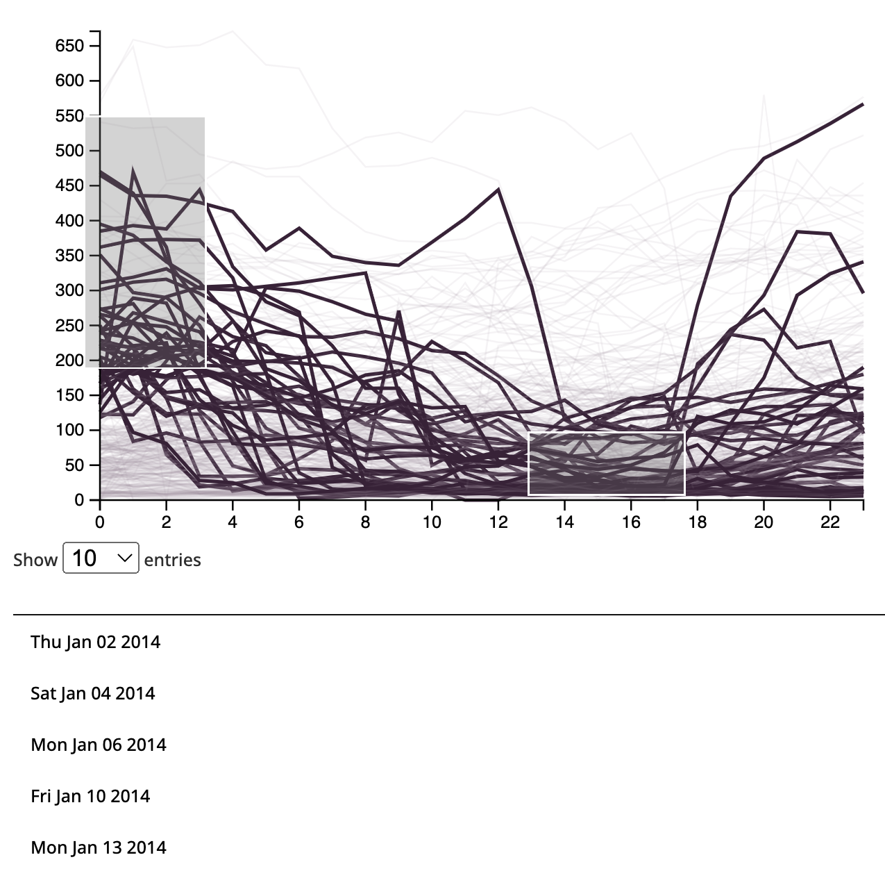 
    ```
    
1. [Polio Clustering] The polio dataset contains weekly counts of new polio cases across each state in
the United States, starting as early as 1912. In this question, our goal is to
apply $K$-means to group states with similar incidence patterns.

    ```{r}
    polio <- read_csv("https://uwmadison.box.com/shared/static/nm7yku4y9q7ylvz5kbxya3ouj2njd0x6.csv")
    head(polio)
    ```
    
    a. Is it necessary to reshape the data before it can be used in the
    `kmeans` function? If so, provide the code. If not, provide a brief
    explanation.
    
    b. Let `x` contain the output from part (a). Compare the two
    approaches to $K$-means in the code block below. Which would you recommend
    using? Justify your choice.
    
    Option 1:
    ```{r, eval = FALSE}
    x %>%
      select(-state) %>%
      kmeans(centers = 5)
    ```
            
    Option 2:

    ```{r, eval = FALSE}
    x %>%
      select(-state) %>%
      scale() %>%
      kmeans(centers = 5)
    ```
      
    Option 3:
        
    ```{r, eval = FALSE}
    x |>
      select(-state) |>
      t() |>
      scale() |>
      t() |>
      kmeans(centers = 5)
    ```

    c. Provide code needed for extracting and visualizing centroids
    from the $K$-means fit made in part (b). Draw a rough sketch of the expected
    result and include annotations that would help a reader understand the output.
    
1. [Women, Business and the Law] The World Bank's Women, Business, and the Law
program has curated a dataset about gender equality across countries since 1971.
Since there are more than 30 variables summarizing each country for each year,
we will use clustering to observe the general trends across all measures.

    a. The code below reads in the data, simplifies column names (saving the
    original names in the `question_mapping` data.frame), and converts text Yes
    / No responses to numerical 0 / 1. Widen the dataset so that each row
    corresponds to a single country $\times$ year combination.
    
    ```{r wbl-data}
    # read in and create a codebook
    survey <- read_csv("https://github.com/krisrs1128/stat992_f23/raw/main/exercises/data/Viz5-July-2020-economic-empowerement.csv")
    question_mapping <- survey |>
      select(Question, `Question Category`) |>
      distinct() |>
      mutate(q_id = str_c("Q", row_number()))
    
    recode_vector <- setNames(question_mapping$Question, question_mapping$q_id)
    survey <- survey |>
      mutate(
        Question = fct_recode(Question, !!!recode_vector),
        answer = as.numeric(ifelse(`Text Answer` == "Yes", 1, 0))
      ) |>
      select(Country, `WBL Report Year`, Question, answer)
    
    survey
    ```
    
    b. Apply $K$-means to the question responses (you may choose $K$). Visualize
    the centroids and briefly interpret each cluster in context, using the
    original text of the questions stored in `question_mapping`.
    
    c. Visualize change in cluster sizes over time. Provide a brief
    interpretation (for example, in which types of questions is there the most /
    least progress towards equality?).

    
1. [NYC Trees] In this problem, we'll use vector data to enrich a visualization
of trees in New York City. In the process, we'll practice reading in and
generating summaries of geospatial data.
    
    a. The data at this
    [link](https://uwmadison.box.com/shared/static/t1mk6i4u5ks5bjxaw2c7soe2z8i75m2o.csv)
    include a subset of data from the New York City Tree Census. Make a scatterplot
    of the locations of all trees in the data, coloring in by tree species group and
    faceting by health.
    
    b. Suppose we wanted to relate these data to characteristics of the built
    environment. We have curated public data on
    [roads](https://uwmadison.box.com/shared/static/28y5003s1d0w9nqjnk9xme2n86xazuuj.geojson)
    and
    [buildings](https://uwmadison.box.com/shared/static/qfmrp9srsoq0a7oj0e7xmgu5spojr33e.geojson)
    within the same neighborhood. Read these data into `sf` objects using `read_sf`.
    For both datasets, report (i) the associated CRS and (ii) the geometry type
    (i.e., one of point, linestring, polygon, multipoint, multilinestring,
    multipolygon, geometry collection).
    
    c. Generate a version of the plot in (a) that has the roads and buildings in the
    background.
    
1. [Himalayan Glaciers] In this problem, we'll apply the reading's discussion of
raster data to understand a
[dataset](https://uwmadison.box.com/shared/static/2z3apyg4t7ct5qd4mcwh9rpr63t02jql.tif)
containing Landsat 7 satellite imagery of a Himalayan glacier system.
    
    a. Read the data into a `brick` object. What is the spatial extent of the file
    (that is, within what geographic coordinates do we have data)? How many layers
    of sensor measurements are available?
    
    b. Generate an RGB image of this area. In Landsat 7, the first three layers (B1,
    B2, and B3) provide the red, green, and blue channels.
    
    c. Make a plot of the slopes associated with each pixel within this region.
  
1. [Himalyan Glaciers II] Imagine that you have been tasked with training models
of glacial change in the Himalaya mountain range. You decide to first generate
exploratory visualizations of the relevant spatial data.

    a. The block below reads in an `sf` object with one row per glacier.
    Provide code for visualizing these glaciers, faceted by the `Glaciers` category.
    An example result is given in Figure \ref{fig:glaciers_sf}.
        
    ```{r glaciers_read}
    library(sf)
    glaciers <- read_sf("https://uwmadison.box.com/shared/static/k6htkjqj0w48g8oixfwq0zaobsny04jh.geojson") %>%
      filter(Longitude < 86.91, Longitude > 86.1, Latitude < 27.81, Latitude > 27.7)

    glaciers[1:2, 1:5]
    ```
      
    ```{r, fig.cap = "An example result for Himalayan Glaciers (a). \\label{fig:glaciers_sf}", fig.align = "center", out.width = "0.9\\textwidth", echo = FALSE}
    ggplot(glaciers) +
      geom_sf() +
      facet_wrap(~ Glaciers)
    ```

    b. The block below reads in a raster image for the same region. The
    15th channel of this dataset contains information about the slope at each pixel
    in the image. Provide code that could be used to visualize the slope at each
    location in the dataset.

    ```{r glaciers_raster}
    image <- raster::brick("https://uwmadison.box.com/shared/static/2z3apyg4t7ct5qd4mcwh9rpr63t02jql.tif")
    ```  

    c. Suggest an approach to layering the glacier boundaries from (a)
    onto the slope map from (b). An example result is given in Figure
    \ref{fig:glaciersoverlay}.

    ```{r, fig.cap = "\\label{fig:glaciersoverlay} An example result for Himalayan Glaciers (c).", fig.align = "center", out.width = "0.5\\textwidth", echo = FALSE}
    library(RStoolbox)
    ggRGB(image, r = 15, g = 15, b = 15, alpha = 0.3) +
      geom_sf(data = glaciers, col = "red") +
      facet_wrap(~ Glaciers)
    ```
    
1. [CalFresh Enrollment I] In this problem, we will investigate spatial and
temporal aspects of enrollment in CalFresh, a nutritional assistance program in
California.
    
    a. The code below reads in the CalFresh data. We've filtered out February 2019,
    since benefits were distributed differently in this month, leading to outliers
    for most counties. Extract features of the `calfresh` time series using the
    `features` function in the feasts library.
    
    ```{r calfresh-data}
    library(tsibble)
    calfresh <- read_csv("https://uwmadison.box.com/shared/static/rduej9hsc4w3mdethxnx9ccv752f22yr.csv") |>
      filter(date != "2019 Feb") |>
      mutate(date = yearmonth(date)) |>
      as_tsibble(key = county, index = date)
    ```
    
    b. Visualize CalFresh enrollment over time for the counties with the highest and
    lowest `seasonal_strength_year`.
    
    c. The code below reads in a vector dataset demarcating the county boundaries in
    California. Join in the features dataset from (a) with this these vector data.
    Use this to produce a map with each county shaded in by its
    `seasonal_strength_year`.
    
    ```{r calfresh-counties}
    library(sf)
    sf_use_s2(FALSE)

    counties <- read_sf("https://uwmadison.box.com/shared/static/gropucqxgqm82yhq13do1ws9k16dnxq7.geojson")
    ```
    
    d. Propose, but do not implement, a visualization of this dataset that makes use
    of dynamic queries. What questions would the visualization answer? What would be
    the structure of interaction, and how would the display update when the user
    provides a cue?
    
1. [CalFresh Enrollment II] In this problem, we will develop an interactively
linked spatial and temporal visualization of enrollment data from CalFresh, a
nutritional assistance program in California. We will work off of the [pre-filtered dataset](https://github.com/krisrs1128/stat992_f23/blob/main/exercises/ps3/calfresh-small.csv) from the previous problem. We will use D3 in this problem, and a recording of an example solution can be found [here](https://github.com/krisrs1128/stat992_f23/raw/main/exercises/ps3/calfresh_recording.mov).

    a. Using a line generator, create a static line plot that visualizes change in
  enrollment for every county in California.
    b. On the same page as part (a), create a choropleth map of California, shaded
  in by the average enrollment for that county over the full time window of the
  dataset.
    c. Propose one interactive, graphical query the links the combined spatial +
    temporal view from (a - b). For example, you may consider highlighting time
    series when a county is hovered, highlighting counties when specific series
    are brushed, or updating choropleth colors when a subsetted time range is selected.
    d. Implement your proposal from part (c).

1. [CalFresh Comparison] In this problem, we will compare several approaches to
visualizing the CalFresh enrollment dataset.

    a. In your own words, define the term, “graphical encoding” and give an
    example.

    b. The code below reads in a dataset of monthly unemployment rates in
    California from 2014 through 2020. These data are visualized using three
    different techniques below. Describe the relative strengths and
    weaknesses of *two of these views* with respect to the tasks that they
    support.
    ```{r, unemployment_read}
library(tsibble)
library(feasts)
unemployment <- read_sf("https://go.wisc.edu/lai63c") |>
  mutate(date = yearmonth(date))
focus <- c("Colusa", "Monterey", "San Francisco", "Imperial", "Los Angeles", "San Joaquin")
head(unemployment, 3)
    ```
    ```{r unemployment_figures, echo = FALSE, fig.width = 8, fig.height = 5, out.width = "0.7\\textwidth", fig.align = "center"}
library(scico)
library(tmap) 
    
p1 <- unemployment |>
  as_tsibble(county, date) |>
  filter(county %in% focus) |>
  gg_season(unemployment, linewidth = 1) +
  guides(color = guide_legend(override.aes = list(linewidth = 2))) +
  facet_wrap(~ reorder(county, unemployment), ncol = 2) +
  labs(title = "Approach 1") +
  theme(
    title = element_text(size = 18),
    axis.title = element_text(size = 16),
    axis.text.y = element_text(size = 14),
    axis.text.x = element_text(size = 10),
    strip.text = element_text(size = 16),
    legend.text = element_text(size = 14),
    legend.position = "right"
  )

p2 <- ggplot(unemployment) +
  geom_tile(
    aes(
      as_date(date),
      reorder(county, unemployment, na.rm = TRUE),
      fill = sqrt(unemployment),
      col = sqrt(unemployment)
    ),
    linewidth = 1
  ) +
  scale_x_date(expand = c(0, 0)) +
  scale_fill_scico(palette = "roma") +
  scale_color_scico(palette = "roma") +
  labs(x = "Date", y = "County", fill = "sqrt(Unemployment %)", color = "sqrt(Unemployment %)", title = "Approach 2") +
  theme(
    title = element_text(size = 18),
    axis.title = element_text(size = 18),
    axis.text.y = element_text(size = 8),
    axis.text.x = element_text(size = 16),
    legend.text = element_text(size = 16),
    legend.title = element_text(size = 18)
  )

p3 <- unemployment |>
  group_by(county, year) |>
  summarise(max_unemployed = max(unemployment, na.rm = TRUE)) |>
  tm_shape() +
  tm_polygons(col = "max_unemployed", title = "Max. Unemployed") +
  tm_facets("year", ncol = 4) +
  tm_layout(
    main.title = "Approach 3",
    title.size = 14
  )

p1
    ```
    ```{r, echo = FALSE, fig.width = 10, fig.height = 6.25, out.width = "0.7\\textwidth", fig.align = "center", dpi = 300}
p2
    ```
    ```{r, echo = FALSE, fig.width = 6, fig.height = 3, out.width = "0.7\\textwidth", fig.align="center"}
p3
    ```

    c. Provide code to answer: For each county and year, what was the maximum
    unemployment rate across all months?

    d. Provide code to implement one of the figures above. You may assume
    the result from part (c) and do not need to match color or text themes.

1. [Geospatial Datasets] For each of the datasets below, specify whether it is in a vector or raster
data format. If it is in a vector data format, explain which types of geometries
it contains (e.g., a point or linestring). Explain your reasoning.
  
    a. [NYC Building Footprints](https://uwmadison.box.com/shared/static/qfmrp9srsoq0a7oj0e7xmgu5spojr33e.geojson)
    
    b. [Africa Population 2020](https://github.com/krisrs1128/stat436_f24/raw/refs/heads/main/data/afripop2020.tif)
    
    c. [Himalayan Glacial Lakes](https://raw.githubusercontent.com/krisrs1128/stat436_s23/main/data/GL_3basins_2015.topojson)
    
    d. [Wisconsin EV Charging ](https://github.com/krisrs1128/stat436_s24/raw/main/data/ev.geojson)
  
    e. [Zion Elevation](https://github.com/krisrs1128/stat436_s24/raw/main/data/landsat.tif)

    f. Visualize *one* of these datasets.

    
1. [Geospatial Commands] For each of the commands below, explain (i) whether it
can be applied to vector data, raster data, or both and (ii) discuss a typical
use case for the function.

    a. `read_sf`
    
    b. `raster`
    
    c. `as.data.frame(img, xy = TRUE)`
    
    d. `geom_sf`
    
    e. `coord_sf`
    
1. [Temporal and Geospatial Commands] For each of the commands below, explain
what role it serves in temporal or spatial data visualization. Describe a
specific (if hypothetical) situation within which you could imagine using the
function.

    a. `geom_stream`
    b. `tm_lines`
    c. `rast`
    d. `geom_horizon`

1. [Temporal and Geospatial True/False] Circle TRUE or FALSE for all statements
below about time series and geospatial visualization.

    a. TRUE or FALSE: The `geom_sf` layer can be used to visualize collection of
    spatial polygons of class `sf`.
    b. TRUE or FALSE: The `geom_raster` layer can be used to visualize a
    multi-channel raster as an RGB image.
    c TRUE or FALSE: A gradually decreasing slope in an ACF visualization
    indicates a time series with strong seasonal structure.
    d. TRUE or FALSE: If `x` is a data.frame with columns `date`, `city`, and
    `temperature`, then command `as_tsibble(x, key = city, index = date)` will
    correctly create a `tsibble` object containing the time series collection,
    assuming there are no gaps in time.
    e. TRUE or FALSE: A per-pixel grid of temperature data is an example of a
    spatial vector dataset.

1. [`tmap` Exploration] There are many example maps on the `tmap` package's
[homepage](https://github.com/r-tmap/tmap/) -- see the vignettes, tutorials, or
presentations, for example. In this problem, you will recreate and deconstruct
one example visualization from this webpage.
    
    a. Pick one figure from the page linked above. Describe the data used to
    generate this figure. Is the data in a vector or raster format?
    b. Regenerate the figure and write comments in the code that describe the
    purpose for each layer (or related groups of layers).
    c. Have you ever worked with a dataset where the type of visualization you
    just created might have been helpful? If so, describe how. If not, imagine a
    hypothetical data analysis project where you might use this code.

1. [Glacial Lakes]. The data at this [link](https://drive.google.com/file/d/1zRBnNK7GQhdT03olFe3ws5m-cx-CGbJS/) contain labels of glacial lakes the
Hindu Kush Himalaya, created during an ecological survey in 2015 by the
International Centre for Integrated Mountain Development.

    a. How many lakes are in this dataset? What are the latitude / longitude
    coordinates of the largest lakes in each Sub-basin?
    
    b. Plot the polygons associated with each of the lakes identified in step
    (a). _Hint: You may find it useful to split lakes across panels using the
    `tmap_facets` function. If you use this approach, make sure to include a
    scale with `tm_scale_bar()`, so that it is clear that lakes have different
    sizes.
    
    c. Visualize all lakes with latitude between 28.2 and 28.4 and with
    longitude between 85.8 and 86. Optionally, add a basemap associated with
    each lake.
    
1. [Population Density] The problem below visualizes [population
data](https://github.com/krisrs1128/stat479_s22/blob/main/_slides/week7/exercises/data/afripop2020.tif?raw=true)
from the `afrilearndata` package.

    a. What are the dimensions (in pixels) of the population dataset? What is
    its coordinate reference system?
    
    b. Convert the raster data to a `data.frame`. Omit rows without any
    population data.
    
    c. Visualize the data. What are some regions with the lowest and highest
    population densities?
 
1. [Masking Temperature Data] This problem will visualize the temperature data downloaded from [this
site](http://www.bom.gov.au/jsp/awap/temp/index.jsp?colour=colour&time=latest&step=0&map=maxave&period=month&area=nat)
from the Australian Bureau of Meteorology. It presents some new ideas related to
raster masking.

    a. Read in the raster data, directly convert it to a data.frame, and use a
    `geom_raster` layer to visualize raw temperature data.
    
    b. The data includes temperature over the ocean! We really only want to
    visualize the temperatures over land. Using the `mask` function from the
    `raster` package, clip the original raster data to a polygon containing the
    Australia country boundaries. These boundaries are read in the code block
    below,
        
    ```{r naturalearth}
    library(rnaturalearth)
    australia <- ne_countries(country = "australia")
    # mask(... fill this in...)
    ```
  
    c. Regenerate the plot from (a), but using the masked raster from (b). Ensure
    that the masked NA values are left out of the visualization. Bonus: Use a
    binned color scale (e.g., `scale_fill_viridis_b`) to make the temperature
    variations even clearer.

1. [Interactive NYC Trees] This problem walks through the creation of an
interactive map of the [NYC Trees Dataset](https://uwmadison.box.com/shared/static/t1mk6i4u5ks5bjxaw2c7soe2z8i75m2o.csv).

    a. Filter down to only those trees whose diameter at breast height
      (`tree_dbh`) is larger than 10. This will help reduce overplotting.
      
    b. Use `leaflet` and the `addCircles` command to create a map with the trees
      kept in part (a). Have the size of the circles reflect the `tree_dbh` value.
      
    c. Add a basemap that highlights features of the city without being too
      busy. For example, you can use
      `addProviderTiles(providers$CartoDB.Positron)`.
      
    d. Color each tree's circle according to its species group. _Hint: Create a mapping from species groups to colors using the `colorFactor` function in Leaflet. For example, `pal <- colorFactor(brewer, filtered_trees$species_group)` creates an objet `pal` that can be called in the `color` argument to `addCircles`._
    
1. [Job Interview] Imagine that you are interviewing job candidates for a data
science position that involves visualizing {This Part Filled in Class}. Prepare
an interview question that test candidates' knowledge of / experience with
these topics. Also prepare examples of strong responses. An good question will
either (i) ask the interviewee to describe a specific time in the past where
they used the concept or (ii) present the interviewee with a type of challenge
related to what is commonly encountered and see how they would address it.

1. [Social Data Vis] Perhaps the best way to learn data visualization is to (a)
study the work of those who are more experienced and (b) practice. One neat way
to go about this is to participate in social data visualization activities, like
[TidyTuesday](https://github.com/rfordatascience/tidytuesday) or the
[30DayChartChallenge](https://github.com/30DayChartChallenge/). This exercise
will ask you to study examples of/prepare your own submission to one of these
activities.
  
    a. Pick any prompt from either TidyTuesday or 30DayChartChallenge that
    interests you. Without writing any code or searching online, briefly
    brainstorm some submission ideas (no more than 15 minutes). Summarize your
    thoughts.
    
    b. Search for some publicly posted submissions for your prompt. Pick two and
    comment their designs. Compare and contrast their choices of graphical
    encodings. What effective design decisions did the authors make that you could
    potential imitate? What might you have done differently?
    
    c. Prepare your own response to the prompt. Your visualization and commentary 
    should be complete enough that you could hypothetically use it as a blog
    post/social media thread if you were participating in the challenge publicly.
  
1. [Improving Initial Visualizations] This exercise asks you to discuss and fix
a few common issues that come up in solutions to the exercises above.

    a. The code below gives an initial solution to [Beijing Air Pollution] part
    (b). The output is shown in Figure \ref{fig:airpollutionexample}. Each panel
    represents the centroid of one cluster. Why should we avoid plotting the
    pollution, temperature, and wind speed variables along the same y-axis?
    Discuss how would you improve on this.
    
    ```{r, airpollution, out.width = "0.7\\textwidth", fig.cap = "\\label{fig:airpollutionexample} Example output for [Improving Initial Visualizations] part (a). It is problematic that different types of variables are all shown in the x-axis. What should we do instead?", fig.align = "center"}
    centroids <- read_csv("https://go.wisc.edu/417341") |>
      unite("x_axis", variable:hour)

    ggplot(centroids) +
      geom_point(aes(x_axis, median)) +
      facet_wrap(~ cluster) +
      theme(axis.text.x = element_text(angle = 90, size = 4))
    ```

    b. The code below gives a solution to [HIV Network] that encodes country name
    with color. The output is shown in Figure \ref{fig:ggraphcolors}. There are arguably too many colors in this plot. Why might this
    be a problem? Describe how would you address it.

    ```{r, ggraphcolors, fig.cap = "\\label{fig:ggraphcolors} Example output created by [Improving Initial Visualizations] part (b). There are too many colors in this plot.", out.width = "0.7\\textwidth", fig.align = "center"}
    library(tidygraph)
    nodes <- read_csv("https://github.com/krisrs1128/stat436_s25/raw/refs/heads/main/data/hiv_nodes.csv")
    edges <- read_csv("https://github.com/krisrs1128/stat436_s25/raw/refs/heads/main/data/hiv_edges.csv")
    G <- tbl_graph(nodes, edges)

    library(ggraph)
    ggraph(G) +
      geom_edge_link(colour = "#d3d3d3", alpha = 0.9, width = 2) +
      geom_node_point(aes(col = name))
    ```
      
    c. In an report that included both temporal and spatial data, you notice the
    following libraries were loaded.
      
    ```{r, eval = FALSE}
    library(tidyverse)
    library(tidygraph)
    library(tsibble)
    library(sf)
    ```
      
    In the compiled report, the messages shown in Figure \ref{fig:allmessages}
    are shown before any text. Why might this be a problem? Describe how you
    would address it.

    ```{r, fig.cap = "\\label{fig:allmessages} An example of the messages that appear in Problem [Improving Initial Visualizations] part (c).", out.width = "0.8\\textwidth", fig.align = "center"}
    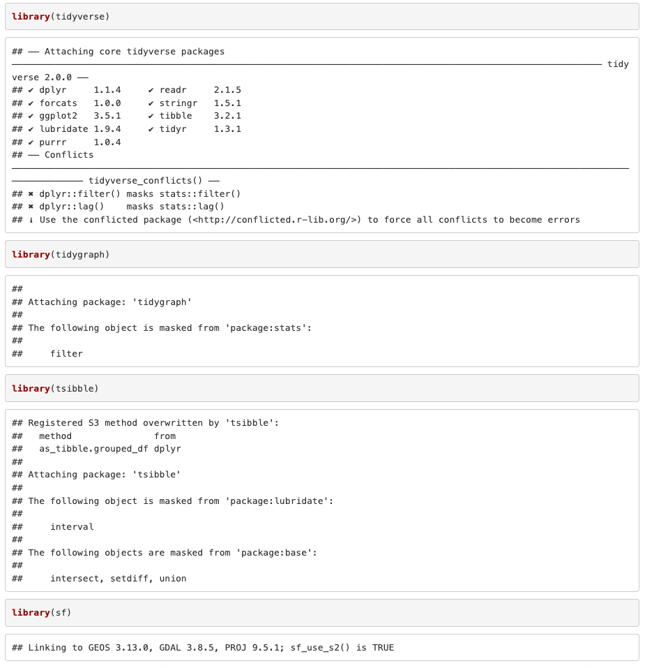
    ```
      
    d. Provide code to implement one of the improvements that you discussed in the
    preceding parts.
  
1. [Visualization for Everyday Decisions] We routinely encounter spatial and
temporal data in everyday life, from the from the dates on a concert calendar to
the layout of buttons in an elevator. This problem asks you to critically
reflect on the way these data are represented.

    a. Describe one type of spatial or temporal dataset (loosely defined) that you
  encounter in a nonacademic context. What visual encodings are used? Does it
  implement any interactivity?
  
    b. What questions does the visualization help you answer? How easily can you
  arrive at an accurate answer?
  
    c. In the spirit of the [re-imagined parking sign](https://nightingaledvs.com/thoughtful-design-the-power-of-naive-optimism-2/) project, propose an
  alternative representation of these data (or an alternative way of interacting
  with the same representation). Why did you propose the design that you did?
  What advantages do you think it has?
    
# Network and Hierarchical Data

1. [Political Book Recommendations] In this problem, we'll study a network
dataset of Amazon bestselling US Politics books. Books are linked by an edge if
they appeared together in the recommendations ("customers who bought this book
also bought these other books").
    
    a. The code below reads in the edges and nodes associated with the network.
    The [edges dataset](https://github.com/krisrs1128/stat992_f23/blob/6c4130bddbdfc9ef90537c794cdca47773643752/activities/week10/political-books-edges.csv) only contains IDs of co-recommended books, while the [nodes
    data](https://github.com/krisrs1128/stat992_f23/blob/6c4130bddbdfc9ef90537c794cdca47773643752/activities/week10/political-books-nodes.csv) includes attributes associated with each book. Build a `tbl_graph`
    object to store the graph.
    
    ```{r}
    edges <- read_csv("https://go.wisc.edu/but14m", col_types = "cci")
    nodes <- read_csv("https://go.wisc.edu/563cy6", col_types = "ccc")
    ```

    b. Use the result from part (a) to visualize the network as a node-link
    diagram. Include the book's title in the node label, and shade in the node
    according to political ideology.
    
    c. Create the analogous adjacency matrix visualization. Provide examples of
    visual queries that are easy to answer using one encoding but not the other
    (i.e., what is easy to see in the node-link view vs. what is easy to see in
    the adjacency matrix).
    
1. [Interactive Political Books] In this problem, we'll study a network dataset of Amazon bestselling US Politics books. Books are linked by an edge if they appeared together in the recommendations ("customers who bought this book also bought these other books"). Since including all the book titles in a single static view can be overwhelming, we will design an interactive view that selectively reveals titles depending on user interest.

    a. Represent the network using a node-link diagram. Layout the nodes using a force-directed layout. Color nodes in by their political affiliation.
    
    b. Implement a tooltip that reveals the title of a book whenever the user places their mouse near (but not necessarily on) its node. Use a transition to gradually increase the size of the associated node.
    
    c. Extend the interactivity in (b) so that the titles of all neighboring books of the currently hovered node are also displayed. Ensure that the title of the central book appears larger than the rest.
    
    ```{r, fig.cap = "An example solution to [Interactive Political Books] part (c). The currently selected book is Ghost Wars. All its neighbors are also labeled, but in a smaller font.", out.width = 200, fig.align = "center", echo = FALSE}
    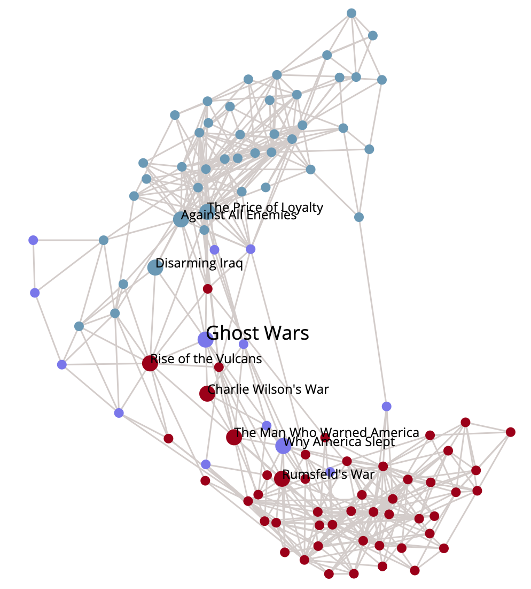
    ```
    
1. [Network Vis T/F] Select all the true statements about network visualization.
    * For large, dense networks, node-link diagrams are preferable to adjacency matrix visualizations.
    * For tasks related to local topology, node-link diagrams are preferable to adjacency matrix visualizations.
    * It is possible to visually encode edge weight in either node-link or adjacency matrix visualizations.
    * It is possible to visually encode node category in either node-link or adjacency matrix visualizations.
    

1. [More Network T/F] Circle whether the following statements about network and
tree visualization are TRUE or FALSE.

    a. TRUE FALSE In treemap visualizations, each tree node is allocated an
    area, and all of its children are contained within that area.
    
    b. TRUE FALSE For large, dense networks, node-link diagrams are preferable to
    adjacency matrix visualizations.

    c. TRUE FALSE For topological queries, both node-link diagrams and
    adjacency network visualizations are equally effective.

    d. TRUE FALSE Adjacency matrix views are only appropriate when all edges are undirected.
    
1. [Network Layout and Implementation] Circle all TRUE or FALSE statements below
about network visualization.

    a. TRUE or FALSE: For tasks related to local topology, node-link diagrams
    are preferable to adjacency matrix visualizations.
    b. TRUE or FALSE: For large networks, node-link diagrams are preferable to adjacency matrix visualizations.
    c. TRUE or FALSE: If `G` is a `tbl_graph` defining a network, then an adjacency matrix visualization can be created using
    ```{r, eval = FALSE}
    ggraph(G) +
      geom_adjaceny()
    ```

    d. TRUE or FALSE: The `treemap` and `circlepack` layouts in `ggraph` can be
    used to visually represent enclosure relationships between nodes in a graph.
    e. TRUE or FALSE: The adjacency matrix visualization of a directed graph
    will generally be symmetric across the diagonal.
    
1. [Movie Genres] How do movie genres relate to one another? Is romance + comedy
a more common combination than fantasy + adventure? We will use the dataset
[here](https://github.com/krisrs1128/stat436_s24/raw/main/data/movie_links.csv)
to answer these questions, using a node-link diagram inspired by (but much
simpler than) the [film
flowers](https://observablehq.com/@sxywu/introduction-to-svg-and-d3-js) project
by Shirley Wu.

    a. Build a `tbl_graph` containing the movies and their links.
    
    b. Create a node-link diagram to represent the connections between movies and
    their genres.
    
    c. A list of all the genres in this network is available
    [here](https://github.com/krisrs1128/stat992_f23/blob/main/activities/week9/genres.csv).
    Design a strategy to distinguish between genres and movies, and justify your
    choice of visual encodings. _Hint: Mutate the nodes in the `tbl_graph`._

  
1. [COVID-19 Phylogeny] We will visualize a phylogenetic tree of [SARS-CoV-2 genetic sequences](https://observablehq.com/@mbostock/sars-cov-2-phylogenetic-tree).
Each sequence has been annotated with the date and location it was found, and we
will try to see how genetic variation covaries with these measurements.

    a. Build a `tbl_graph` using the
    [links](https://raw.githubusercontent.com/krisrs1128/stat479_s22/main/_slides/week8/exercises/data/covid-edges.csv)
    and
    [nodes](https://raw.githubusercontent.com/krisrs1128/stat479_s22/main/_slides/week8/exercises/data/covid-nodes.csv)
    associated with the phylogenetic tree. Note that many nodes do not have
    variables associated with them. This is because annotations are only
    available for the leaves of the
    tree, and nodes are unobserved common ancestor viruses.
    
    b. Visualize the phylogenetic tree using the data from (a).
    
    c. Visually encode the date or location at which each sequence was found (for
    a challenge, try encoding both). Justify your choice of encodings -- what are
    some advantages / downsides of the approach you decided on?
    
    d. Discuss the resulting visualization. For example, how much genetic
    diversity do different countries have? Where are different waves located
    genetically?
    
1. [HIV Network] The code below reads in nodes and edges for a graph describing
the similarity of 512 HIV samples collected across 32 countries. Two samples are
linked if they have similar genetic sequences.

    ```{r, echo = TRUE, warning = FALSE, message = FALSE}
    library(tidygraph)
    nodes <- read_csv("https://github.com/krisrs1128/stat436_s25/raw/refs/heads/main/data/hiv_nodes.csv")
    edges <- read_csv("https://github.com/krisrs1128/stat436_s25/raw/refs/heads/main/data/hiv_edges.csv")
    G <- tbl_graph(nodes, edges)
    G
    ```
    
    a. Provide code to generate a node-link visualization similar to that in
    Figure \ref{fig:hiv_graph}. Make at least one style customization that
    improves the visualization. Justify your choice.
    
    ```{r, echo = FALSE, fig.width = 10, fig.height = 10, out.width = "0.5\\textwidth", fig.cap = "\\label{fig:hiv_graph} A network between HIV sequences, labeled by the country from which they originated.", fig.align = "center"}
    library(ggraph)
    ggraph(G) +
      geom_edge_link(colour = "#d3d3d3", alpha = 0.9, width = 2) +
      geom_node_text(aes(label = name)) +
      theme_void()
    ```
  
    b. The figure below shows the node-link visualization for a simple graph.
    Sketch its exact adjacency matrix.
    
    ```{r, echo = FALSE, out.width = "0.3\\textwidth", fig.width = 5, fig.height = 5, fig.align = "left"}
    set.seed(123)
    library(igraph)
    G <- as_tbl_graph(sample_pa(5)) %>%
      mutate(node = 1:5)
    ggraph(G, layout = "kk") +
      geom_edge_link() +
      geom_node_label(aes(label = node)) +
      theme_void()
    ```
  
    c. The figure below shows the node-link visualization for a more complex
    graph. How do you expect its corresponding adjacency matrix visualization to
    look? Provide a rough sketch and a one-sentence justification.
    
    ```{r, echo = FALSE, out.width = "0.3\\textwidth", fig.width = 10, fig.height = 10, fig.align = "left"}
    G <- as_tbl_graph(sample_islands(3, 40, .12, 2))
    ggraph(G) +
      geom_edge_link() +
      geom_node_point() +
      coord_fixed() +
      theme_void()
    ```
    
1. [Interactive Phylogeny] We will build an interactive phylogenetic tree of
SARS-CoV-2 genetic sequences. Each sequence has been annotated with a date and
location of its discovery. We will use D3 to allow readers to explore the way
genetic changes unfold over time and space. You can find the raw data here:
[nodes](https://raw.githubusercontent.com/krisrs1128/stat992_f23/main/exercises/ps4/covid-nodes.csv), [edges](https://raw.githubusercontent.com/krisrs1128/stat992_f23/main/exercises/ps4/covid-edges.csv). We have provided [starter code](https://github.com/krisrs1128/stat992_f23/tree/main/exercises/ps4) to build a `d3.stratify()` object from
the edge data and to define an object, `node_lookup`, which can be used to look
up the country and date associated with the `from` and `to` fields in the edges.

    a. Create a static tree visualization that shows how the different COVID
    variants evolved from one another. Use color to encode the location of the
    variant’s discovery. You may group rare countries into “Other,” and draw
    variants with unknown origins using either white or grey.
    b. Implement *one* of the following forms of interactivity, 
        i. Provide a selection menu that highlights countries that the user selects. 
        ii. As the user hovers near to a node, highlight all of its ancestors.
        Blend the rest of the nodes into the background.
        iii. As the user brushes a collection of nodes, highlight only those
        nodes under the brush. Blend the rest of the nodes into the background.
    c. Propose, but do not implement, an extend version of part (b) that is
    linked with an additional table or visualization. How would the second
    graphic be updated in response to user interactions? What additional queries
    become possible in your proposed visualization?

1. [Climate Crisis Youtube recommendations] We will study a
[dataset](https://observablehq.com/@emma-ba/youtube-recommendation-network-on-the-climate-crisis)
giving links between Youtube videos related to the climate crisis.  The data
were gathered by simulating a user browsing through recommendations, after
having initially searched using a set of climate-related seed terms. Each node
is a video, which includes features like the number of views and the channel it
belongs to. Each edge provides an algorithmically generated recommendation.

    a. Build a `tbl_graph` from the provided [node](https://github.com/krisrs1128/stat992_f23/raw/main/activities/week9/climate-nodes.csv) and [edge](https://github.com/krisrs1128/stat992_f23/raw/main/activities/week9/climate-edges.csv) data.
    
    b. Visualize the connections between videos as a node-link diagram. Color nodes in by the simulated browser session.
    
    c. Visualize the connections between videos as an adjacency matrix.
    
    d. Compare and contrast the visualizations in parts (b) and (c). What are
    some of the trade-offs associated with using one view vs. the other?
    
    e. Select a small number of channels of interest (e.g., "The Daily Show with
    Trevor Noah") For either parts (b) or (c), find a way to visually
    distinguish nodes belonging to these channels from the rest.

1. [UK Energy Flow] We will visualize how energy is produced and consumed in the
United Kingdom, using a [dataset](https://github.com/krisrs1128/stat436_s24/raw/main/data/energy.csv) from the UK's Department of Energy and Climate
Change. Nodes and edges are used to classify types of activity that produce or
consume energy. For example, the edge

    ```
    Wind    Electricity grid    289 
    ```

    means that 289 KwH produced by wind power were sent to the country's electricity grid.
    
    a. Build a `tbl_graph` from the provided edges. Ensure that the resulting
    graph object has directed edges.
    
    b. Use `ggraph` to visualize the flow of energy across nodes in this
    network. Ensure nodes are annotated.
    
    c. Experiment with several layouts. Which do you find most useful? Is there
    an alternative layout you would prefer? Explain your reasoning.
    
1. [Stack Overflow Tag Network] Questions on Stack Overflow are given tags. This
makes it easy to search through all the questions on a certain topic. The
co-occurrence of tags appearing on certain questions also makes it natural to
build a network between these tags -- we draw a weighted edge between
co-occurring tag, with weights representing the number of questions within which
the pair appears. We will look at only a small subset of tags, originally
presented in [this
post](https://observablehq.com/@philipp-ulm/network-of-stack-overflow-tags). In
the process, we will practice creating network visualizations and encoding detected cluster memberships.

    a. Build a `tbl_graph` object based on [node](https://raw.githubusercontent.com/krisrs1128/stat479_s22/main/_slides/week8/exercises/data/stack_overflow-nodes.csv) and [link](https://raw.githubusercontent.com/krisrs1128/stat479_s22/main/_slides/week8/exercises/data/stack_overflow-edges.csv) data that were
    generated using a web scraper.
    
    b. Create a node-link visualization associated with the network.
    
    c. Cluster nodes and encode modify your visualization from (b) to encode
    cluster membership. _Hint: Mutate the graph using the `group_louvain()` or
    `group_infomap()` functions from `tidygraph`._
    
    d. Comment on the visualization from (c). What do the clusters seem to
    correspond to?

1. [Coltrane Network] We will visualize the network of musicians who share a
recording with John Coltrane, obtained from this
[source](https://observablehq.com/@arnauqc/john-coltranes-co-authorship-network).
Two musicians are linked with one another if they appeared on an album together,
at least as recorded in the MusicBrainz database. To visualize these data, we
will practice creating network visualizations and encoding detected cluster
memberships.

    a. Build a `tbl_graph` object based on the [node](https://raw.githubusercontent.com/krisrs1128/stat479_s22/main/_slides/week8/exercises/data/coltraine-nodes.csv) and [link](https://raw.githubusercontent.com/krisrs1128/stat479_s22/main/_slides/week8/exercises/data/coltraine-edges.csv) data.

    b. Create a node-link visualization associated with the network.
    
    c. Cluster nodes and modify your visualization from (b) to encode cluster
    membership. _Hint: Mutate the graph using the `group_louvain()` or
    `group_infomap()` functions from `tidygraph`._
    
    d. Comment on the visualization from (c). How would you interpret the resulting clustering?
    
    
1. [Hierarchical Edge Bundling] In this problem, we will study a D3 hierarchical
edge bundling implementation available at [this link](https://observablehq.com/@d3/hierarchical-edge-bundling). The display
shows how different files in a software package import from one another. Unlike
a naive radial node-link layout, this layout “bundles” together edges if their
source and target nodes have common ancestors in the package’s directory tree
(which is why the resulting layout is called a “Hierarchical Edge Bundling”).

    a. Use `console.log()` to inspect the `root` object. Describe its structure.
    b. What does this line do?
        ```{r, eval = FALSE}
.attr("d", ([i, o]) => line(i.path(o)))
        ```
    Provide one example of an edge in the original visualization (e.g., for
    example `xor <--> or`, though this is not a correct answer) where you
    believe `i.path(o)` contains more than two elements, and explain your
    reasoning. You may find it useful to `console.log()` the result from
    `i.path(o)`.
    c. Imagine that you are working for a biotechnology firm that is interested
    in visualizing a protein network. You have data on the co-occurrence
    frequency for all pairs of proteins (high-co-occurrence can be interpreted
    as the proteins lying on a shared regulatory pathway). What, if any,
    additional information would you need before you could implement a
    hierarchical edge bundling visualization of the network? Explain your
    reasoning.
    
# High-Dimensional and Text Data

1. [Colony Collapse] In this problem, we will study a dataset describing factors
that might be leading to colony collapse disorder among bees. Since there are
multiple stressors for each state $\times$ timepoint combination, we will use
clustering to create a summarized "ecological stress" profile.

    a. The code below reads in data from its original Tidy Tuesday source and
    replaces NAs with 0's. We will summarize each state $\times$ timepoint
    combination by its profile of `stress_pct` across each stressor. Reshape the
    data so that `stressor` appears along columns, with the associated
    percentage contained within the table. Each row is therefore a profile of
    the amount of different stressors at a particular location and time.
    
    ```{r}
    stressor <- read_csv('https://raw.githubusercontent.com/rfordatascience/tidytuesday/master/data/2022/2022-01-11/stressor.csv') |>
      mutate(stress_pct = replace_na(stress_pct, 0))
    ```
    
    b. Apply $K$-means to the profiles constructed in part (a). You may choose
    $K$. Visualize and briefly interpret the resulting centroids.
    
    c. Design and implement a visualization to show the change in cluster
    memberships over time. Briefly interpret your results in context.
    
    d. [Bonus] The code below reads in spatial data associated with each state.
    Design and implement a visualization that encodes spatial variation across
    clusters, either at a single timepoint or over all time. An example result is shown in Figure \ref{fig:ccd_states}.
    
    ```{r natural_earth}
    library(rnaturalearth)
    library(sf)
    states <- ne_states("United States of America") |>
      st_as_sf() |>
      rmapshaper::ms_simplify() |> # reduce size for easy plotting
      filter(!(name %in% c("Alaska", "Hawaii"))) |>
      dplyr::select(name, geometry) |>
      rename(state = name)
    ```
    
    ```{r, fig.cap="\\label{fig:ccd_states} Spatial distribution of colony collapse clusters over time.", echo = FALSE, out.width="60%", fig.align = "center"}
    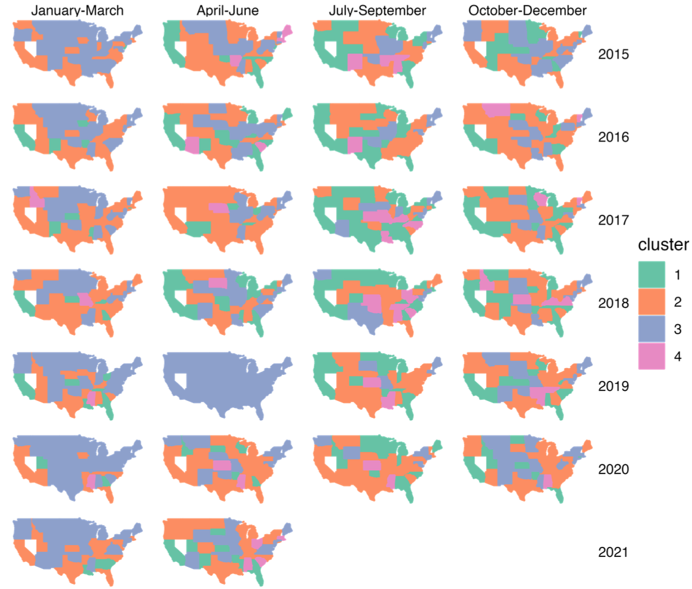
    ```
    
1. [Hierarchical Clustering T/F] Figure \@ref(fig-hclusttf) shows a subset of a large hierarchical clustering tree. Select all the true statements below.
    * Samples C and D are more similar to one another than A and B.
    * If this subtree were cut to form K = 5 clusters, then C and D would belong to the same cluster.
    * A and B are more similar to each other than B and C.
    * If this subtree were cut to form K = 2 clusters, then A and B would belong to the same cluster.

    ```{r hclusttf, echo = FALSE, fig.cap = "A subset of a large hierarchical clustering tree", fig.align = "center", out.width = "40%"}
    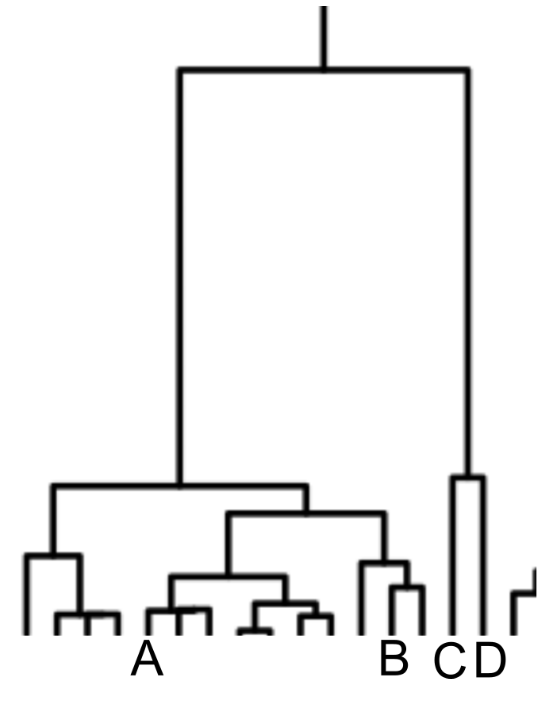
    ```

1. [Taxi Trips] In this problem, we will use hierarchical clustering to find
typical taxi trip trajectories in Porto, Portugal. The data are a subset from
the the [ECML / PKDD 2015
Challenge](http://www.geolink.pt/ecmlpkdd2015-challenge/dataset.html) -- the
link provides a complete data dictionary. We have preprocessed it into two
formats. The first
([`wide`](https://uwmadison.box.com/shared/static/cv0lij4d9gn3s8m2k98t2ue34oz6sbj5.csv))
includes each taxi trip on its own row, with latitude and longitude coordinates
along the journey given as separate columns (`x_0, y_0` is the origin of the
trip and `x_15`, `y_15` is the destination). The second
([`long`](https://uwmadison.box.com/shared/static/098cjaetm8vy0mufq21mc8i9nue2rr2b.csv))
format spreads each point of the journey into a separate row.
    
    a. Filter the `long` form of the data down to trip `1389986517620000047` and
    plot its trajectory as a sequence of points.
    
    ```{r}
    trips <- read_csv("https://uwmadison.box.com/shared/static/098cjaetm8vy0mufq21mc8i9nue2rr2b.csv", col_types = cols(TRIP_ID = col_character()))
    trips_wide <- read_csv("https://uwmadison.box.com/shared/static/cv0lij4d9gn3s8m2k98t2ue34oz6sbj5.csv", col_types = cols(TRIP_ID = col_character()))
    ```
    
    b. We could hierarchically cluster rows in either the `wide` or the `long`
    format datasets. How would the interpretation of the results differ between the
    two approaches?
    
    c. Compute a hierarchical clustering of the `wide` format data, using only the
    columns starting with `x` or `y` as features.
    
    d. Cut the hierarchical clustering tree so that 8 clusters are produced.
    Visualize the trajectories of the taxi trips either colored or faceted by their
    cluster.
    
1. [Support for Animal Research] This problem utilizes response data from a
survey of UW–Madison students and faculty by Sandgren and Streiffer (2019). The
survey assessed respondents’ support for the use of non-human animals in
scientific research. Questions were categorized into various groups. The heatmap
in figure \@ref(fig-sandgren) shows each respondent’s average response by question type. Higher-valued
responses indicate more support for the use of non-human animals in scientific
research.
    a. The definition of “strong support” is not given. However, one cluster
    seems to correspond to the strong support group. Which one, and why?
    b. True or False: There appears to be a weak relationship between support
    for non-human animal research across question types.
    c. Cluster 3 contains the fewest respondents. Discuss potential reasons why
    this may have been the case.
    
    ```{r sandgren-figure, fig.cap = "Responses from Sandgren and Streiffer (2022).", out.width = 300, fig.align = "center", echo = FALSE}
    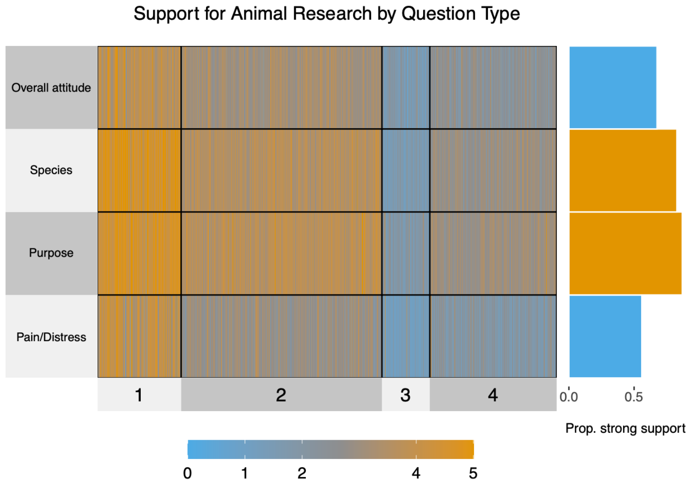
    ```
  
1. [Interpreting Clustering] Imagine that you are a statistical consultant
working with a scientist / sports team / journalist / sales division head (pick
your favorite or make up your own example). At one point in your study, you
found it useful to apply various types of clustering methods. In this problem,
you are asked to provide a non-technical explanation of how to interpret your
clustering output, assuming that your audience is familiar with their data but
not statistical methodology.

    a. You have run $K$-means with $K = 5$ clusters across their dataset, which
    includes $50$ different measurements for each row. Explain to your audience
    what each centroid represents.
    
    b. At another point, you applied hierarchical clustering to the same
    dataset. You include a visualization of the hierarchical clustering tree in
    your report. Provide a brief, non-technical explanation of how to interpret
    the tree.
    
    c. Your audience finds the hierarchical clustering tree, but wonders why you
    needed a new algorithm to produce it. They think that you would have gotten
    similar results if you had simply run $K$-means with different values of
    $K$. Respond to their observations.
    
1. [Beijing Air Pollution] This problem studies daily air pollution and weather
patterns in Beijing from 2010 to 2014. Each row in this [dataset](https://go.wisc.edu/wi35ja) gives
measurements for three variables, `pollution`, `temp`, and `wndspd` over time
for a single day, indexed by `date`. For example the `temp_13` column gives the
temperature at 1pm. Note that both `pollution` and `wndspd` have been
$\log\left(1 + x\right)$ transformed.

    a. Cluster all the days using a hierarchical clustering. Be sure to scale
    the columns in advance, so that no single variable has undue influence on
    the result. Cut the tree so that we are left with 10 clusters, and provide a
    ribbon plot to visualize several quantiles associated with each cluster's
    typical pollution, temperature, and windspeed trajectories. visualization to
    understand the centroids of each cluster. Briefly interpret the main
    patterns you observe.
    
    b. Visualize the hierarchical clustering tree associated with your
    clustering from part (a). Bonus: For a single time of day, encode the
    average pollution level for all descendant nodes within your tree
    representation. To summarize a the pollution level of all descendants leaves
    in a tree, you may use the `map_local_dbl` function from `tidygraph`.
    
    ```{r hclust-beijing, eval = FALSE}
    mean_fun <- function(neighborhood, ...) {
      cur_pollution <- neighborhood |>
        filter(leaf) |>
        pull(pollution_10) # average the 10am pollutions
      mean(cur_pollution, na.rm = TRUE)
    }
    
    G |>
      mutate(avg_pollution = map_local_dbl(order = graph_order(), mode = "out", .f = mean_fun))
    ```
    
1. [Living wages] This problem will study a dataset from MIT's [living wage
calculator](https://livingwage.mit.edu/). Each row in this
[dataset](https://raw.githubusercontent.com/krisrs1128/stat479_s22/main/_slides/week10/exercises/living_wages.csv)
gives living wages for state capitals within the continental US. Since living
wages depend on a personal situation (e.g., number of children), this dataset is
high-dimensional. The interpretation of each column is given
[here](https://raw.githubusercontent.com/krisrs1128/stat479_s22/main/_slides/week10/exercises/living_wages_lookup.csv).

    a. Define a tidymodels `recipe` that normalizes all city features and
    specifies that PCA should be performed.
    
    b. Visualize the top 4 principal components. Based on the interpretation of
    each columns, what seems to distinguish capital cities with low vs. high
    values of PC2?
    
    c. Visualize the scores of each capital city with respect to the first two
    principal components. Make sure to annotate cities with their names. Pick a city
    on the graph and interpret its relative wage profile based on the principal
    components.
  
1. [Food nutrients] This problem will use PCA to provide a low-dimensional view
of a 14-dimensional nutritional facts
[dataset](https://uwmadison.box.com/shared/static/nmgouzobq5367aex45pnbzgkhm7sur63.csv).
The data were originally curated by the USDA and are regularly used in
[visualization studies](http://bl.ocks.org/syntagmatic/raw/3150059/).
    
    ```{r nutrients-data}
    nutrients <- read_csv("https://uwmadison.box.com/shared/static/nmgouzobq5367aex45pnbzgkhm7sur63.csv")
    ```
    
    a. Define a tidymodels `recipe` that normalizes all nutrient features and
    specifies that PCA should be performed.
    
    b. Visualize the top 6 principal components. What types of food do you expect to
    have low or high values for PC1 or PC2?
    
    c. Compute the average value of PC2 within each category of the `group` column.
    Give the names of the groups sorted by this average.
    
    d. Visualize the scores of each food item with respect to the first two
    principal components. Facet the visualization according to the `group` column,
    and sort the facets according to the results of part (c). How does the result
    compare with your guess from part (b)?

1. [Olympics PCA] This problem asks you to check the interpretation of a PCA
visualization. The original analysis comes from Chapter 7 of [Modern Statistics
for Modern
Biology](https://web.stanford.edu/class/bios221/book/07-chap.html#the-pca-workflow).
It runs principal components analysis a dataset summarizing the 1988 Olympic
Decathlon.  The decathlon is a competition where each athlete has to compete in
10 different sports. For example, the first athlete in the dataset ran the 100
meter race in 11.25 seconds and got a score of 7.43 in the long jump.
    ```{r, olympics_preview}
    data(olympic, package = "ade4")
    head(olympic$tab)
    ```
    The analysis results in three figures (Figure \ref{fig:athletepca}). The first
    shows the proportion of variance explained by each component, the second shows
    the principal component scores, and the third gives the top two principal
    components plotted against each other. Your colleague has included the following
    claims in a report about these data. If an interpretation is correct, briefly
    explain why, and if it is not, provide a corrected version.

    a. Since there are ten events total, the $y$-axis values for the 10 bars in
    the proportion of variance explained must add up to 100.

    b. The first PC is mostly related to athlete speed, while the second is more
    related to strength.

    c. Athlete 17 likely did better than average in the discus event, but worse
    than average in the 100 meter race.

    d. Athletes seem to be numbered according to their rank in the pole vault.

    ```{r athletepcafigs, echo = FALSE, fig.show="hold", out.width = "0.3\\textwidth", fig.cap = "\\label{fig:athletepca} The PCA of the decathlon data, from Chapter 7 of Holmes and Huber's Modern Statistics for Modern Biology.", fig.align = "center"}
    include_graphics("figure/fig-screeplota-1.png")
    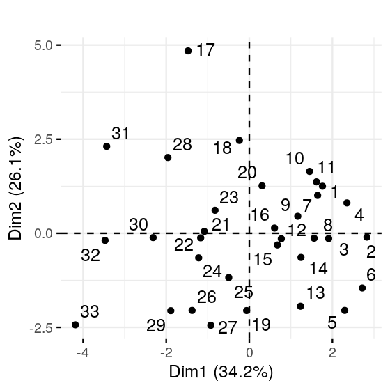
    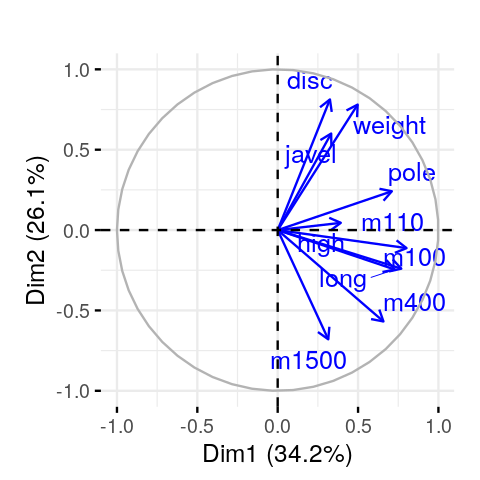
    ```

1. [Clustering and Topics True/False] Circle TRUE or FALSE for all statements
below about clustering and topic models.
    
    a. TRUE or FALSE: If all samples in a cluster have large silhouette statistics, then that
    cluster is poorly-defined.
    b. TRUE or FALSE: Consider the `survey` dataset below,
          
      ```
        Country     `WBL Report Year` Question answer
        <chr>                   <dbl> <fct>     <dbl>
      1 Afghanistan              1971 Q1            0
      2 Afghanistan              1971 Q2            1
      3 Afghanistan              1971 Q3            0
      4 Afghanistan              1971 Q4            1
      ```
    
      To use $K$-means to cluster country $\times$ year combinations by their pattern of question responses, we would need to first pivot it using the command,
        
      ```{r, eval = FALSE}
      survey %>%
        pivot_wider(names_from = "Country", values_from = "answer")
      ```	
        
    c. TRUE or FALSE: Suppose a data.frame has a column, `reviews`, containing raw
    text from across a collection of reviews (one review per row). Then, the
    `cast_dtm` function can be used to split the raw text so that one word appears
    on each row.
    d. TRUE or FALSE: A Structure plot visualizes the `n_samples` $\times$
    `K`-dimensional matrix of mixed memberships fitted by a topic model.
    e. TRUE or FALSE: When cutting a hierarchical clustering tree at two
    heights, the clusters found at the height closer to the leaves will always
    be nested within the clusters found at the height closer to the root.

1. [Topics in _Pride and Prejudice_] This problem uses LDA to analyze the full text
of _Pride and Prejudice_. The object `paragraph` is a data.frame whose rows are
paragraphs from the book. We've filtered very short paragraphs; e.g., from
dialogue. We're interested in how the topics appearing in the book vary from the
start to the end of the book, for example.

    ```{r tidytext-read}
    library(tidytext)
    paragraphs <- read_csv("https://uwmadison.box.com/shared/static/pz1lz301ufhbedzsj9iioee77r95xz4v.csv")
    paragraphs
    ```
          
    a. Create a Document-Term Matrix containing word counts from across the same
    paragraphs. That is, the $i^{th}$ row of `dtm` should correspond to the $i^{th}$
    row of `paragraph`. Make sure to remove all stopwords.
    
    b. Fit an LDA model to `dtm` using 6 topics. Set the seed by using the argument
    `control = list(seed = 479)` to remove any randomness in the result.
    
    c. Visualize the top 30 words within each of the fitted topics.
    Specifically, create a faceted bar chart where the lengths of the bars
    correspond to word probabilities and the facets correspond to topics.
    Reorder the bars so that each topic's top words are displayed in order of
    decreasing probability.
    
    d. Find the paragraph that is the purest representative of Topic 2. That is,
    if $\gamma_{ik}$ denotes the weight of topic $k$ in paragraph $i$, then
    print out paragraph $i^{\ast}$ where $i^{\ast} = \arg \max_{i}\gamma_{i2}$.
    Verify that the at least a few of the words with high probability for this
    topic appear. Only copy the first sentence into your solution.
    
1. [Personality Types] This
[dataset](https://github.com/krisrs1128/stat436_f24/raw/refs/heads/main/data/mbti_1.csv)
contains a sample of posts from the Personality Cafe forum, together with labels
giving the poster's (self-reported) Meyer-Briggs type (e.g., types starting with
"I" are introverted, those with "E" are extroverted). It is time-consuming to go
through all the posts manually, but to get a quick overview of the main topics
that are discussed, we can use a Latent Dirichlet Allocation (LDA) model. This
problem walks through the steps for (1) preparing a Document-Term matrix for
LDA, (2) fitting the LDA model, and (3) interpreting the estimated topics and
memberships.

    a. Transform the raw posts into a collection of per-post word counts. Remove
    stopwords from across all lexicons in `tidytext::stopwords`.
    
    b. Convert the `data.frame` from (a) into a topic models Document-Term
    matrix (i.e., an object of class `DocumentTermMatrix`). Fit an LDA model
    with 8 topics to the prepared object.
    
    c. Visualize the top 30 words within each of the fitted topics.
    Specifically, create a faceted bar chart where the lengths of the bars
    correspond to word probabilities and the facets correspond to topics.
    Reorder the bars so that each topic's top words are displayed in order of
    decreasing probability.
    
    d. Create a Structure plot displaying the topic memberships for each
    document. Sort documents according to their order on a hierarchical
    clustering tree, and facet documents according to personality type. Are
    there certain topics that appear to be more common in some personality types
    than others?
    
1. [Hotel Reviews] In this problem, we will practice using Latent Dirichlet
Allocation to understand the topics that come up across [hotel reviews](https://github.com/krisrs1128/stat992_f23/raw/main/activities/week12/reviews.csv) from an
online database. We will also study whether there are certain topics that are
more common in positive vs. negative reviews.

    a. Transform the raw reviews into a collection of per-review word counts.
    Remove stopwords from across all lexicons in `tidytext::stopwords`.
    
    b. Convert the `data.frame` from (a) into a topic models Document-Term
    matrix (i.e., an object of class `DocumentTermMatrix`). Fit an LDA model
    with 8 topics to the prepared object.
    
    c. Create a Structure plot displaying the topic memberships for each review.
    Sort reviews according to their order on a hierarchical clustering tree, and
    facet documents according to hotel rating. Are there certain topics that
    appear to be more common in negative vs. positive reviews? Manually inspect
    a few reviews with high membership in these topics.

    d. Using either a heatmap or faceted barplot, visualize the content of the
    topics. Which terms distinguish the topics that are associated with more
    negative vs. positive reviews?
    
1. [Dimensionality Reduction Reflection] This problem asks you to explain, in
your own words, a few conceptual and practical aspects for the following
dimensionality reduction techniques,

    * Principal Components Analysis (PCA)
    * Uniform Manifold Approximation and Projection (UMAP)
    * Latent Dirichlet Allocation (LDA)
  
    a. Outline how you would implement this method in R and extract output
    needed for downstream visualizations. Make sure to highlight the the most
    important steps and functions and briefly explain any code you write down.
        
    b. Describe the outputs from (a). How is each part interpreted? Be as
    specific as possible.
    
1. [Interpreting UMAP] Imagine that you are a statistical consultant working
with a scientist / sports team / journalist / sales division head (pick your
favorite or make up your own example). At one point in your study, you found it
useful to apply nonlinear dimensionality reduction with UMAP. In this problem,
you are asked to provide a non-technical explanation of how to interpret the
dimensionality reduction output, assuming that your audience is familiar with
their data but not statistical methodology.

    a. You have run UMAP on the dataset, which includes $50$ different
    measurements for each row. You plot the first two dimensions as a
    scatterplot. Explain to your audience what the embedding represents.
    
    b. Though they have not heard of UMAP, your audience has previously
    encountered principal components analysis for dimensionality reduction. Help
    your audience understand UMAP by comparing and contrasting it with PCA.
    
1. [PCA vs. UMAP Comparison] This problem asks you to compare and contrast
dimensionality reduction using and UMAP and PCA.

    a. Provide an example of a dataset for which using PCA would be
    more appropriate than UMAP. Justify your choice.
  
    b. Provide an example of a dataset for which using UMAP would be
    more appropriate than PCA. Justify your choice.

1. [Single-Cell Genomics] In this problem, we will apply UMAP to a
[dataset](https://uwmadison.box.com/shared/static/ai539s30rjsw5ke4vxbjrxjaiihq7edk.csv)
of Peripheral Blood Mononuclear Cells (PBMC) released by 10X Genomics. The first
column, `cell_tag`, gives an identifier for each cell in the dataset. All other
columns are molecules that were detected in that cell. For example, CD74 is a
molecule often found on the surface of T-cells.
    
    a. Define a tidymodels `recipe` that specifies that UMAP should be performed
    with the parameters `learn_rate = 0.1` and `neighbors = 5`. There is no need to
    normalize these data, as they have been normalized in advance using methods
    tailored to single-cell genomics data.
    
    ```{r pbmc-read}
    pbmc <- read_csv("https://uwmadison.box.com/shared/static/ai539s30rjsw5ke4vxbjrxjaiihq7edk.csv")
    ```
    
    b. Compute the UMAP embeddings across cells. Color points in by their value of
    the GNLY molecule.

1. [Interactive Single-Cell Genomics] The cell-level UMAP embeddings from the
previous problem give an overview of the landscape of PBMC cells. However, on
their own, the embeddings do not provide details for why cells are grouped in
the way that they are. In this problem, we will build an interactive view that
allows users to investigate these details.

    a. Sketch an interactive visualization that supports the following queries,
    
      * For a subset of cells of interest, which gene expression patterns set it
      apart? Does the subset seem to have elevated levels of any specific genes?
      
      * For a given gene (or genes) of interest, which groups of cells show
      elevated (or suppressed) expression levels for this gene?
      
    b. Implement the design you proposed in part (a). Give an example conclusion
    that you derived interactively that would have been more difficult to
    discover using static views alone.

1. [How to (Mis)Read UMAP] This
[article](https://pair-code.github.io/understanding-umap/) includes a section
titled "How to (Mis)Read UMAP," which provides five practical takeaways for
reading UMAP visualizations. In this problem, you will study one of these
takeaways (e.g., "Hyperparameters really Matter") in detail.
    
    a. Provide relevant screenshots from the interactive displays that
    illustrate the point you have chosen. Explain how the screenshot
    communicates the main takeaway.

    b. Imagine one real-world data analysis problem where failing to follow
    these recommendations could have serious consequences. Justify your claim.

1. [Phoneme Identification] The data read in below are a subset of about 4500
audio signals from the TIMIT speaker database. Each row is a processed version
of an audio file describing how a single speaker said one of 5 sounds (e.g.,
"ao" is like the first vowel in "water" and "aa" is like the first vowel in
"dark"). These 5 classes are stored in the column `g`. This dataset played a
historically [important
role](https://catalog.ldc.upenn.edu/docs/LDC93S1/readme.txt) in sparking
progress in the field of speech recognition.

    ```{r read-phoneme, warning = FALSE, message = FALSE}
    phoneme <- read_csv("https://hastie.su.domains/ElemStatLearn/datasets/phoneme.data") |>
      separate(speaker, c("split", "dialect_region", "speaker_id", "sentence_id"))
    ```
    a. Create a plot that shows each speaker's series (colnames `x.1` to
    `x.256`), faceted by phoneme. What features of these audio signals might you
    consider using if your goal were to distinguish between phonemes? _Hint: use `pivot_longer(x.1:x.256)` to reshape the data into tidy format._
    
    b. Prepare a UMAP recipe that could be used to reduce the 256 sound
    dimensions to only two. Since all 256 audio features have the same
    interpretation, there is no need to normalize them. Extract the embeddings
    from the prepared recipe.
      
    c. Create a visualization of your UMAP embeddings from (b). Which phonemes
    seem the most similar to one another in the high-dimensional audio space?
 
 
1. [UMAP Image Collection] We will analyze the visualization available at [this link](https://observablehq.com/@cpietsch/explorawolke-fisheye-view-snappy),
which supports exploration of artworks in the Staatliche Museen zu Berlin. The
visualization shows the results of applying UMAP to the high-dimensional image
features extracted using a pretrained deep learning model (if you are curious,
[this notebook](https://github.com/cpietsch/smb-vis/blob/master/notebooks/2-SMB_Feature_extraction_bit.ipynb)
gives details). It is implemented using a combination of D3 and a graphics
library called PIXI (which we won’t be covering).

    a. This visualization supports panning and zooming. Which lines of code
    support this?
    b. This visualization applies a “fisheye” lens in addition to more standard
    pan and zoom. Why do you think this was included? Do you think it is
    effective? Why or why not?
 
1. [Political Blogs] In this problem, we will use topic modeling to see how the topics discussed
across the political blogsphere evolved over course of 2008. We have fitted a
model to a subsample of [The CMU 2008 Political Blog
Corpus](http://reports-archive.adm.cs.cmu.edu/anon/ml2010/CMU-ML-10-101.pdf),
and the resulting topicmodels object is
[here](https://uwmadison.box.com/shared/static/nen0mdsahjpa4d67g9choq5y481ws4mk.rda).
    
    a. Use the discrepancy formula described in lecture,
    \begin{align*}
    D\left(k, l\right) := \beta_{kw}\log\left(\frac{\beta_{kw}}{\beta_{lw}}\right) + \left(\beta_{lw} - \beta_{kw}\right)
    \end{align*}
    to identify 50 words that can be used to discriminate between the fitted topics.
      
    b. Make a heatmap that displays the $\beta_{kw}$ probabilities of the words in part (b).
      
    c. Using the document [metadata
    file](https://uwmadison.box.com/shared/static/qg91329100k9ah11jvvkvbcy5dy7adnw.csv),
    design and implement a visualization that shows variation in the memberships
    $\gamma_{dk}$ either over time, across blogs, or in relation to political
    leaning. Suggest some interpretations for patterns that you see.
    
1. [Interpreting Topic Models] Imagine that you are a statistical consultant
working with a scientist / sports team / journalist / sales division head (pick
your favorite or make up your own example). At one point in your study, you
found it useful to apply LDA for visualizing a document collection. In this
problem, you are asked to provide a non-technical explanation of how to
interpret the topic model output, assuming that your audience is familiar with
their data but not statistical methodology.

    a. You have run LDA on the dataset. There were originally 10,000 documents,
    and you used $K = 15$ topics. You have shared a Structure plot for the
    memberships and a faceted bar plot for the top terms in each topic. Explain
    to your audience what these visualizations represent.
    
    b. Though they have not heard of LDA, your audience has previously
    encountered principal components analysis for dimensionality reduction. Help
    your audience understand LDA by comparing and contrasting it with PCA.

1. [Clustering and Topic Models] Circle TRUE or FALSE for all statements below
about clustering and topic models.
    
    a. TRUE or FALSE: If all samples in a cluster have large silhouette statistics, then that cluster is poorly-defined.
    b. TRUE or FALSE: Consider the `survey` dataset below,
    ```
      Country     `WBL Report Year` Question answer
      <chr>                   <dbl> <fct>     <dbl>
    1 Afghanistan              1971 Q1            0
    2 Afghanistan              1971 Q2            1
    3 Afghanistan              1971 Q3            0
    4 Afghanistan              1971 Q4            1
    ```
    To use $K$-means to cluster country $\times$ year combinations by their
    pattern of question responses, we would need to first pivot it using the
    command,
      
    ```{r, eval = FALSE}
    survey |>
    	pivot_wider(names_from = "Country", values_from = "answer")
    ```	
      
    b. TRUE or FALSE: Suppose a data.frame has a column, `reviews`, containing raw text from across a collection of reviews (one review per row). Then, the `cast_dtm` function can be used to split the raw text so that one word appears on each row.
    c. TRUE or FALSE: A Structure plot visualizes the `n_samples` $\times$ `K`-dimensional matrix of mixed memberships fitted by a topic model.
    d. TRUE or FALSE: When cutting a hierarchical clustering tree at two heights,
  the clusters found at the height closer to the leaves will always be nested
  within the clusters found at the height closer to the root.

# Model Visualization

1. [Silhouette Statistics Simulation] This problem uses simulation to build
intuition about silhouette statistics. The function below simulates a mixture of
three Gaussians, with means evenly spaced out between `(start, 0)` and `(end,
0)`. We will investigate what happens to the silhouette statistics for each
point as the three clusters are made to gradually overlap.
    
    ```{r mixture-data, fig.width = 6, fig.height = 2, fig.cap = "An example simulated dataset from problem 2." }
    library(tibble)
    library(purrr)
    library(ggplot2)
    
    mixture_data <- function(start = 0, end = 10, K = 3, n = 100) {
      mu <- cbind(seq(start, end, length.out = K), 0)
      map_dfr(1:K, ~ MASS::mvrnorm(n, mu[., ], diag(2)) |> as_tibble())
    }
    
    ggplot(mixture_data()) +
      geom_point(aes(V1, V2)) +
      coord_fixed() +
      labs(x = "x", y = "y")
    ```
    
    a. Simulate versions of these data where the `end` argument is decreased from 10
    to 0.
    
    b. Write a function that performs $K$-means and computes the silhouette
    statistic given any one of the datasets generated in part (a). Use this function
    to compute the silhouette statistics for each point in the simulated datasets.
    
    c. Visualize the silhouette statistics from part (b) overlaid onto the simulated
    data. Discuss the results.
    

1. [A Bikesharing Model] In this and the next problem, we will visualize models
fitted to predict bikesharing demand in a subset of the Capitol Bikesharing
[dataset](https://uwmadison.box.com/shared/static/aa91qdqehagag8wg8mqsm4z5b4g2hu0x.csv).
We will see what types of features are learned by different types of models,
whether there are any interactions between features, and whether linear and
nonlinear approaches are substantively different.

    a. The code below fits a gradient boosting machine (GBM) to predict bikesharing
    demand (count) using all features available, except day of the year. Visualize
    the Ceteris Paribus profiles for the temperature and humidity variables, and
    provide a brief interpretation.
          
    ```{r bike-data, echo = TRUE, include = TRUE}
    library(caret)
    bike <- read_csv("https://uwmadison.box.com/shared/static/aa91qdqehagag8wg8mqsm4z5b4g2hu0x.csv")
    x <- dplyr::select(bike, -count, -dteday)
    hyper <- data.frame(n.trees = 100, interaction.depth = 4, shrinkage = 0.1, n.minobsinnode = 10)
    fit <- train(x = x, y = bike$count, method = "gbm", tuneGrid = hyper, verbose = FALSE)
    ```
    
    b. Has the GBM learned an interaction effect between the hour of day (`hr`) and
    weekend (`weekend`) features? Briefly justify your answer using a grouped CP
    plot.
  
1. [Contrastive Profiles for Bikesharing] This problem continues the exploration
in the previous one. Here, we study whether the choice of GBM was critical, or
whether any other model would have learned the same relationship between the
predictors and bikesharing demand.

    a. The code below fits a lasso model to the same input and output dataset.
    Provide contrastive partial dependence profiles between the lasso and the GBM
    from above, focusing on the hour (`hr`), humidity (`hum`), and temperature
    (`temp`) features. Comment on the result.

    ```{r contrastive-bike, echo = TRUE, include = TRUE}
    hyper <- data.frame(lambda = 0.001, alpha = 0)
    fit_lm <- train(x = x, y = bike$count, method = "glmnet", tuneGrid = hyper)
    ```
        
    b. Repeat part (a), but comparing the GBM with the CART model fitted below.
    Comment on the result.
      
    ```{r cart-bike, echo = TRUE, include = TRUE}
    library(caret)
    hyper <- data.frame(cp = 0.01)
    fit_cart <- train(x = x, y = bike$count, method = "rpart", tuneGrid = hyper)
    ```
    
1. [Gender Pay Gap] This problem uses CP profiles to investigate the gender gap
in a Glassdoor dataset of employee salaries. It is helpful to use a model,
because it allows us to control for multiple other factors -- a direct plot of
salary vs. gender could be criticized as not accounting for confounding
variables. The code below trains a gradient boosting machine model on `BasePay`
variable (yearly salary in USD), using all potential predictors in the dataset.
    
    ```{r salary-data, warning = FALSE, message = FALSE}
    salary <- read_csv("https://github.com/krisrs1128/stat992_f23/raw/main/exercises/data/Glassdoor%20Gender%20Pay%20Gap.csv")
    library(caret)
    
    x <- salary |>
      select(Gender:Seniority) |>
      mutate(across(where(is.character), as.factor)) # gbm needs chr -> factor
    y <- salary$BasePay
    fit <- train(x, y, method = "gbm", verbose = FALSE)
    ```
    
    a. Before attempting to explain the model, it is helpful to consider its
    accuracy. Make a plot of the truth (`y`) against model predictions (`y_hat <- predict(fit)`) and comment on model performance.
    
    b. Compute aggregate CP profiles grouped by gender and comment on the extent
    of the gender pay gap. According to the fitted prediction surface, is there
    more or less of a pay gap at certain ages or levels of seniority?
  
    c. Show the analogous display without aggregating (i.e., `geom = "profiles"`). What is the interpretation of each line in this plot?
  
1. [Overfitting `sin(x)`] We can use contrastive PD plots to visually evaluate
model over / underfitting. To illustrate, we will fit two $K$-nearest neighbors
models on a simple dataset, simulated below.
      
    ```{r, out.width = "0.4\\textwidth", fig.width = 6,, fig.height = 3, fig.align = "center", fig.cap = "A simulated sine wave dataset, used to evaluate overfitting."}
    N <- 100
    df <- data.frame(x = runif(N, -pi, pi)) |>
      mutate(y = sin(x) + rnorm(N, 0, 0.2))
    
    ggplot(df) +
      geom_point(aes(x, y))
    ```
    
    Below, we train three models to fit this curve, averaging over the 2, 10, and
    50 nearest neighbors before making a prediction at a new location.
    
    ```{r train-curve-fit}
    library(caret)
    library(tidyverse)
    
    hyper <- map(c(2, 10, 50), ~ data.frame(k = .))
    fits <- map(
      hyper, 
      ~ train(x = df |> select(x), y = df$y, method = "knn", tuneGrid = .)
    )
    ```
    
    a. Create an `explainer` object for each of the fits above. Use these to
    create contrastive PD profiles between the three models. _Hint: It will be important to label each of the derived profile objects._
      
    b. Interpret the result from (a). Which models seem over / underfit? Which
    would you use in practice, and how did you draw this conclusion?
    
    c. Repeat the same analysis with a random forest model (`method = "rf"` in
    caret). Instead of varying the `k` parameter, try several values of `mtry`. Is
    this class of models more or less sensitive to overfitting than $K$-nearest
    neighbors?

1. [Deep Learning as a Mixture of Separating Planes] In this exercise, we will
visualize the predictions and hidden layer activations in a simple, but
nonlinear, classification problem. The goal is to illustrate how nonlinear
decision boundaries can be learned by deeper layers of a neural network, even
though each neuron is a linear combination of the previous layer's units.

    a. The block below simulates a toy dataset with predictors `x` and response
    `y`. Provide a visualization for the dataset and comment on why a one-layer
    deep learning model would not be sufficient to achieve good performance.

    ```{r simulate-toy}
    x <- matrix(rt(N * 2, 12), N, 2)
    y <- rowSums(x ^ 2) < 1
    flip_ix <- sample(N, N / 20) # 5% unavoidable error
    y[flip_ix] <- !y[flip_ix]
    simulation <- data.frame(x = x, y = y)
    ```
    
    b. The block below defines and fits a deep learning model with three hidden
    layers. Design and implement a visualization that shows the predicted
    probabilities for each sample after the model has converged.
    
    ```{r, eval = FALSE}
    library(keras)
    model <- keras_model_sequential() |> 
      layer_dense(units = 20, activation = "relu", input_shape = c(2)) |> 
      layer_dense(units = 20, activation = "relu", input_shape = c(20)) |> 
      layer_dense(units = 20, activation = "relu", input_shape = c(20)) |> 
      layer_dense(2, activation = "softmax")
    
    model |> 
      compile(optimizer = "adam", loss = "categorical_crossentropy") |>
      fit(
        x = simulation |> select(starts_with("x")) |> as.matrix(),
        y = to_categorical(simulation$y),
        metric = "accuracy",
        epochs = 60,
        verbose = 0
      )
    ```
      
      c. The block below defines a `keras` model that can be used to extract
      activations from the first hidden layer of the trained deep learning
      model. Design and implement a visualization to characterize how
      activations for a single neuron behave, as a function of the input $x$
      coordinates. Make the analogous visualization for a deeper layer.
      
    ```{r, eval = FALSE}
    submodel <- keras_model(model$input, model$layers[[1]]$output)
    ```
  
    d. Generate a heatmap of activations across all neurons from some layer of
    the model. Comment on the structure of the learned features.
    
    
1. [Tensorflow Playground] This
[website](http://playground.tensorflow.org/#activation=tanh&batchSize=10&dataset=circle&regDataset=reg-plane&learningRate=0.03&regularizationRate=0&noise=0&networkShape=4,2&seed=0.06717&showTestData=false&discretize=false&percTrainData=50&x=true&y=true&xTimesY=false&xSquared=true&ySquared=true&cosX=false&sinX=false&cosY=false&sinY=false&collectStats=false&problem=classification&initZero=false&hideText=false)
provides an interactive visualization of a deep learning model trained on
several toy datasets. This problem invites you to explore the visualization and
reflect on its interpretation and design.

    a. Experiment with several datasets, input features, layer sizes, or network
    depths. For which setups does the model seem to converge to a solution most
    easily? When does the model struggle to converge? Describe how you drew your
    conclusions.
    
    b. Comment on the design of this visualization and the visualization
    concepts that it uses. What do you think are some of its more effective
    design decisions?
  
    c. Pose a question motivated by your experimentation with the interface.
    For example, this can be something you found confusing about the interface,
    a question it raised about neural networks more generally, or a thought
    about visual design.
  
1. [Histopathology Embeddings] This problem investigates the features learned by
a residual network model trained trained to classify histopathology slides.
Specifically, the script at [this
link](https://colab.research.google.com/drive/1bPFz718F-YE0iUcdkm2kc0Aeg8g6-Neh?usp=sharing)
was used to train a model to images from the Pcam [benchmark
dataset](https://www.kaggle.com/competitions/histopathologic-cancer-detection/data).
Each image is a tissue slide. The class labels describe whether the center $32 \times 32$ patch within the image contains any cancerous cells.

    In the process, we will also practice using the `reticulate` package to read in
    numpy arrays produced by the python training script linked above. This language
    interoperability makes it possible to use the packages best suited to both
    modeling (`pytorch`) and visualization (`ggplot2`).

    a. We have hosted a subsample of the training images at [this
    link](https://github.com/krisrs1128/stat479_s22/blob/main/_slides/week13/exercises/subset.tar.gz?raw=true).
    Their corresponding [labels](https://github.com/krisrs1128/stat479_s22/blob/main/_slides/week13/exercises/y.npy?raw=true) are stored as numpy arrays. Visualize the raw images corresponding to 10 images from each class. _Hint: To unzip these files from the command line, you can use `tar -zxvf subset.tar.gz`_ 
    
    b. For the subsample in part (a), we have saved the residual network
    features from the final pre-classification layer. They are available
    at [this
    link](https://github.com/krisrs1128/stat479_s22/blob/main/_slides/week13/exercises/h.npy?raw=true).
    Generate UMAP embeddings for the images based on these features, and shade
    in each sample according to its class.
    
    c. Using `annotation_raster` layers from `ggplot2`, display the original
    images from (a) at the locations of the UMAP coordinates from (b). The
    correspondence between image filenames and features is given by [this
    array](https://github.com/krisrs1128/stat479_s22/blob/main/_slides/week13/exercises/fnames.npy?raw=true).
    In particular, the $i^{th}$ element of this array is the source image for
    the $i^{th}$ row of the features matrix.

1. [Hotel Review Embeddings] This problem revisits the
[dataset](https://github.com/krisrs1128/stat436_f24/raw/refs/heads/main/data/reviews.csv)
from [Hotel Reviews]. Instead of using Latent Dirichlet Allocation, we will use
the embeddings from a Large Language Model. The advantage of this approach is
that it doesn't reduce each review into a "bag of words" -- the full context of
each word is considered when determining a latent representation for teh
sentence.

    a. Use the `embed_text` function from `rollama` to extract model embeddings
    from the `llama3.2:1b` model. What is the embedding dimension of this model?

    b. Create a two-dimensional UMAP scatterplot of the extracted embeddings.
    Color each point by the review's final ratings. Do the embeddings seem to
    capture qualities related to the overall review rating? Why or why not? *Hint: If you could not complete part (a), you may use the embeddings saved at [this link](https://uwmadison.box.com/shared/static/8j0um7k06qbu0nozks1i2mwzmahn7cpw.csv).*

    c. Prepare an interactive visualization that allows the reader to brush
    points on the UMAP scatterplot to reveal the associated review text. Can you
    identify differences between reviews even among those with the same rating?
    
    d. [Optional] Compare and contrast the visualization derived from LLM
    embeddings with those from the LDA topic memberships. What conclusions are
    consistent across both approaches? Which are specific to either LDA or LLM?

    ```{r italyembeddings, out.width="0.9\\textwidth", fig.cap = "An example solution to [Hotel Review Embeddings] part (c). The brushed region in the bottom right seems to encode 4 - 5 star rated hotels in Italy.", echo = FALSE, fig.align = "center"}
    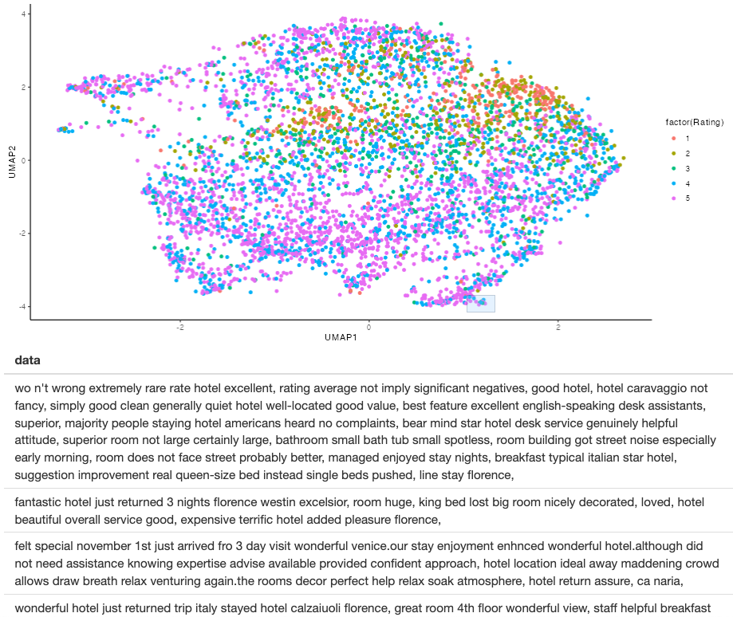
    ```
    
1. [Representation Analysis for CIFAR10] This problem asks you to investigate
the features learned by a deep learning model trained to the [CIFAR10
dataset](https://www.cs.toronto.edu/~kriz/cifar.html). We will study the
structure of the dataset and develop some intuition for what representations
different neurons are learning.

    a. The code below loads the CIFAR training dataset. Training images and labels
    can be accessed using `cifar$x` and `cifar$y`, respectively. Plot the first 15
    examples from this dataset and print out their class labels. What does class 7
    seem to correspond to?
  
    ```{r, echo = TRUE, include = TRUE, eval = FALSE}
    library(keras)
    cifar <- dataset_cifar10()$train
    ```
    
    b. We have trained a small model to this dataset, available at this
    [link](https://uwmadison.box.com/shared/static/c9kkxyrjb9myfj5knj5vnx0j8gn1uh0s.h5).
    Extract and visualize the feature activations associated with the first five
    features in layer 1 (`conv2d_8`) for the first image in the dataset.
    
    ```{r download-model, echo = TRUE, include = TRUE, eval = FALSE}
    f <- tempfile()
    download.file("https://uwmadison.box.com/shared/static/c9kkxyrjb9myfj5knj5vnx0j8gn1uh0s.h5", f)
    model <- load_model_hdf5(f)
    ```
  
    c. The block below extracts feature activations associated with layer 7, for the
    first 10% of the dataset. Specifically, the $ij^{th}$ element of `features`
    gives the activation of neuron $j$ (in layer 7) on image $i$. Visualize the 10
    images that have the highest activation for neuron 1. What does this neuron seem
    to be responsive to?
        
    ```{r activations, echo = TRUE, include = TRUE, eval = FALSE}
    activation_model <- keras_model(inputs = model$input, outputs = model$layers[[7]]$output)
    features <- activation_model(cifar$x[1:5000,,, ]) |>
      as.matrix()
    ```
    
1. [Model Visualization Use Cases] The exercise below describes a few
hypothetical situations where model visualization can be used. Discuss how you
might approach them.
    
    a. Your colleagues have trained a random forest model to predict whether
    activity observed on a corporate network might be the early signs of a
    cyberattack. The model is based on features like the average network data rate,
    the average packet size, and the port numbers of source traffic. Describe
    visualizations that could help your colleagues understand and improve their
    trained model.
    
    b. You working with a client to analyze data from a crisis text helpline.
    They are interested in the topics that often arise during these support
    sessions. They are also curious whether some topics are are more easily
    resolved than others, as measured by a follow-up survey. Propose an analysis
    strategy and the types of visualizations you expect to be helpful.
    
    c. You have built a deep learning model to detect changes in satellite imagery
    (e.g., before and after a natural disaster). Describe visualization techniques
    that can help you understand the latent image characteristics that may be
    learned by your model.

# Uncertainty Visualization

1. [Evolutionary Ecology] This problem visualizes the uncertainty of estimates
derived from an evolutionary ecology model. Vonesh and Bolker (2005) ran an
experiment to see how three factors -- size, initial population density, and
presence of predators -- influenced tadpole survival. There were several
replicate tanks for each combination of factors. As an initial analysis
strategy, it is natural to quantify the uncertainty in per-tank survival
probability using a multilevel model. This is discussed in full detail in
Chapter 12 of McElreath's [Statistical Rethinking](https://xcelab.net/rm/statistical-rethinking/)^[This book is accompanied by a fantastic set of [free lectures](https://www.youtube.com/playlist?list=PLDcUM9US4XdMROZ57-OIRtIK0aOynbgZN).].
This model implements a kind of partial pooling: Each tank is allowed to have
its own survival probability, but information is shared across all the tanks.

    a. Each row in the raw dataset below describes a single tank. Visualize
    variation in tank-level survival, as well as the potential influence of
    initial density and tadpole size.
    ```{r read-tank-data}
    x <- read_csv("https://github.com/krisrs1128/stat992_f23/raw/e9b55299b9c4d4140665eadf1d4268ed2d940b1b/activities/week13/reedfrogs.csv") |>
      mutate(tank = as.factor(tank))
    x
    ```
      
    b. The code below fits the following model, where $y_{i}$ represents the
    number of tadpoles that survive in tank $i$, $N_{i}$ is the initial
    tadpole density, and $p_{i}$ is the (unknown) survival probability.
    
    \begin{align*}
    y_{i} &\sim \text{Bin}\left(N_{i}, p_{i}\right) \\
    p_{i} &= \text{logit}^{-1}\left(\alpha_{i}\right) \\
    \alpha_{i} &\sim \mathcal{N}\left(0, 2\right)
    \end{align*}
    ```{r tank-posterior, message = FALSE, warning = FALSE}
    library(brms)
    fit <- brm(
      data = x, family = binomial,
      surv | trials(density) ~ 0 + factor(tank),
      prior(normal(0, 2)),
      silent = 2, refresh = 0,
      chains = 1
    )
    
    posterior <- as_draws_df(fit)
    ```
    Make a graded confidence plot of the posterior $p_{i}$ associated with each
    tank. Overlay the tank's original survival probability, and comment on how
    uncertainty varies across experimental settings.
    
    c. Create a version of the same figure that shows the full posterior
    densities, rather than simply their quantiles.
    
    d. In assessment of more complex models, it is often interesting to
    visualize samples simulated from the fitted model. If the simulation
    captures the most salient aspects of the original data without simply
    memorizing it, then we can have more faith in our model. Conversely, if
    important features are not reflected, then we may need to refine the model.
    The code below samples 4000 survival counts for each tank in the fitted
    model.
        
    ```{r brms-posterior-pred}
    y_sim <- posterior_predict(fit)
    ```
      
    Create a static visualization that shows the variation associated with 10 of
    these 4000 hypothetical datasets.
    
    e. Create an animated hypothetical outcome plot of the same data used in the
    previous part.
  
1. [Household Radon Levels] This problem analyzes a
[dataset](https://uwmadison.box.com/shared/static/3yn994tc1ft73z3br4ys18uri700gvik.csv)
of household radon levels in Minnesota. The data were gathered by the EPA in [an
effort](https://pubmed.ncbi.nlm.nih.gov/8919076/) to understand which factors
lead to increased exposure to this carcinogenic gas; e.g., it is known that
radon levels are higher in basements than on the ground floor. A secondary goal
of this problem is to illustrate the use of the `rstanarm` and `tidybayes`
packages to extract prior and posterior predictive distributions. While these
packages cannot be applied as generally as the methods discussed in lecture,
they provide an elegant interface for specific types of Bayesian models. You
will not need to write any code using these packages -- we only ask that you
visualize their outputs.
    
    a. Design and implement a visualization that describes the variation in
    `log_radon` levels from county to county.
  
    ```{r, echo = TRUE, include = TRUE}
    radon <- read_csv("https://uwmadison.box.com/shared/static/3yn994tc1ft73z3br4ys18uri700gvik.csv")
    ```
      
    b. The code below simulates prior predictive data from two potential Bayesian
    models of `log_radon`. Both models have the form `log_radon ~ (1 | county) +
    floor`, which means each county - floor level combination gets its own mean. In
    the first model, a vague $\mathcal{N}\left(0, 1000\right)$ prior is used, while
    in the second, a somewhat more informative $\mathcal{N}\left(0, 10\right)$ is
    used instead.
    
    ```{r, echo = TRUE, include = TRUE}
    library(rstanarm)
    priors <- list(
      "vague" = stan_lmer(log_radon ~ (1 | county) + floor, prior = normal(0, 1000), data = radon, prior_PD = 1, refresh = 0),
      "informative" = stan_lmer(log_radon ~ (1 | county) + floor, prior = normal(0, 10), data = radon, prior_PD = 1, refresh = 0)
    )
    ```
          
    The code below extracts 5 simulated datasets from the prior predictive. Each
    row is a simulated house; the simulation number is denoted by `.draw`. The
    index to the original dataset is given by `.row`. The simulated `log_radon`
    levels are given in the `.prediction` column. The `prior` column describes
    which type of prior was used for that simulation.
     
    ```{r, echo = TRUE, include = TRUE}
    library(tidybayes)
    prior_preds <- map_dfr(priors, ~ add_predicted_draws(radon, .), .id = "prior") |>
      filter(.draw > 3995)
    
    head(prior_preds)
    ```
        
    Design and implement a visualization to compare the two types of priors. Which
    prior seems more plausible?
      
    c. The code below draws posterior predictive samples from two new models, which
    either ignore or model variation from county to county (`lm` and `hierarchical`
    respectively). Both use information about whether the measurement came from a
    basement. Only the last 10 simulated runs are kept. Using these data, make
    boxplots of posterior predictive samples across counties, for each of the two
    models. What are the main differences between the two models? In what ways are
    the county level effects (as you studied in part (a)) accurately or
    inaccurately modeled?
     
    ```{r, echo = TRUE, include = TRUE}
    library(tidybayes)
    posterior_preds <- list(
      "lm" = stan_glm(log_radon ~ floor, prior = normal(0, 10), data = radon, chains = 1, refresh = 0),
      "hierarchical" = stan_lmer(log_radon ~ (1 | county) + floor, prior = normal(0, 10), data = radon, chains = 1, refresh = 0)
    ) |>
      map_dfr(~ add_predicted_draws(radon, .), .id = "model") |>
      filter(.draw > 990)
    ```

1. [South African Heart Disease GAM] In this problem, we will visualize the
prediction uncertainty in a generalized additive model (GAM) of the South
African Heart Disease
[dataset](https://hastie.su.domains/ElemStatLearn/datasets/SAheart.info.txt).
This data were used to evaluate risk factors for heart disease in a sample of
462 South African men in a region with high coronary heart disease (CHD)
prevalence. We will use a GAM to fit a type of logistic regression to the binary
CHD response using LDL cholesterol level as the predictor. Unlike standard
logistic regression, a GAM's logistic regression does not constrain the
predicted probability to follow a logistic function^[This is achieved by applying the logistic link to a nonlinear transformation of LDL.].

    a. Make a jittered scatterplot showing how CHD risk varies as a function of LDL.

    ```{r}
    heart <- read_csv("https://github.com/krisrs1128/stat992_f23/raw/e9b55299b9c4d4140665eadf1d4268ed2d940b1b/activities/week13/heart.csv")
    ```
    
    b. The code below fits a GAM between LDL and CHD. Visualize 20 predicted
    probability curves obtained by bootstrapping the original dataset.

    ```{r}
    library(mgcv)
    fit <- gam(chd ~ s(ldl), data = heart, family = "binomial")
    new_data <- tibble(ldl = seq(min(heart$ldl), max(heart$ldl), length.out = 100))
    ```
  
    c. Overlay a 95% pointwise confidence band onto the 20 hypothetical outcomes from (b).

    d. Instead of showing all the predicted probability curves simultaneously,
    create an animated hypothetical outcome plot. Each frame should highlight
    both the a hypothetical predicted probability curve and the samples used to
    generate that bootstrap sample.
